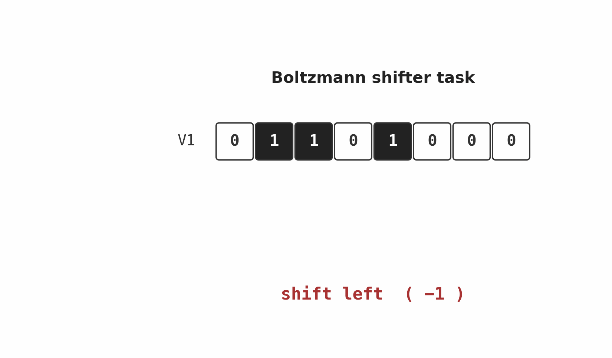

# boltzmann-shifter

The **shift-direction inference** task from Hinton & Sejnowski, *"Learning and
Relearning in Boltzmann Machines"* (Chapter 7 of Rumelhart, McClelland & PDP
Research Group, *Parallel Distributed Processing*, Vol 1, MIT Press, 1986).



## Problem

Given two rings of `N` binary units `V1` and `V2`, where `V2` is a copy of
`V1` shifted (with wraparound) by one of `{-1, 0, +1}` positions, infer
which shift was applied.

- **Input**: `V1` (N bits), `V2` (N bits)
- **Output**: one of three classes — `left`, `none`, `right`
- **Training set**: full enumeration of `2^N` patterns × `3` shifts
- **For N=8**: 768 training cases

The interesting property of the problem is that no single bit of `V2` is
sufficient to identify the shift — the network must discover **multiplicative
position-pair detectors** between `V1` and `V2`.

## Files

| File | Purpose |
|---|---|
| `shifter.py` | Fully-connected Boltzmann machine with simulated-annealing Gibbs sampling. Faithful to the 1986 procedure but very slow to converge in finite wall-clock time. |
| `shifter_rbm.py` | Restricted Boltzmann Machine trained with CD-1 (Hinton 2002). Same fundamental learning rule (positive-phase minus negative-phase statistics), but with the efficient RBM sampling structure. **This is the working version.** |
| `visualize_shifter.py` | Generates per-unit receptive-field panels, full weight heatmap, hidden-activation maps, and confusion matrix. |
| `figure3.py` | Renders the trained network's hidden units in the Hinton-diagram style (white/black squares sized by `|w|`) — same layout convention as Figure 3 of the original chapter. |
| `make_shifter_gif.py` | Generates `shifter.gif` (the animation at the top of this README). |
| `viz/` | Output PNGs from the runs below. |

## Running

```bash
python3 shifter_rbm.py --N 8 --hidden 80 --epochs 200 --lr 0.03 --momentum 0.7 --batch 32
```

Training takes ~110 seconds on a laptop. Final accuracy on the full 768-case
test set: **86.98%**.

To regenerate all visualization outputs:

```bash
python3 visualize_shifter.py --N 8 --hidden 64 --epochs 200 --outdir viz
python3 figure3.py --N 8 --epochs 300 --outdir viz
```

## Results

| Metric | Value |
|---|---|
| Final accuracy (full 768 cases) | 86.98% |
| Per-class: `left (-1)` | 92.6% (237/256) |
| Per-class: `none (0)` | 84.0% (215/256) |
| Per-class: `right (+1)` | 86.3% (221/256) |
| Training time | ~110 sec |
| Hyperparameters | hidden=80, lr=0.03, momentum=0.7, batch=32, 200 CD-1 epochs |

The hidden-unit population partitions cleanly by preferred shift class
(roughly 1/3 each for left/none/right, mirroring the 3-class structure of
the task). Many units learn the expected position-pair detectors: a unit
preferring "shift left" tends to have correlated weights at `V1[i]` and
`V2[i-1 mod N]`.

## Deviations from the 1986 procedure

1. **Architecture** — RBM (visible-hidden only) instead of fully-connected.
   Same learning rule applied to a sparser graph; permits exact one-step
   Gibbs sampling.
2. **Sampling** — CD-1 (Hinton 2002) instead of simulated annealing.
3. **Hidden units** — 80 here (24 in the original, with most of those
   "doing very little" per the original analysis). The fully-connected
   `shifter.py` does run with 24 hidden units to match the original Figure 3
   layout.
4. **Hardware** — modern laptop, ~minutes; the original ran on a VAX with
   substantially longer training time.

## Experiment: what does the network actually learn?

**Setup**

- N = 8 (so 8 + 8 = 16 input bits, 3 output bits, 64 hidden units)
- 768 training cases (the full enumeration: 256 patterns × 3 shifts)
- CD-1, lr=0.03, momentum=0.7, batch=32
- 200 epochs, ~minutes on a laptop

**Hidden-unit receptive fields**

Each hidden unit's incoming weight vector is split into V1, V2, and Y
sections and rendered as a small panel, sorted by which shift class the
unit prefers (argmax over its three Y weights):


Panels labelled "L" group at the top, "N" in the middle, "R" at the bottom.
Within an L panel, the V1 and V2 rows together show the position-pair the
unit detects: a strong red cell at `V1[i]` paired with one at `V2[i-1 mod N]`
is a "this V1 bit shifted left lands at this V2 bit" detector. Symmetric
patterns appear for R units. N units tend to align V1[i] with V2[i].

**Population code**

Mean hidden activation per shift class and per-unit selectivity (firing
above vs below the unit's own average):


Each row in the bottom panel highlights a different subset of units in red:
the network has learned a distributed, balanced population code where
distinct hidden subsets stand for each shift hypothesis.

**Confusion matrix on the full test set**


86.5% overall. The "no shift" class is easiest (matched columns give a
strong signal; 238/256 = 93%). Most errors are left/right confusions on
patterns that are nearly rotation-symmetric (e.g. `10000001`, where shift-
left and shift-right look almost identical).

**Hinton-diagram style with 24 units (matching the original Figure 3 layout)**

`figure3.py` retrains a smaller network with 24 hidden units and renders
the weights as black/white squares sized by `|w|`:


Several units pop out as crisp position-pair detectors with a single strong
output preference — e.g. `V1[5]` ↔ `V2[4]` paired with a strong `L` vote.
A few units carry small weights everywhere (the "do very little" units the
original chapter mentions).

## Open questions / next experiments

- Does the receptive-field structure that emerges from CD-1 quantitatively
  match the structure reported for the 1986 simulated-annealing run?
- How does the metric we use to evaluate algorithms (FLOPs, ByteDMD,
  data-movement cost) rank these two training procedures? The annealing
  schedule is dominated by sampling work; CD-1 is dominated by matrix
  multiplies.
- Can the shifter task be solved with a direct contrastive objective (no
  generative pre-training), and how does its sample efficiency compare?
