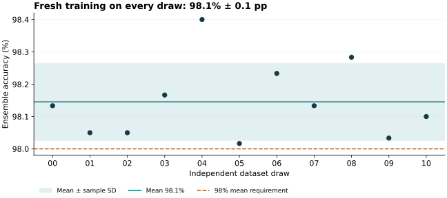

# MNIST-medium: three ConvNets across 11 datasets

**The frozen ensemble reached 98.1% ± 0.1 percentage points across 11 independently sampled datasets.** It meets the **98% mean accuracy requirement** with 64,776 / 66,000 correct predictions. The unrounded total is 96 predictions above the inclusive 64,680 threshold.

A100 measurements include fresh training of all three members and prediction: **5.9 × 10⁴ ms** and **1.7 × 10⁶ mJ** idle-adjusted GPU-board energy per complete task, using medians of three trials on draw 00.

> **Submission status:** The accuracy requirement and A100 measurements are established. The exact Dally v4 translation and its theoretical time, energy, area, and scoring runtime remain incomplete. This is a submitted attempt for review, not a claim of complete benchmark compliance. The separate problems report and scoring-feasibility audit explain the missing work.

[TOC]

## Submission entry

| Accuracy | Time (ms) | Energy (mJ) | Area (mm²) | Time to score (s) | Time on A100 (ms) | Energy on A100 (mJ) |
| ---: | ---: | ---: | ---: | ---: | ---: | ---: |
| 98.1% ± 0.1 pp | — | — | — | — | 5.9 × 10⁴ | 1.7 × 10⁶ |

Accuracy is mean ± sample standard deviation of dataset-level accuracies. The target applies to the unrounded mean; it does not require every draw, or mean minus SD, to exceed 98%. Costs use two significant figures. Dashes mean unavailable; accuracy-evaluation duration is not substituted for time to score.

## Accuracy on the 11 frozen draws

Both training and test subsets are resampled independently for every draw from the original 60,000 MNIST training images. Each draw has 6,000 training rows and 6,000 disjoint test rows, resized to 9 × 9 with the canonical competition-v2 area-resize procedure. Different draws may overlap. The integer dataset seeds are fixed in the protocol; they are not timestamps.

| Draw | Dataset seed | Accuracy | Correct / total | Predictions |
| ---: | ---: | ---: | ---: | --- |
| 00 | 20261001 | 98.1% | 5,888 / 6,000 | [Array](predictions/draw-00.npy) · [Manifest](draws/draw-00.json) |
| 01 | 20261002 | 98.0% | 5,883 / 6,000 | [Array](predictions/draw-01.npy) · [Manifest](draws/draw-01.json) |
| 02 | 20261003 | 98.0% | 5,883 / 6,000 | [Array](predictions/draw-02.npy) · [Manifest](draws/draw-02.json) |
| 03 | 20261004 | 98.2% | 5,890 / 6,000 | [Array](predictions/draw-03.npy) · [Manifest](draws/draw-03.json) |
| 04 | 20261005 | 98.4% | 5,904 / 6,000 | [Array](predictions/draw-04.npy) · [Manifest](draws/draw-04.json) |
| 05 | 20261006 | 98.0% | 5,881 / 6,000 | [Array](predictions/draw-05.npy) · [Manifest](draws/draw-05.json) |
| 06 | 20261007 | 98.2% | 5,894 / 6,000 | [Array](predictions/draw-06.npy) · [Manifest](draws/draw-06.json) |
| 07 | 20261008 | 98.1% | 5,888 / 6,000 | [Array](predictions/draw-07.npy) · [Manifest](draws/draw-07.json) |
| 08 | 20261009 | 98.3% | 5,897 / 6,000 | [Array](predictions/draw-08.npy) · [Manifest](draws/draw-08.json) |
| 09 | 20261010 | 98.0% | 5,882 / 6,000 | [Array](predictions/draw-09.npy) · [Manifest](draws/draw-09.json) |
| 10 | 20261011 | 98.1% | 5,886 / 6,000 | [Array](predictions/draw-10.npy) · [Manifest](draws/draw-10.json) |

The exact aggregate is **64,776 / 66,000**. `accuracy.json` retains the full-precision mean, sample SD, exact rational variance, and per-member diagnostic counts. SD uses the 11 percentages with denominator 10 (`ddof=1`); it is not SD across the three members and not a standard error. All 11 draws are retained; none was discarded or selected after evaluation.

## Frozen learner

Each member uses three padded 3 × 3 convolution layers of width 64, each followed by BatchNorm and GELU, with no pooling. A flattened 5,184-element feature vector feeds a 256-unit GELU head, dropout 0.2, and ten output logits. There are 1,404,618 trainable parameters per member. The three FP32 raw-logit arrays are averaged in FP64; argmax breaks ties toward the smallest digit.

Training runs for exactly 71 epochs with AdamW (learning rate 0.001, weight decay 0.001, betas 0.9 and 0.999, epsilon 1e-8). The cosine schedule retains its original 100-epoch horizon and a 2% learning-rate floor. Minibatches contain 128 examples, retaining the final partial batch of 112. Each epoch receives a seeded shuffle. Normalization uses only that draw’s training-image mean and population standard deviation.

Mild affine augmentation applies with probability 0.5: rotation within ±8°, translation within ±0.35 pixels per axis, and inverse sampling scale from 0.94 to 1.06. Bilinear sampling uses zero padding and `align_corners=False`, before normalization. Test images are normalized only and do not affect training statistics or optimizer updates.

Member seeds 101, 102, and 103 are held fixed across draws. Every member starts with fresh weights, optimizer, scheduler, and normalization state. The final 71st epoch is used without validation, early stopping, checkpoint selection, or tuning on these draws. Per-epoch training diagnostics are recorded but do not select the returned model.

## Development history and label isolation

The architecture and 71-epoch stopping rule came from the preceding ConvNet search using a training-only validation split. That study’s final single-dataset test also measured a diagnostic three-model ensemble. Choosing that ensemble for this new attempt was informed by its disclosed historical result; it is not presented as a choice made before all historical test observations. The new 11 seeds and complete procedure were frozen before this evaluation. No historical weights or learned state were reused.

- Protocol frozen: `2026-09-11 05:28:50 UTC`.
- All 11 prediction artifacts frozen: `2026-09-11 05:34:31 UTC`.
- Evaluator/evidence freeze: `2026-09-11 05:34:56 UTC`.
- Raw labels opened for scoring: `2026-09-11 05:35:00 UTC`.

Trusted preparation reads the original label pool only to extract permitted training labels. It does not construct per-draw test labels. Each remote fit receives only its own draw’s training images, training labels, and test images. Raw IDX files, other draws’ archives, and pretrained checkpoints are not mounted. The separate evaluator verifies every prediction, logit, manifest, source hash, ensemble calculation, and retained checkpoint before deriving any test-label vector.

An independent audit regenerated all 11 index sets and 22 resized image arrays, checked source equivalence to the earlier learner, and independently recomputed aggregate counts and sample SD. All predictions, logits, histories, and model-state hashes are retained; checkpoint binaries are retained for draw 00 only. Repeating the learner regenerates the other weights.

## Complete-task A100 measurements

The benchmark uses draw 00 (dataset seed 20261001), chosen before measuring performance. It calls the unchanged frozen learner sequentially for seeds 101, 102, and 103, then averages their logits in FP64 and returns predictions. One complete warmup precedes three measured fresh tasks in one A100 allocation. Each measured invocation includes model initialization, optimizer initialization, normalization, all training, the per-epoch training diagnostics, test inference, CPU↔GPU transfers, tensor hashing, checkpoint serialization, and ensemble construction. No trained parameters are reused between tasks.

| Measured quantity | Median per complete task |
| --- | ---: |
| Wall time on A100 (ms), primary runtime | 5.9 × 10⁴ |
| CUDA-event elapsed time (ms) | 5.9 × 10⁴ |
| Idle-adjusted GPU-board energy (mJ), primary energy | 1.7 × 10⁶ |
| Gross GPU-board energy (mJ) | 5.5 × 10⁶ |

Across the three trials, wall time ranges from 5.4 × 10⁴ to 5.9 × 10⁴ ms, and idle-adjusted energy from 1.6 × 10⁶ to 2.1 × 10⁶ mJ. The entry reports medians; the per-trial spread and both idle baselines remain visible below.

| Trial | Wall time (ms) | Idle-adjusted energy (mJ) | Idle before (W) | Idle after (W) |
| ---: | ---: | ---: | ---: | ---: |
| 1 | 5.9 × 10⁴ | 1.7 × 10⁶ | 64 | 66 |
| 2 | 5.4 × 10⁴ | 2.1 × 10⁶ | 66 | 66 |
| 3 | 5.9 × 10⁴ | 1.6 × 10⁶ | 66 | 66 |

The wall timer excludes the bounding NVML API calls. A separately retained counter interval drives energy subtraction. Container startup, dependency imports, input delivery to the container, and result upload to this machine are excluded. CUDA-event elapsed time includes host-induced gaps between GPU work; it is not kernel-active time. The GPU and its memory are measured by NVML; host CPU and network energy are excluded.

Before and after each trial, the benchmark waits three seconds for settling and samples idle energy for three seconds. Idle-adjusted energy is the gross counter delta minus the average of those two idle powers times the counter interval. The raw trials retain both baseline choices, gross energy, timing intervals, temperatures, clocks, and output-identity checks. Reference comparisons are verification only: the learner does not receive or consume reference learned parameters or answers.

The pinned image uses PyTorch 2.5.1+cu124 with CUDA 12.4, cuDNN 9.1, and NumPy 2.2.6. Execution uses deterministic PyTorch/cuDNN, FP32, no autocast, and no TF32. The raw benchmark record identifies the exact GPU, driver, NVML library, and measurement environment. Results describe this implementation on this allocation, not an optimized lower bound.

Measured GPU: **NVIDIA A100-SXM4-40GB**. Driver: `580.95.05`. NVML: `13.580.95.05`. All warmup and measured model-state hashes, FP32 logits, FP64 ensemble values, and final predictions matched draw 00 exactly.

The container requests four CPU cores. The host CPU model was not recorded; because host work is included in the elapsed task, reproductions on another host may differ even with the same GPU. The GPU power limit and clocks were left at platform defaults.

## Theoretical scoring is still open

There is no complete v4 program for this learner. GELU, BatchNorm, AdamW, cross-entropy, augmentation, and FP64 ensemble arithmetic need explicit lowering to the restricted primitive set; GPU reductions and fused arithmetic need a defined numerical correspondence. A compact tensor-loop IL can describe repeated work, but every operator must expand to valid instructions with charged memory accesses. The feasibility audit documents the proposed representation and validation path. It does not claim an implemented translator.

Theoretical model time, energy, area, and time to score are therefore left unavailable. Parameter count and GPU allocation do not establish occupied scratch-cell area. Any changed arithmetic needs its own accuracy evaluation before it can claim this result. The report intentionally does not equate a native PyTorch FLOP estimate with an exact model score.

## Reproduction and evidence

The accompanying README gives commands to prepare isolated inputs, run the 33 fits, freeze and evaluate predictions, repeat the A100 measurements, and rebuild these pages. Contributors: Yaroslav Bulatov (requirements), Codex (implementation, experiments, auditing, and reporting). No W&B runs were created.

- [Reproduction instructions](README.md)
- [Exact accuracy results](accuracy.json) · [Independent audit](audit.json)
- [Frozen protocol](protocol.json) · [Draw manifest](draw_manifest.json)
- [Prediction freeze](prediction_manifest.json) · [Evaluator freeze](evaluation_freeze.json)
- [Learner source](learner.py) · [Source-equivalence audit](learner_equivalence.json)
- [Raw A100 measurements](benchmark/measurements.json) · [Independent A100 audit](benchmark/audit.json) · [Benchmark source](gpu_benchmark.py)
- [Detailed scoring-feasibility audit](scoring-feasibility.md)
- [Separate ambiguities and problems](ambiguities.html)
- [Human-readable session export](session.html)
- [Previous ConvNet development study](../medium-convnet-20260911/)
