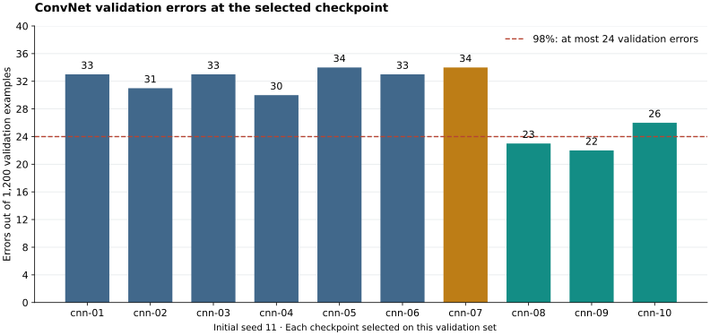

# MNIST-medium: ConvNet accuracy study

> **Accuracy scope:** These are historical results on one fixed dataset. The current small/medium rule requires **mean ± sample SD over 11 independently resampled datasets**; that aggregate has not been measured here. Threshold checks below describe the fixed dataset. Training-seed repeats do not supply across-dataset SD. [Current accuracy protocol](https://github.com/cybertronai/sutro-problems/blob/main/mnist/instructions.md#accuracy-over-11-random-datasets).

**The fixed three-ConvNet ensemble reached 5,894 / 6,000 correct (98.2%), clearing both per-dataset accuracy thresholds.** The validation-selected single ConvNet, seed 101 scored 5,868 / 6,000 correct (97.8%). On this dataset it does not meet the requested 98% goal and does not meet the repository’s 98.14% threshold. Exact counts determine these checks; accuracy percentages are rounded to one decimal place.

Ten ConvNet variants were trained from scratch, followed by six validation replications and three final full-data fits. Model selection used only training labels. The final architecture, epoch count, seeds, and ensemble rule were frozen before the ConvNet test evaluation. **This is the accuracy phase: no cost translation, scoring run, or complete-task performance/energy benchmark has been performed for these ConvNets.**

[TOC]

## Frozen test results

The selected architecture has **3 convolutional layers with 64 channels**, GELU activations, batch normalization, no pooling, and a 256-unit dense head. Each full-data fit runs for **71 epochs**, with the original 100-epoch cosine schedule. The ensemble averages the three raw FP32 logit arrays in FP64, then takes argmax. It has no learned mixing weights or test-time augmentation.

| Predictor | Accuracy | Correct / total | Requested 98% | Repository 98.14% |
| --- | ---: | ---: | --- | --- |
| seed101 **(selected before test)** | 97.8% | 5,868 / 6,000 | Miss | Miss |
| seed102 | 97.9% | 5,876 / 6,000 | Miss | Miss |
| seed103 | 98.0% | 5,882 / 6,000 | Pass | Miss |
| ensemble | 98.2% | 5,894 / 6,000 | Pass | Pass |

The requested threshold needs 5,880 correct predictions; the repository threshold needs 5,889. Seeds 101, 102, and 103 were declared before test evaluation. Seed 101 is the fixed primary individual model; the most favorable test seed is not selected afterward. Validation favored a single model, whose predeclared final seed was 101; the ensemble is a predeclared diagnostic, not the validation winner. Promoting that ensemble for a later submission after observing these results would be a test-informed decision, which must be disclosed. The result nevertheless demonstrates an existing ConvNet algorithm reaching the requested accuracy on this fixed dataset.

The previous 512-unit MLP attempt scored 5,755 / 6,000. Its training and validation protocol differed, so this comparison establishes the new learner’s result, not an isolated causal effect of convolution.

## Architecture search

All candidates trained on the same stratified 4,800-example fit split, with 1,200 training examples reserved for validation (PCG64 split seed 20260914). Initial training seed: 11. Each trajectory ran 100 epochs. Checkpoint selection maximized validation correct count, then minimized validation cross-entropy; remaining ties favored the earlier epoch. Architecture ranking used the same accuracy/loss ordering, then parameter count and configuration ID.

Blue bars use GELU without augmentation; amber uses ReLU; teal uses mild affine augmentation. The dashed line marks 24 validation errors, equivalent to 98%. These checkpoints were selected using this validation set.

| ID | Conv layers × channels | Activation | Pooling | Augmentation | Accuracy | Correct / 1,200 | Best epoch |
| --- | --- | --- | --- | --- | ---: | ---: | ---: |
| cnn-01 | 3 × 32 | GELU | none | None | 97.2% | 1,167 | 23 |
| cnn-02 | 3 × 48 | GELU | none | None | 97.4% | 1,169 | 43 |
| cnn-03 | 3 × 64 | GELU | none | None | 97.2% | 1,167 | 24 |
| cnn-04 | 4 × 32 | GELU | none | None | 97.5% | 1,170 | 65 |
| cnn-05 | 3 × 32 | GELU | max | None | 97.2% | 1,166 | 26 |
| cnn-06 | 2 × 32 | GELU | max | None | 97.2% | 1,167 | 42 |
| cnn-07 | 3 × 64 | RELU | none | None | 97.2% | 1,166 | 42 |
| cnn-08 | 3 × 32 | GELU | none | Mild affine | 98.1% | 1,177 | 82 |
| cnn-09 | 3 × 64 | GELU | none | Mild affine | 98.2% | 1,178 | 71 |
| cnn-10 | 4 × 64 | GELU | none | Mild affine | 97.8% | 1,174 | 61 |

Each convolution is padded 3 × 3 with no bias, followed by batch normalization and the listed activation. The flattened features feed a dense layer of width four times the channel count, the same activation, dropout, and ten output logits. Max-pool variants pool once after the second convolution, reducing 9 × 9 to 4 × 4.

Default optimization is AdamW with learning rate 0.001, weight decay 0.001, batch size 128, dropout 0.2, and cross-entropy. The learning rate decays by cosine to 2% of its initial value over 100 epochs. cnn-05 uses learning rate 0.003; cnn-06 uses dropout 0.1 and weight decay 0.01. A seeded shuffle is generated each epoch, retaining the partial last batch. Normalization mean and population standard deviation come only from the unaugmented fit images, or all 6,000 training images for refit.

Mild affine augmentation changes each training image with probability 0.5: rotation within ±8°, translation within ±0.35 pixels per axis, and inverse sampling scale from 0.94 to 1.06. It uses bilinear sampling with zero padding, before normalization. Validation and test images receive no augmentation.

## Validation replications and selection

The three highest-ranked configurations were repeated with seeds 22 and 33 on the same split and schedule. Final architecture selection maximized mean best-checkpoint correct count across seeds 11/22/33, then minimized mean loss, parameter count, and ID. The refit epoch is the median of its three selected epochs. The preferred architecture uses an ensemble only if its three-seed validation logits average beats its fixed seed-11 checkpoint; ties favor a single model.

| ID | Mean validation accuracy | Correct at seeds 11 / 22 / 33 | Ensemble correct / 1,200 | Refit epochs |
| --- | ---: | --- | ---: | ---: |
| cnn-09 | 97.9% | 1178 / 1173 / 1173 | 1,174 | 71 |
| cnn-08 | 97.8% | 1177 / 1176 / 1167 | 1,173 | 82 |
| cnn-10 | 97.8% | 1174 / 1170 / 1176 | 1,172 | 61 |

The frozen selection is **cnn-09, single ConvNet, seed 101, 71 epochs**. Replications assess initialization sensitivity on one fixed validation set; they do not provide an independent held-out validation sample. No architecture, epoch, seed, or ensemble change followed the test result.

## Dataset and verification

This study uses canonical competition-v2 MNIST-medium: 6,000 training images and 6,000 test images at 9 × 9. Both are disjoint subsets of the original MNIST training pool. The preparation seed is 20260910. All permitted array hashes match the repository manifest. Historical CNN weights were not used: their 10,000-example training set overlaps 4,000 of the current test examples.

- Search protocol frozen: `2026-09-11T05:05:22 UTC`.
- Final selection frozen: `2026-09-11T05:11:04 UTC`.
- Separate test evaluation: `2026-09-11T05:12:57 UTC`.

The search process receives only training images and labels. Refit receives training images, training labels, and test images. All final predictions are saved and hashed before a separate local evaluator opens test labels. The evaluator verifies the selected predictor against the frozen validation choice, then checks all prediction hashes. Independent checks recompute validation predictions and losses, verify source/config/seed/provenance and checkpoint/logit hashes, check checkpoint selection against all epoch histories, and independently count parameters.

Training runs use the pinned container image in the protocol: PyTorch 2.5.1+cu124, NumPy 2.2.6, FP32 without autocast or TF32, deterministic PyTorch algorithms, and deterministic cuDNN. The GPU is an NVIDIA A100-SXM4-40GB. Exact software versions and operational durations are in each run JSON; those durations are not submitted performance measurements. Contributors: Yaroslav Bulatov (requirements), Codex (implementation, experiments, verification, and reporting). No W&B runs were created.

## Reproduction

See the accompanying README for commands to prepare isolated inputs, repeat the search, freeze a validation choice, refit, and evaluate predictions. The final learner can also be reproduced directly from the retained selection. Modal credentials are required for the supplied GPU runner. Historical weights, external labels, and saved prediction oracles are not learner inputs.

Search checkpoints are excluded from the repository to avoid storing all candidate weights; rerunning the search regenerates them. Validation logits and all run histories are retained. Final weights, logits, predictions, the frozen selection, and exact test results are retained beside this report.

Cost fields remain unmeasured. Any later translation must recheck accuracy under its declared arithmetic and include fresh training plus prediction. Human-readable cost tables will use ms, mJ, mm², and seconds for time to score, with two significant figures.

## Evidence and related reports

- [Reproduction instructions](README.md)
- [Search protocol](protocol.json) · [Exact search ranking](search_summary.json) · [Validation selection](validation_selection.json)
- [Frozen final selection](selection.json) · [Exact test results](test_results.json) · [Prediction freeze](prediction_manifest.json)
- [Initial artifact audit](search_audit.json) · [Replicated artifact audit](validation_audit.json) · [Independent selection audit](selection_audit.json)
- [Final artifact audit](final/artifact_audit.json) · [Repository evaluator cross-check](official-ensemble-check.json)
- [Separate ambiguities and problems](ambiguities.html)
- [Human-readable session export](session.html)
- [Previous MLP submission](../medium-affine-20260911/)
