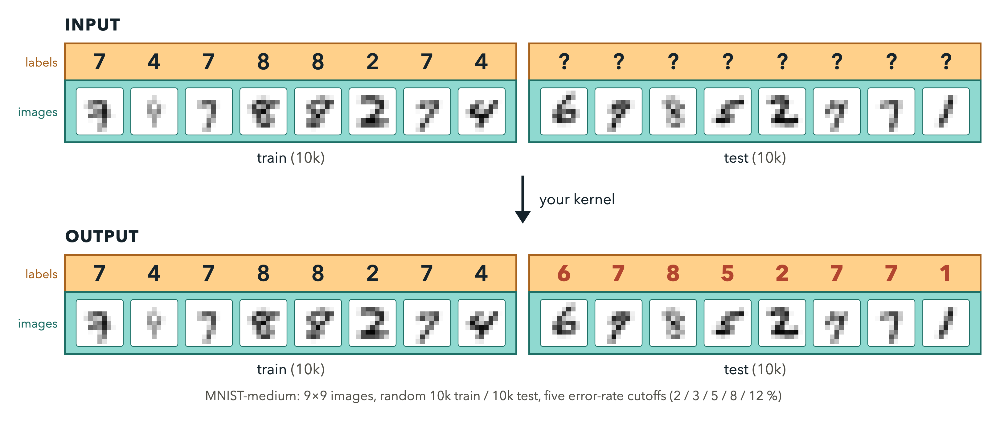

# MNIST-medium: train and predict, as fast as possible



One call of your kernel receives 10,000 labelled examples drawn from 9x9 MNIST
and 10,000 unlabelled ones, all already on the GPU, and returns a label for each
of the 10,000 queries. Train from scratch inside the call. Every call is a fresh
draw, the two halves come from disjoint halves of the pool, the labels are
secretly permuted per draw, and the examples arrive as 60 numbers under a secret
per-draw linear map rather than as pixels, so nothing carries over from one call
to the next. You are ranked by time, and you qualify by accuracy: pick the band
you can hit and make the call as short as you can.

## What you submit

A single Python file exposing `custom_kernel`:

```python
#!POPCORN leaderboard mnist-medium-5pct
#!POPCORN gpu A100

import torch
from task import input_t, output_t

def custom_kernel(data: input_t) -> output_t:
    train_x, train_y, test_x = data
    ...
    return labels
```

| Name | Shape | Type |
| --- | --- | --- |
| `train_x` | `(10000, 60)` | float32, CUDA |
| `train_y` | `(10000,)` | int64 in [0, 9], CUDA |
| `test_x` | `(10000, 60)` | float32, CUDA |
| return | `(10000,)` | any integer dtype, values in [0, 9], CUDA |

The 60 columns are not pixels; see
[what you receive](#what-you-receive-a-whitened-secretly-rotated-release)
below. Read your feature count off the tensor
(`x = train_x.reshape(train_x.shape[0], -1)`) rather than hard-coding it: a case
with `release_dims: 0` hands over `(10000, 1, 9, 9)` pixels in [0, 1] instead,
which is what a local dry run with `--case release_dims=0` gives you. Every band
in `bands.json`, and therefore every dry run below that does not override it,
uses the 60-column release.

The same three tensor objects arrive on every call; only their contents change.
Capturing a CUDA graph over them is allowed and is how the current leaders run.

```bash
popcorn submit --mode test       submission.py   # one draw, format and sanity
popcorn submit --mode benchmark  submission.py   # short timed rehearsal
popcorn submit --mode leaderboard submission.py  # the ranked run
```

Start from [`submission.py`](submission.py), which ships the nearest-class-mean
baseline as its body. Each band folder holds the same file with its own
`#!POPCORN leaderboard` line (`mnist-medium-12pct/submission.py`, and so on);
that is the copy KernelBot serves as the template, so a downloaded template
always posts to the board it came from.

## What you receive: a whitened, secretly rotated release

Every draw hands over

    z = Q W (x - mu)

where `x` is a 9x9 MNIST image flattened to 81 pixels, `mu` is the mean of that
draw's 10,000 training rows, `W` whitens exactly onto the top 60 principal
directions of those same rows (no variance floor), and `Q` is a Haar-random
60x60 orthogonal matrix drawn from the evaluator's secret seed, fresh for every
draw. One map is fitted on the training rows and applied unchanged to both
halves, so training and test features are directly comparable. Over the training
rows the release has zero mean and identity covariance; 99.9% of the values fall
inside +-4.6, but the tails are heavy and nothing bounds them -- about 2 values
in 10,000 exceed 6 in magnitude and the largest in a 10,000-row draw runs to
10-12 -- so do not pick an int8 or fixed-point scale from a nominal range. The
map -- `mu`, `W`, `Q`, the eigenvalues -- is never returned, logged, written
down or sent to your process.

**What this costs you.** Under a point for an honest dense learner: 60 of the 81
directions carry essentially all the signal, and an MLP or a logistic regression
sees an orthogonal change of basis, which it is invariant to up to conditioning.
Kernel methods notice more, because the metric changes: exact whitening cost an
arc-cosine kernel ridge about 1.2 percentage points at N = 10,000 in the
`pmnist-medium-cutoffs-20260923` study. Convolutions lose their subject matter
entirely -- there is no grid, and column *j* is not a pixel.

**Why it is here.** Spatial structure is deliberately unavailable, because it
was the cheapest thing to smuggle in. Measured in
[the rotation-obfuscation study](../mnist/experiments/rotation-obfuscation-20260923/README.md)
(2026-09-23, three draw seeds):

* A rotation alone is not enough. It leaves the pixel covariance intact, and one
  eigendecomposition plus a moment fit recovered the pixels to 7% RMS.
  Whitening first deletes that channel: the released covariance is the identity
  whatever the pixels were.
* The map has to be a per-draw secret, not a protocol constant. Against a fixed
  published map, a 5.5-7.2 KB int8 inverse fits inside the 20,480-byte
  submission and undoes it exactly -- which is also why the previous proposal, a
  fixed secret pixel permutation, was dropped.
* A *blind* entrant -- one that sees only the release -- cannot get the lattice
  back. The best blind basis recovery (sparse non-negative unmixing plus a QAP
  lattice search) returned about 20 of 64 live pixels, and a CNN trained on the
  recovered lattice did no better than an MLP on the released features. So the
  release closes the cheap route at no cost to honest entrants.
* An *informed* entrant, holding the public MNIST split offline, still can:
  matching class-conditional second moments recovered pixels to 10-13% RMS on
  whitened releases, and an offline CNN on those recovered pixels scored
  98.4-98.8%. Whitening does not touch class-conditional moments. That attack
  needs roughly 19 KB of class statistics plus a network, which is why the
  **size cap** (20,480 bytes, no literal over 4,096) is the load-bearing
  defence, with the **hold-out draws** (Fashion-MNIST, at secret positions, 70%
  floor) behind it -- though a hold-out call is cheap to recognize from the
  release alone, so that floor only stops a smuggler that does not bother to
  look (see the [residual risks](#known-residual-risks)). The release is a third
  layer, not a replacement for the cap.

`release_dims` is a case field, so it is one line in `bands.json`; `0` restores
the 1.1.1 pixel release for a local dry run.

**Calibration note.** The accuracy bands in this README were calibrated on the
pixel release, and the dense ceiling on the 60-dimensional release is being
re-measured. CPU numbers so far, mean over five 10,000/10,000 draws (pixels ->
release): the conjugate-gradient pair 98.0% -> 95.8%, the 512-unit MLP
96.4% -> 95.7%, PCA-QDA 95.5% -> 90.3%, and nearest class mean *rises* from
80.1% to 85.0%. On those numbers the 2% and 3% bands have no known entry and
the 5% band is a coin toss. The per-entry detail is in
[`submissions/README.md`](submissions/README.md). The band thresholds are
unchanged for now; if the re-measurement moves them it will be a `bands.json`
edit and every standing record will be re-scored, as rule 7 requires.

First A100 confirmation of the release path (harness 1.2.0, benchmark mode,
3 draws, secret seed 20260924, A100-SXM4-40GB, torch 2.12.0+cu130): the
conjugate-gradient pair scored 95.92% (28,775/30,000, needs 28,500; per draw
9,584 / 9,576 / 9,615 against a 9,350 floor) at 253.3 ms per call and passed
the 5% gate -- [`results/gpu-release-cg-pair-5pct-benchmark.json`](results/gpu-release-cg-pair-5pct-benchmark.json).
A full leaderboard run (11 draws plus the two Fashion hold-outs) on the release
has not been run yet.

The best dense learner found in the `pmnist-medium-cutoffs-20260923` study, an
arc-cosine depth-3 kernel ridge, measured with this evaluator's own draws
(`redteam/release/dense_ceiling.py`, case seed 101, three 10,000/10,000 draws,
CPU): 97.47% on pixels -> 96.29% on the release (per draw 96.39 / 96.31 / 96.17), i.e. an error of about
3.7% at 10,000 examples. That is the best-known honest ceiling on the
release so far: it clears the 5% band, not the 3% band.

## How it is scored

| | |
| --- | --- |
| Ranked value | mean CUDA-event time of one complete training-and-prediction call |
| Ranked calls | 11 MNIST draws plus 2 hold-out draws, all fresh, all secret, all timed and ranked |
| Accuracy rule | `sum(correct) >= ceil(draws * 10000 * (10000 - error_bp) / 10000)`, and no single draw more than 1.5 percentage points below the band |
| Consistency | the slowest ranked call may not exceed 2x the median (plus 2 ms) |
| Warm-up | one untimed call, on an equally shaped draw from a *different* dataset |
| Per call | fresh draw released through its own secret map and staged into the fixed tensors (untimed), `synchronize`, 256 MB L2 flush, `synchronize`, `start` event, your call, `end` event, `synchronize` |
| Hold-out | 2 of the ranked calls are Fashion-MNIST, at positions only the evaluator knows; together they must be at least 70% correct |
| Submission | one file, at most 20,480 bytes, no string or bytes literal over 4,096 bytes |
| Timeouts | test 300 s, benchmark 600 s, ranked 1200 s; a single call over 60 s fails, and one that does not return is killed |
| Ranking | `ranking_by: last`, one benchmark case per band |

A draw is a fresh random split of the official 60,000-image MNIST training set
into 10,000 training and 10,000 test images, downsampled 28 -> 9 by exact
box-area averaging, divided by 255, and then released through that draw's own
secret `z = Q W (x - mu)` map. The pool is cut in half once per run, from the
secret seed: training halves come from one half and test halves from the other,
so an image you have been shown with a label is never asked about later. The ten
class labels are permuted by a secret per-draw permutation applied to both
halves, so a label only means something relative to the training set it arrives
with.

Inside the timed window: everything `custom_kernel` does, including any host
work it triggers. Outside: generating the draw, fitting and applying its release
map, copying the result into the input tensors, the L2 flush, reading your
predictions back, and scoring them.

Four clocks bracket every call: CUDA events in the child process, the child's
`perf_counter`, the parent's `perf_counter` around the call round trip, and the
parent's `perf_counter` around the staging round trip. Before your file is
imported, the evaluator calibrates what the protocol itself costs, so the
parent's numbers bound yours from *both* sides: your device time may not exceed
the parent's measurement, and it may not fall below a quarter of it either.
Scaling every clock inside your process by a constant therefore changes
nothing, because the parent's clock does not scale with it. The evaluator also
captures `perf_counter`, `torch.cuda.Event`, `torch.cuda.synchronize` and the
tensor methods it uses to stage inputs and read outputs *before* importing your
file, so rebinding them changes nothing it measures. The child's wall clock also
covers checking your output and copying it to the host. Return a plain
`torch.Tensor`, not a subclass; work on an unsynchronized side stream, a
disabled-timing event and work deferred past the end event all fail these
checks.

### Bands

<!-- GENERATED by make_bands.py from bands.json -- do not edit by hand. -->

| Problem | Mean error at most | Correct needed | Ranked draws |
| --- | ---: | ---: | ---: |
| `mnist-medium-2pct` | 2% | 107,800 / 110,000 | 11 |
| `mnist-medium-3pct` | 3% | 106,700 / 110,000 | 11 |
| `mnist-medium-5pct` | 5% | 104,500 / 110,000 | 11 |
| `mnist-medium-8pct` | 8% | 101,200 / 110,000 | 11 |
| `mnist-medium-12pct` | 12% | 96,800 / 110,000 | 11 |

<!-- END GENERATED -->

The bands are one file, [`bands.json`](bands.json); `python make_bands.py`
regenerates every `task.yml` from it.

### Current board

Measured on one A100-SXM4-40GB, harness 1.1.0, full leaderboard runs, each row
with the result JSON behind it. **Every row below predates the 1.2.0 linear
release and was measured on pixels**; over five CPU draws of the same size the
same entries score 95.8% (`cg_pair`, was 98.0%), 95.7% (`mlp512`, was 96.4%),
90.3% (`pca_qda`, was 95.5%) and 85.0% (`ncm_baseline`, was 80.1%) on the
release, so this board will be re-measured before a band opens. Rows marked "not run" are entries that qualify
arithmetically on an easier band but have not been measured there. These are the
reference entries in [`submissions/`](submissions/), not records: nobody has
competed yet.

| Band | Best entry | Mean ms | Accuracy | Hold-out | Result |
| --- | --- | ---: | ---: | ---: | --- |
| 2% | none yet | | | | `cg_pair` misses at 97.93% |
| 3% | `submissions/cg_pair.py` | 270.18 | 97.93% | 88.2% | [`results/gpu-03b-cg-pair-3pct-leaderboard.json`](results/gpu-03b-cg-pair-3pct-leaderboard.json) |
| 5% | `submissions/pca_qda.py` | 4.55 | 95.35% | 78.0% | [`results/gpu-02-pca-qda-5pct-leaderboard.json`](results/gpu-02-pca-qda-5pct-leaderboard.json) |
| 8% | `submissions/pca_qda.py` (not run) | | | | clears 5%, so it clears this band |
| 12% | `submissions/pca_qda.py` (not run) | | | | clears 5%, so it clears this band |

Nearest class mean (`submissions/ncm_baseline.py`, 1.09 ms, about 80%) meets no
band. `submissions/mlp512.py` clears 5% on accuracy (96.4%) but failed the
hold-out at 47.8% on the pixel release; see the residual risks below. On the
1.2.0 release, and after the input-scale fix that file needed for it, its CPU
hold-out draws score 86.2 to 86.9%, so that verdict is expected to change when
the board is re-measured.

Run-to-run noise, from three leaderboard runs of the same entry on three secret
seeds and three containers: 4.5475 / 4.5349 / 4.5043 ms, i.e. 0.95% spread
across containers and 0.2 to 0.35% within a run. Times below a 1% difference are
a tie.

## Rules

1. **Train from scratch on every call.** No parameters, statistics, caches,
   predictions or fitted state may cross a call boundary. Compiled kernels,
   captured graphs and allocator state may. Enforced two ways: the warm-up call
   is on a different dataset, so nothing fitted before the timed loop transfers,
   and the ranked calls must all take about the same time, so a submission that
   trains once and then only predicts is visible as one slow call among fast
   ones.
2. **No external data and no memorized constants.** Following MLPerf's open
   division rule, *the implementation must not encode any information about the
   content of the dataset or a successful model's state.* Seeded random
   initialization is fine; a table of MNIST hashes or a pretrained feature
   extractor is not. Machine-checked: `submission.py` may not exceed 20,480
   bytes and no single literal may exceed 4,096 bytes, which is far less than
   the public pool compresses to. Every reference entry here is under 6 KB.
   The release map is part of this rule: a submission may not carry anything
   that only makes sense for one map, and no fixed map exists to carry.
   Module level must also be inert -- only imports, `def`, `class`, constants
   and `torch` configuration calls -- because the host compiles a Python
   submission by running it once, before the evaluator starts and outside every
   guard below. Do your work inside `custom_kernel`.
3. **No network access.** The scored container is run with egress denied, and
   inside the submission's process an audit hook refuses `socket.connect`,
   `getaddrinfo` and `urllib`, plus any attempt to open a file that looks like a
   dataset. The in-process guard is a tripwire, not a sandbox: a subprocess is a
   fresh interpreter that does not inherit it, which is why the container-level
   block is the part that counts.
4. **Read the data you are given.** A run that answers without using `train_y`,
   or that recognizes MNIST rather than learning from it, fails the hold-out
   calls -- which are ranked like any other call, so there is no free slot in
   which to be slow.
5. **Readable code.** Organizers must be able to see what the submission does.
6. **Records are reproduced before they are recognized.** The top three of each
   band are rerun by the organizers on a fresh secret seed.
7. **The evaluator is versioned** (`system.harness` in every result). If it
   changes during the competition, standing records are re-scored with the new
   version and both numbers are published.
8. **Do not attack the release.** Attempting to invert `Q W`, to recover the
   pixel lattice, or to re-identify the underlying MNIST rows -- by any means,
   including statistics carried in from the public split -- disqualifies the
   entry, whether or not it succeeds. The release is an obfuscation with known
   limits (see [what you receive](#what-you-receive-a-whitened-secretly-rotated-release)
   and the residual risks below), so this one is a rule, not a wall. Learn from
   the 60 numbers you are handed.

## Run it yourself

```bash
# one A100 on your own Modal account
python run_modal.py --band mnist-medium-5pct --submission submissions/pca_qda.py \
    --mode leaderboard --seed 12345 --output results/pca-qda.json

# the same pipeline on a CPU, no GPU and no Modal account needed
python run_modal.py --band mnist-medium-12pct --submission submissions/ncm_baseline.py \
    --mode test --local --case train=2000 --case test=2000

# the same dry run on the 1.1.1 pixel release instead of the 60-column one
python run_modal.py --band mnist-medium-12pct --submission submissions/ncm_baseline.py \
    --mode test --local --case train=2000 --case test=2000 --case release_dims=0

# the evaluator directly, the way KernelBot invokes it
POPCORN_FD=9 POPCORN_SEED=12345 python eval.py benchmark cases.txt 9>results.txt
```

`--case KEY=VALUE` overrides a case field and `--env KEY=VALUE` sets an
environment variable for the evaluator, locally and inside the container. Both
runs begin with the host's own compile step (`python3 submission.py`), so a
submission that does work at import time fails here exactly as it would on the
board.

`--local` runs the identical protocol with `perf_counter` in place of CUDA
events and no L2 flush. Set `MNIST_POOL_CACHE` to a directory of verified
`idx.gz` files to work offline on a machine you trust. A hosted run instead
bakes the verified files into the image and sets `MNIST_POOL_CONSUME=1`: the
evaluator loads them into RAM and deletes them before any submission process
exists, so the public labels are never on disk while a submission is running.

## Known residual risks

Honest list of what this harness does *not* close, from a red-team pass in
which five agents attacked it (their submissions are in `redteam/`):

* **The test images are public, and the release only raises the price.** Both
  halves of a draw come from the public 60k MNIST training split, whose labels
  are published, and the training half hands back the per-draw label
  permutation. Harness 1.2.0 adds the per-draw secret release, which closes the
  blind and the fixed-inverse routes outright, but an *informed* attacker who
  holds the public split offline can still align class-conditional second
  moments to recover pixels to 10-13% RMS and then apply a smuggled CNN
  (98.4-98.8% in the rotation-obfuscation study). The binding constraints on
  that attack are the 20,480-byte cap -- it needs ~19 KB of class statistics
  plus a network -- and the Fashion-MNIST hold-out draws, which a
  *non-adaptive* MNIST-specific smuggled model fails. Rule 8 forbids it
  outright. Closing it by construction still needs a competition-design change:
  a private, never-published pool.
* **A hold-out call is detectable, so the floor only binds a non-adaptive
  entry.** The attacker's own moment-matching residual already separates the two
  domains by 11.5x (`redteam/release/results.json`, `summary.holdout_detectability`:
  65.4 on an MNIST draw against 752.9 on a Fashion hold-out), and it is cheaper
  than that: the eigenvalues of the released class-mean scatter are invariant
  under the secret `Q`, so they survive the release untouched. Measured here at
  10,000/10,000, `release_dims: 60`, four draws of each pool, the top eigenvalue
  is 0.778-0.784 on MNIST and 0.922-0.947 on Fashion -- non-overlapping, ten
  lines of code, no external data. The untimed warm-up call is itself a labelled
  Fashion draw, which hands every run a free reference point. An entry that
  wants to can therefore recognize each hold-out call and answer it with an
  honest learner, so against an adaptive entrant the 20,480-byte size cap is the
  binding constraint and the hold-out floor is not. Drawing the warm-up from a
  third dataset would remove the in-run reference but not the separation; only a
  hold-out drawn from the *same* distribution as the ranked calls -- which means
  a private pool -- closes this.
* **Exact-source re-identification.** If a released draw can be matched row by
  row against the public pool, everything follows: norms alone re-identified
  99.9% of rows in the study when the map preserved them, and a least-squares
  fit on matched pairs recovers the whole map. Whitening removes the norm cue,
  but not the possibility in principle. Rule 8 is what stands against it, plus
  the hold-out draws against an entry that does not check which pool it is
  being asked about.
* **A short call can still be under-reported.** The parent's clock bounds the
  device clock from below only after the protocol overhead is subtracted, so
  for a call under about 2 ms the bound goes slack. Entries at the very top of
  a band should be re-run and audited by hand.
* **A 2-4x lie passes.** The timing gates are order-of-magnitude detectors, not
  timers. Together with the consistency check they make gross cheating visible;
  they do not certify a number to within a factor of two.
* **The submission process is not sandboxed.** It runs as the same user, in the
  same container, with a writable filesystem. It cannot import the harness, read
  the cases file, see the secret seed (which is kept out of the environment and
  therefore out of `/proc`), or open a file that looks like a dataset, and
  anything it spawns is killed with its process group -- but a real sandbox
  (Landlock, seccomp, a separate uid) is a hosting decision, not a harness one.
* **The hold-out floor can reject an honest learner.** Measured on an A100:
  PCA-QDA 78.0%, the conjugate-gradient pair 88.2%, and `submissions/mlp512.py`
  **47.8%**, which fails. That entry is not a memorizer: its fixed learning rate
  is tuned for sparse 9x9 digits and diverges on Fashion's denser images, at two
  different secret seeds, collapsing onto one class both times. The 70% floor
  therefore favours closed-form learners over iterative ones, and it still
  cannot separate a genuine learner from an entry that memorized MNIST *and*
  learns properly on everything else. The number is under review. **Those three
  figures are pixel-release measurements and the 1.2.0 release moves them**: on
  CPU, two released Fashion hold-out draws of 10,000/10,000 give PCA-QDA
  74.9-75.9%, the conjugate-gradient pair 86.3-86.7%, `mlp512` 86.2-86.9% (after
  the input scale it needed for the release) and nearest class mean -- which
  meets no band -- 77.2-78.0%. So on the release the floor may reject nobody and
  admit the control. Nothing is re-measured on an A100 yet; `bands.json` says
  the same.
* **`A100` is two boards.** 23 of 25 validation containers were A100-SXM4-40GB
  and 2 were A100-SXM4-80GB; the same computation ran 4.5% faster on the 80 GB
  board, about 5x the cross-container noise. `system.device` is recorded in
  every result, and entries measured on different variants are not comparable.
* **KernelBot cannot rotate a leaderboard's secret seed.** `secret_seed` is a
  column defaulted when the leaderboard is created, so rule 6's rerun has to be
  done by the organizers on a seed of their own, outside the hosted service.
* **Static screening is not done here.** KernelGuard-style source review for
  replay, hardcoded shapes and trivial work is complementary to everything
  above, and is worth running on the top of each band.

## Layout

| Path | What it is |
| --- | --- |
| `eval.py` | the evaluator: draws, timing, scoring, trust boundary |
| `task.py` | input and output types, and every case field |
| `utils.py` | seeding, accuracy rule, timing gate, network guard, version info (the L2 flush lives in `eval.py`, on pre-captured references) |
| `mnist_data.py` | verified MNIST and Fashion-MNIST loading and downsampling |
| `reference.py`, `submission.py` | the baseline learner and the template |
| `bands.json`, `make_bands.py` | thresholds, and the generator for `task.yml` |
| `mnist-medium-*/task.yml` | one problem per band (generated) |
| `sutro.yaml` | the competition file (generated) |
| `submissions/` | ported entries from the Sutro problem set |
| `run_modal.py` | standalone runner, Modal A100 or local CPU |
| `tests/test_eval.py` | unit tests for the rules that decide a run |
| `tests/GPU_CHECKS.md` | what must be re-run on an A100, and what to expect |
| `redteam/` | attacks against this harness, and their current verdicts |

Design decisions, threat model and what this harness deliberately does not do:
[DESIGN.md](DESIGN.md).
