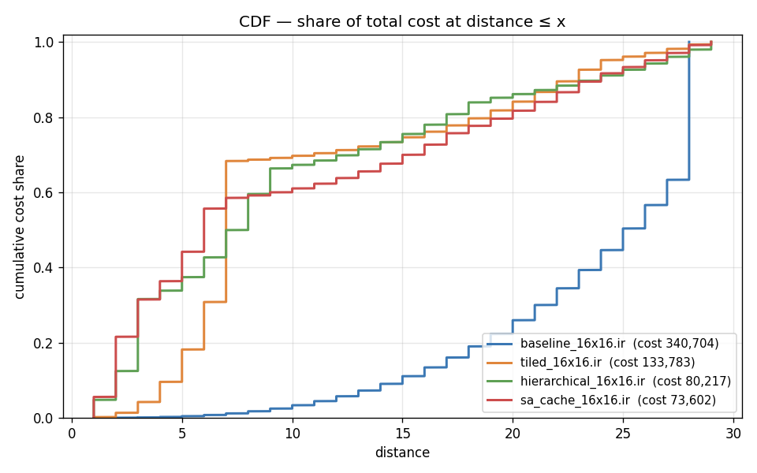
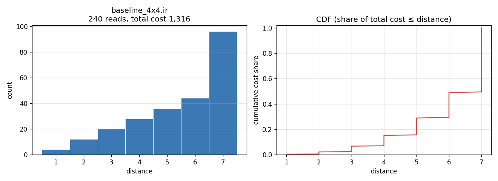
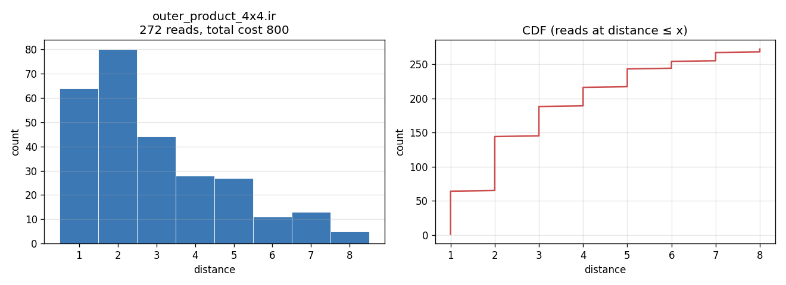
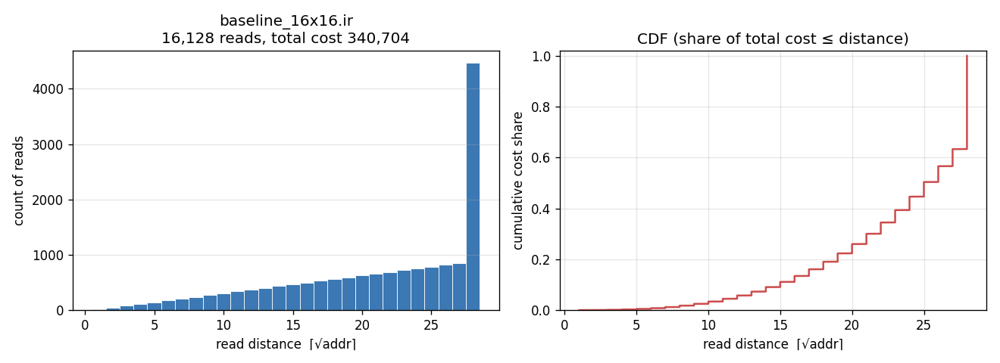
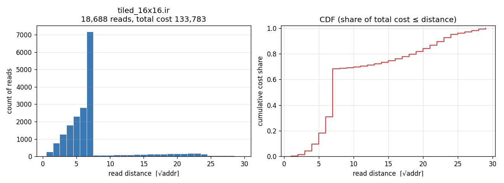
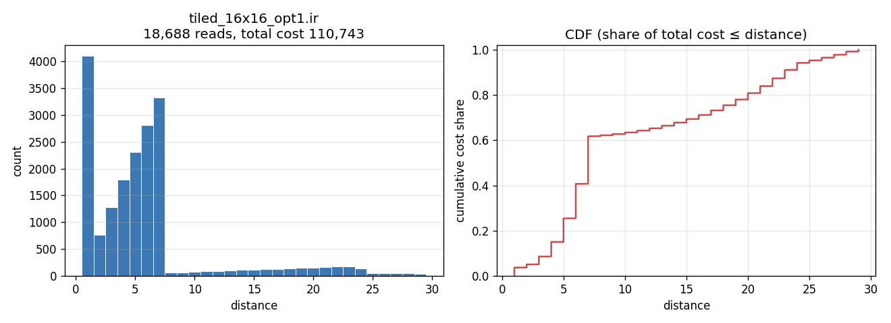
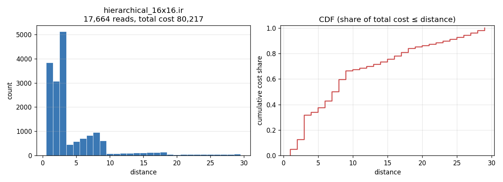
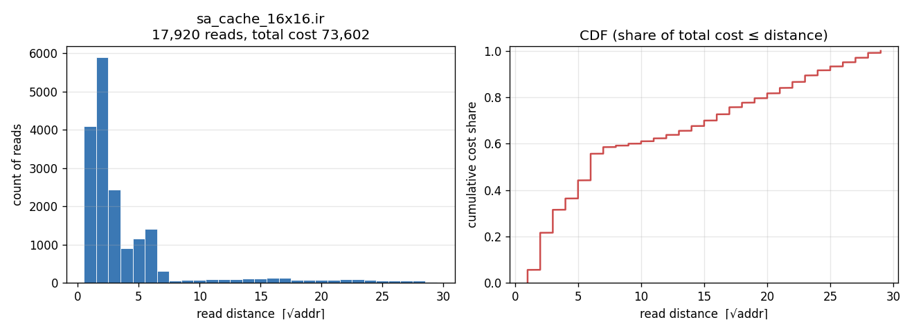

# Matmul

- DeepMind's [AlphaTensor](https://github.com/google-deepmind/alphatensor) discover a better 4x4 matrix multiplication algorithm in terms of FLOPs. 
- What is the best algorithm when we care about *energy* instead?
- To measure energy, use [simplified version](https://github.com/cybertronai/simplified-dally-model) of Bill Dally's *Parallel Explicit Communication Model*

## API

```python
import matmul

# Verify your IR computes A @ B correctly and return its read-cost.
cost = matmul.score_1x1("1,2;mul 3,1,2;3")    # 5

ir = matmul.generate_baseline_4x4()      # naive triple loop, 4×4
cost = matmul.score_4x4(ir)

ir = matmul.generate_baseline_16x16()    # naive triple loop, 16×16
cost = matmul.score_16x16(ir)

ir = matmul.generate_tiled_16x16()       # 4×4 scratchpad-cached tiles
cost = matmul.score_16x16(ir)
```

## 4×4 Record History

| Date       | Cost  | Submission                                          | Contributors                                 | Description                              |
| -          | -:    | -                                                   | -                                            | -                                        |
| 2026-04-29 | 1,316 | [ir](submissions/baseline_4x4.ir), [report](submissions/baseline_4x4.md)       | [@yaroslavvb](https://github.com/yaroslavvb) | `generate_baseline_4x4` (naive)          |
| 2026-04-30 |   800 | [ir](submissions/outer_product_4x4.ir), report  | [@sjbaebae](https://github.com/sjbaebae)     | `generate_outer_product_4x4` (size-1 sA) |

## 16×16 Record History

| Date       | Cost    | Submission                                          | Contributors                                 | Description                                   |
| -          | -:      | -                                                   | -                                            | -                                             |
| 2026-04-29 | 340,704 | [ir](submissions/baseline_16x16.ir), [report](submissions/baseline_16x16.md)     | [@yaroslavvb](https://github.com/yaroslavvb) | `generate_baseline_16x16` (naive)             |
| 2026-04-29 | 133,783 | [ir](submissions/tiled_16x16.ir), [report](submissions/tiled_16x16.md)        | [@yaroslavvb](https://github.com/yaroslavvb) | `generate_tiled_16x16` (4×4 tiles)            |
| 2026-04-30 | 110,743 | [ir](submissions/tiled_16x16_opt1.ir), report   | [@SethTS](https://github.com/SethTS)         | `generate_tiled_16x16_opt1` (tmp@1)           |
| 2026-04-30 |  80,217 | [ir](submissions/hierarchical_16x16.ir), report | [@sjbaebae](https://github.com/sjbaebae)     | `generate_hierarchical_16x16` (asym. reload)  |
| 2026-04-30 |  73,602 | [ir](submissions/sa_cache_16x16.ir), report     | [@adotzh](https://github.com/adotzh)         | sA-cache + sB scratchpad (rank2) ★ best      |

## Access-distance distributions

Charts to see how many reads are <x distance away:
[`access_distance_plots/plot_access_distances.py`](access_distance_plots/plot_access_distances.py).

### Combined CDF — 16×16

Four representative 16×16 submissions overlaid:


### 4×4

**`baseline_4x4`** — 240 reads, total 1,316


**`outer_product_4x4`** — 272 reads, total 800


### 16×16

**`baseline_16x16`** — 16,128 reads, total 340,704


**`tiled_16x16`** — 18,688 reads, total 133,783


**`tiled_16x16_opt1`** — 18,688 reads, total 110,743


**`hierarchical_16x16`** — 17,664 reads, total 80,217


**`sa_cache_16x16`** — 17,920 reads, total 73,602

