# Access distance

One PNG per IR submission. Left panel: histogram of read distance ⌈√addr⌉
across every operand read in the v0 trace. Right panel: CDF of cumulative
read count at each distance — showing how much of the total cost comes
from reads at distance ≤ x.

Generated by [`plot_access_distance.py`](plot_access_distance.py).

## Combined CDF — 16×16

All 16×16 record-table submissions on one axis (legend sorted by total cost,
cheapest first).

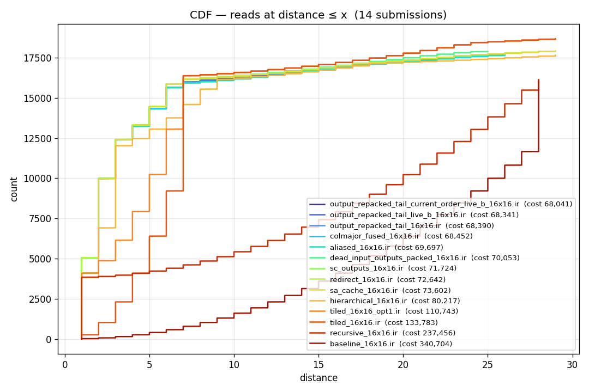

## 4×4

**`baseline_4x4.ir`** — cost 1,316
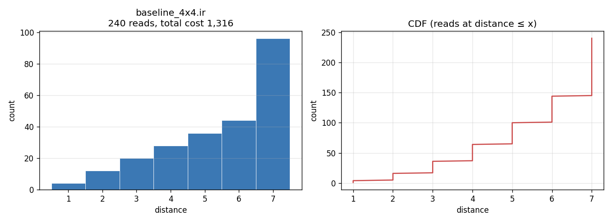

**`outer_product_4x4.ir`** — cost 800 ★ best
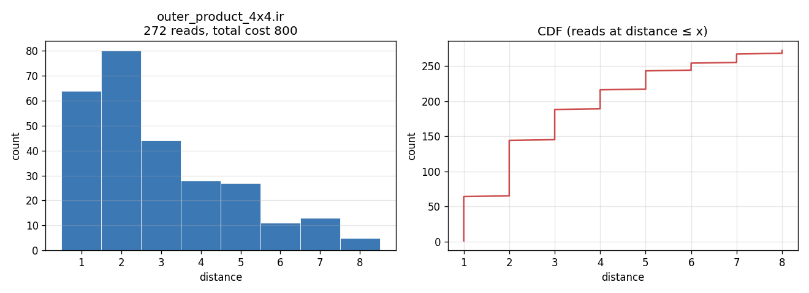

## 16×16

**`baseline_16x16.ir`** — cost 340,704
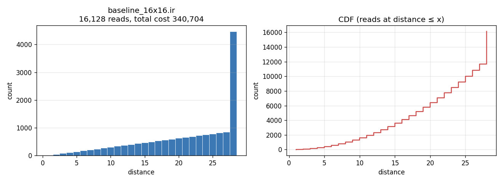

**`recursive_16x16.ir`** — cost 237,456
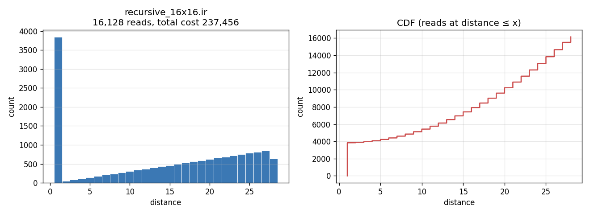

**`tiled_16x16.ir`** — cost 133,783
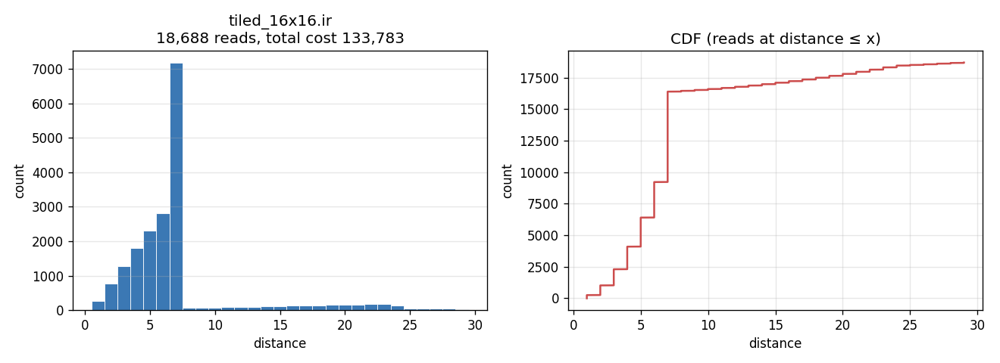

**`tiled_16x16_opt1.ir`** — cost 110,743
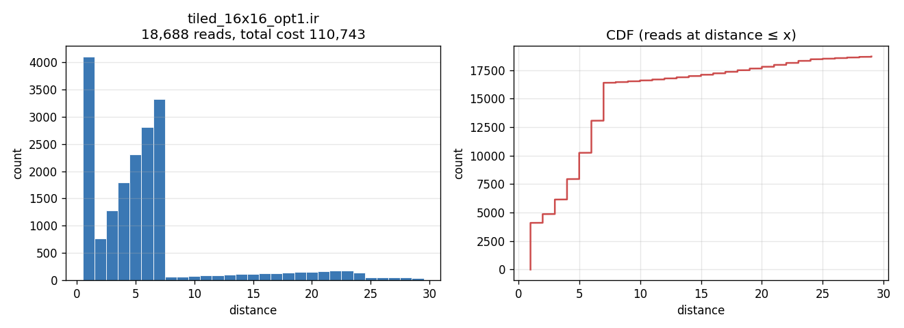

**`hierarchical_16x16.ir`** — cost 80,217
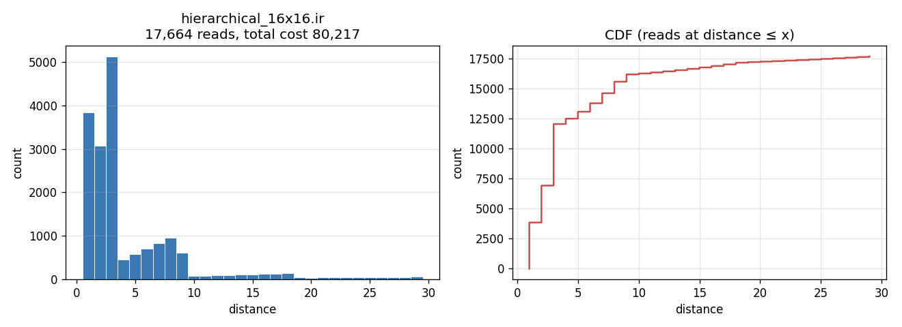

**`sa_cache_16x16.ir`** — cost 73,602
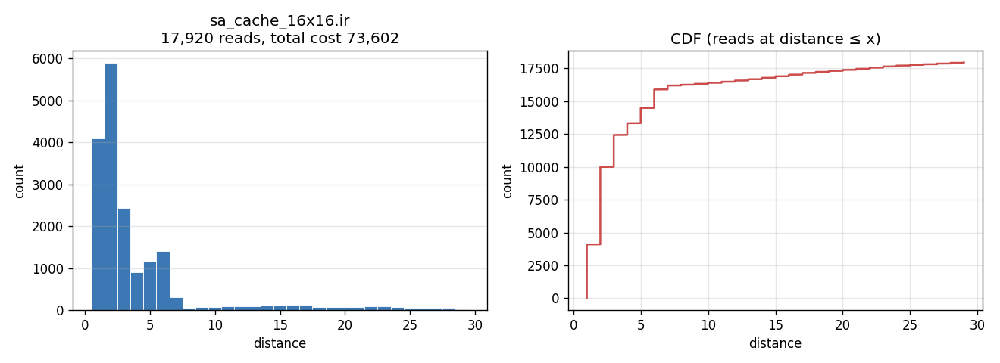

**`redirect_16x16.ir`** — cost 72,642
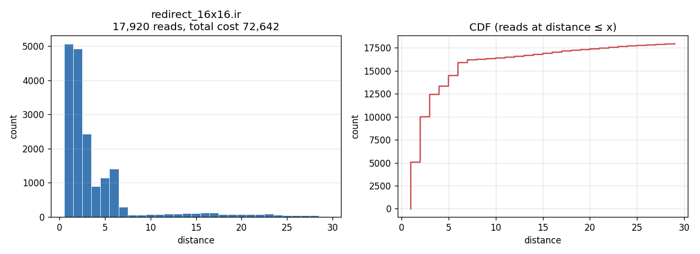

**`sc_outputs_16x16.ir`** — cost 71,724
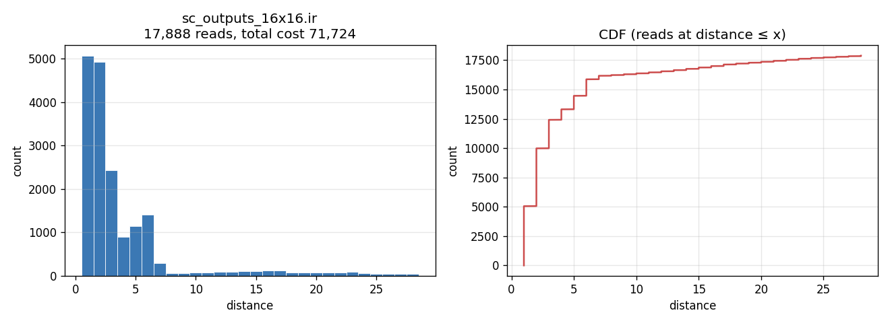

**`dead_input_outputs_packed_16x16.ir`** — cost 70,053

**`aliased_16x16.ir`** — cost 69,697

**`colmajor_fused_16x16.ir`** — cost 68,452
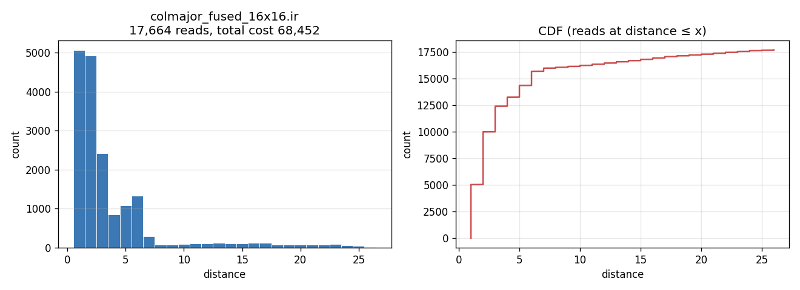

**`output_repacked_tail_16x16.ir`** — cost 68,390

**`output_repacked_tail_live_b_16x16.ir`** — cost 68,341
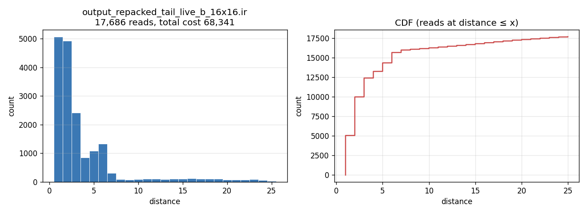

**`output_repacked_tail_current_order_live_b_16x16.ir`** — cost 68,041 ★ best
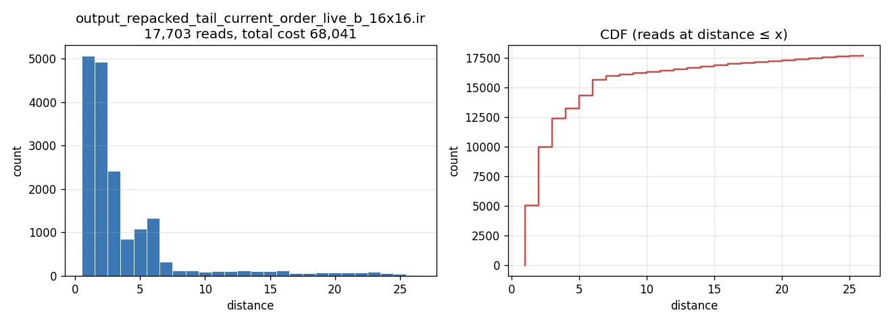
