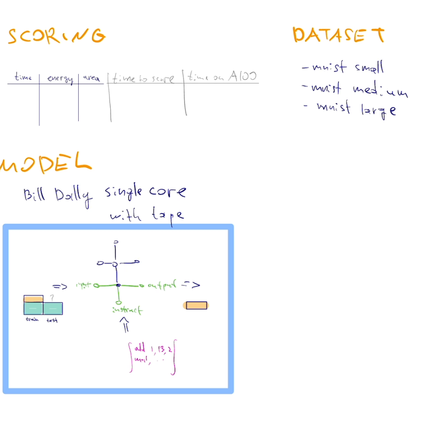

# MNIST (information for humans)

The system takes **train**/*test* images + **train** labels, and produces *test* labels.

Provide a way to solve this problem at prescribed accuracy without hitting **the memory
wall**. 

IE
- kernel that runs on A100 using few Joules (measured using NVML)
- an algorithm that runs with small memory footprint in Bill Dally's 2D grid (measured by counting hops in [Bill Dally's 2D grid](https://github.com/cybertronai/simplified-dally-model/tree/main/models/spatial-computer)

## Motivation
Today's learning is based on backprop which was popularized in the 80s when we were bottlenecked by arithmetic. Today, we are bottlenecked by memory movement. This favors algorithms with small memory footprint. Backprop has a large memory footprint.

Footprint issue is partly mitigated by batching, yet batching comes with costs. Is there an alternative solution?

To understand the memory wall, consider that the energy of an 8-bit add is comparable to the energy needed to move its operands 10 micrometers. A chip is 16 millimeters wide. Bill Dally's AHA retreat [slides]( https://aha.stanford.edu/sites/g/files/sbiybj20066/files/media/file/aha-retreat-2023_dally_keynote_en_eff_ai_hw_0.pdf)

## Datasets

- MNIST-small: 1k train, 1k test, 3x3 images
- MNIST-medium: 10k train, 10k test, 9x9 images
- MNIST-large: original 60k train, 10k test, 28x28 images

MNIST-medium comes with 5 test-set error targets, 2% error, 3% error, 5% error, 8% error, 12% error
MNIST-large uses LeNet5 original 1% error rate

# Submissions

## MNIST-small — 67% accuracy target

| Date | Accuracy | Energy on A100 (mJ) | Time on A100 (ms) | Energy in grid model (mJ) | Time in grid model (ms) | submission |
| --- | ---: | ---: | ---: | ---: | ---: | --- |
| 2026-09-11 | 67.08% ± 1.54 pp | 3,300 | 130 | 0.24 | 3,100 | [H32 MLP](submissions/small60-grid-20260912/README.md) |

## MNIST-medium — 2% error target

| Date | Accuracy | Energy on A100 (mJ) | Time on A100 (ms) | Energy in grid model (mJ) | Time in grid model (ms) | submission |
| --- | ---: | ---: | ---: | ---: | ---: | --- |

## MNIST-medium — 3% error target

| Date | Accuracy | Energy on A100 (mJ) | Time on A100 (ms) | Energy in grid model (mJ) | Time in grid model (ms) | submission |
| --- | ---: | ---: | ---: | ---: | ---: | --- |

## MNIST-medium — 5% error target

| Date | Accuracy | Energy on A100 (mJ) | Time on A100 (ms) | Energy in grid model (mJ) | Time in grid model (ms) | submission |
| --- | ---: | ---: | ---: | ---: | ---: | --- |
| 2026-09-11 | 96.41% ± 0.13 pp | 290,000 | 9,300 | 440 | 3.7 × 10⁶ | [512-unit MLP (96% target)](submissions/medium96-grid-20260912/README.md) |

## MNIST-medium — 8% error target

| Date | Accuracy | Energy on A100 (mJ) | Time on A100 (ms) | Energy in grid model (mJ) | Time in grid model (ms) | submission |
| --- | ---: | ---: | ---: | ---: | ---: | --- |

## MNIST-medium — 12% error target

| Date | Accuracy | Energy on A100 (mJ) | Time on A100 (ms) | Energy in grid model (mJ) | Time in grid model (ms) | submission |
| --- | ---: | ---: | ---: | ---: | ---: | --- |

## MNIST-original — 1% test error target

| Date | Accuracy | Energy on A100 (mJ) | Time on A100 (ms) | Energy in grid model (mJ) | Time in grid model (ms) | submission |
| --- | ---: | ---: | ---: | ---: | ---: | --- |

Information for agents

## Task and datasets

Learn from the supplied training images and labels, then produce one digit label
(0–9) for each test image. The computation being compared includes both training
and prediction. Test labels are for evaluation only.

- **MNIST-small:** 1,000 training / 1,000 test images, 3 × 3 pixels; at least
  **67% mean accuracy**.
- **MNIST-medium:** 10,000 training / 10,000 test images, 9 × 9 pixels; the five
  error bands below.
- **MNIST-original (MNIST-large):** 60,000 training / 10,000 test images,
  28 × 28 pixels; at most **1% test error** (at least **99% accuracy**).

For small and medium, use disjoint random training and test subsets of the
original 60,000 MNIST training examples. Report **mean accuracy ± sample standard
deviation over 11 independently sampled datasets**, with fresh training on each
dataset. Record all dataset seeds, preprocessing, checksums, learner seeds, and
individual `correct / total` counts. Choose the learning procedure before
inspecting test results; do not transfer learned state between datasets.
Standard deviation is in **percentage points (pp)**. Original uses the complete
official training and test splits.

### MNIST-medium error bands

Error is the fraction of incorrect test predictions. Each band is an inclusive
maximum error, equivalent to the following minimum accuracy:

Across 11 datasets (110,000 test predictions), the thresholds are:

- **2% mean error:** at least 98% mean accuracy; 107,800 correct.
- **3% mean error:** at least 97% mean accuracy; 106,700 correct.
- **5% mean error:** at least 95% mean accuracy; 104,500 correct.
- **8% mean error:** at least 92% mean accuracy; 101,200 correct.
- **12% mean error:** at least 88% mean accuracy; 96,800 correct.

Label each medium result with the error band it targets and whether it meets
that band. Apply thresholds to the **unrounded 11-dataset mean**, calculated as
`sum(correct) / 110000`; a rounded display percentage does not establish a pass.
Report all 11 draws, including their mean and sample standard deviation, rather
than selecting favorable draws.

### MNIST-small accuracy target

The target is **at least 67% mean accuracy** over 11 independent datasets.
Use the exact `sum(correct) / 11000` fraction: at least **7,370 correct** across
11,000 predictions. A rounded display percentage does not establish a pass.
The existing H32 MLP result, 7,379 / 11,000, meets this target; its frozen report
retains the original 60% study target.

### MNIST-original error target

The target is **at most 1% test error**, equivalent to **at least 99% accuracy**
on the official 10,000-image test split. A submission must predict at least
**9,900 labels correctly**, with at most **100 errors**. Apply this inclusive
threshold to the exact `correct / 10000` fraction, not a rounded percentage.

## Efficiency measurements

Costs are per complete training-and-prediction run. The two MLP grid entries
use a globally serialized schedule; their reports describe this baseline and
its limits.

Address the memory wall by reducing memory footprint and data movement. The two
implementation goals are:

- **A100:** provide a kernel or implementation that uses little energy. Use an
  ISA or toolchain of your choice, such as
  [pyptx](https://github.com/patrick-toulme/pyptx) or Triton. Report runtime and
  **idle-adjusted energy measured with NVML**, including the measurement commands
  and idle-baseline method.
- **Bill Dally's 2D grid:** use the
  [spatial-computer model](https://github.com/cybertronai/simplified-dally-model/tree/main/models/spatial-computer)
  and its specified instruction set. Declare processor and memory placement,
  data representation, tape layout, and execution schedule. Count data movement
  in **word-node hops**, including local accesses, interprocessor traffic, and
  tape I/O according to that model. Report **peak scratch-memory use**, active
  processors, hop counts, and the resulting model energy and elapsed time.

Identify the model revision and scoring method used. Report **time to score**:
the host runtime of computing the theoretical metrics. Account for the full
training-and-prediction computation, identifying any setup or preprocessing
excluded from a measurement. Keep theoretical scores distinct from measured
A100 costs; report an em dash for unmeasured values.

Display execution times in **ms**, energies in **mJ** (1 J = 1,000 mJ), and time
to score in **s**, using two significant figures for cost measurements. Report
memory in bytes or KiB and retain exact counts, accuracies, and measurements in
the accompanying data files. If reporting area, state its spatial-model
definition and derivation; do not reuse the old single-core area conversion.

## Submission

Open a pull request adding the source or generator, reproduction commands, and
a standalone report under `mnist/submissions/<name>/`. Include the tier, error
target for medium or original, accuracy evidence, dataset and learner seeds,
model revision, memory layout, scoring calculations, hardware/software versions, A100
measurements, and any W&B runs. Identify which efficiency metrics have been
measured and which remain unavailable.

Add a row to the matching submission table above. For medium, use a table whose
error bound the submission meets; a result may appear in multiple qualifying
bands, as on the sparse-parity page. Include the submission date, measured
accuracy, A100 energy and runtime, spatial-grid energy and runtime, and a link
to the submission report. Put contributors, memory use, hop counts, the full
measurement scope, and reproduction evidence in that report. Keep historical results under their original
specification.

## Existing tooling

The [older agent instructions](instructions.md), default dataset generator, and
accuracy evaluator still describe the previous specification: 600/600 and
6,000/6,000 sizes and single-core scoring. The evaluator also lacks the current
small target, medium error bands, and the original tier's 99% target. Update or
configure reproduction code to match the datasets, error bands, and spatial
model above before claiming current results.
The generator's `reference-20260910` profile has the new counts but uses a
different train/test split protocol; matching counts alone is insufficient.

Historical submissions (previous specification)

The entries below retain their original measurements. Small used 600 training
and 600 test images; medium used 6,000 of each. Reported Dally scores and areas
use the former **single-core-with-tape** model. These results do not establish
accuracy or spatial-computer costs for the revised datasets and error bands.
Their reports preserve the single-core scores, areas, scoring times, and
original evaluation scope, including whether an entry used one dataset or 11
draws. Grid columns are unmeasured: single-core scores are not spatial-grid
scores.

### MNIST-small (historical)

| Date | Accuracy | Energy on A100 (mJ) | Time on A100 (ms) | Energy in grid model (mJ) | Time in grid model (ms) | submission |
| --- | ---: | ---: | ---: | ---: | ---: | --- |
| 2026-09-10 | 62% | 2,000 | 71 | — | — | [32-unit MLP](https://cybertronai.github.io/sutro-problems/docs/submissions/mlp60-affine-20260911/) |
| 2026-09-10 | 51% | 0.52 | 0.0069 | — | — | [1NN](https://cybertronai.github.io/sutro-problems/docs/submissions/1nn-v4-20260911/) |

### MNIST-medium (historical)

| Date | Accuracy | Energy on A100 (mJ) | Time on A100 (ms) | Energy in grid model (mJ) | Time in grid model (ms) | submission |
| --- | ---: | ---: | ---: | ---: | ---: | --- |
| 2026-09-10 | 98.1% ± 0.1 pp | 1.7 × 10⁶ | 5.9 × 10⁴ | — | — | [Three ConvNets](https://cybertronai.github.io/sutro-problems/docs/submissions/medium-convnet-11draw-20260911/) |
| 2026-09-10 | 96% | 150,000 | 4,700 | — | — | [512-unit MLP](https://cybertronai.github.io/sutro-problems/docs/submissions/medium-affine-20260911/) |

### MNIST-large (historical)

| Date | Accuracy | Energy on A100 (mJ) | Time on A100 (ms) | Energy in grid model (mJ) | Time in grid model (ms) | submission |
| --- | ---: | ---: | ---: | ---: | ---: | --- |

Historical single-core-with-tape sketch:

