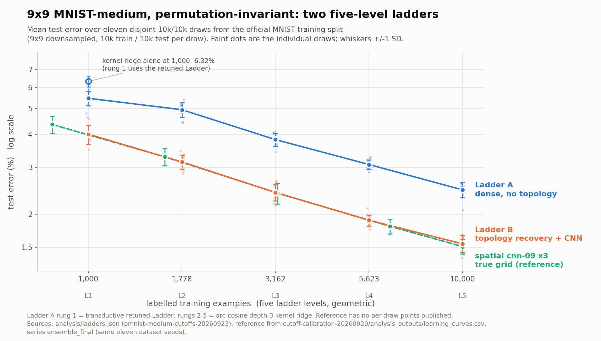

# Permutation-invariant MNIST-medium: the best result under 20 A100-minutes, and two five-level ladders

Study date: 2026-09-23/24. Study id `pmnist-medium-cutoffs-20260923`. This directory is a
self-contained report; start another agent with [HANDOFF.md](HANDOFF.md). Task: MNIST-medium
(9x9 images, 10,000 training and 10,000 query examples drawn disjointly from the official MNIST
60,000-example training split), presented to the learner as 81 features in one fixed unknown
order. The official MNIST test split is never used.

## Answer

On this task the best result we could reach with **at most one A100-40GB for 20 minutes per fit**
is **1.55% error** at 10,000 examples (`topo-cnn09-x3`, ladder B), and **2.47% error** if
data-driven pixel-topology recovery is disallowed (`kr-arccos1-d3`, ladder A); both are pooled
means over the same eleven dataset draws with 10,000 queries each. Ladder A's bottom rung, a
retuned transductive Ladder network, reaches **5.46% error at 1,000 examples**, and ladder B's
bottom rung reaches **4.00%**. The answer to *what does 20 minutes of A100 buy* is: **almost
nothing here**. The best dense recipe needs no GPU at all — arc-cosine depth-3 kernel ridge, a
mean of 124.3 s of Intel-Mac CPU per fit at N=10,000 — and every attempt to spend the GPU budget
(64-member batched MLP ensembles, 600- and 1,800-epoch schedules, a deliberate ~900 s
max-compute arm, and a transductive Ladder that hit the 1,200 s guard) scored *worse* on the
development seed. The binding constraints are labels and the 9x9 information bottleneck, not
compute. The study also confirms a loophole in the "permutation-invariant" framing: the 9x9
pixel lattice can be recovered from the permuted training features alone by second-order
statistics in **6-9 s**, exactly enough to hand a convolutional network its grid back. The
recovered-grid CNN matches the true-grid spatial reference (paired difference +0.04 pp at
N=10,000, confidence interval including zero), so on this task the permutation is not a barrier
unless the protocol adds a rotation — see [Can the loophole be closed?](#can-the-loophole-be-closed-whitening-and-rotation).



## The two ladders

Levels are `N_i = 1000 * 10 ** (i/4)`, i = 0..4, rounded to 1,000, 1,778, 3,162, 5,623, 10,000;
each step multiplies the label budget by 1.778279. All five levels of both ladders are
**measured** (not interpolated) on eleven dataset draws, seeds 2026092001..2026092011, each with
10,000 queries. Source: [analysis/ladders.md](analysis/ladders.md),
[analysis/ladders.json](analysis/ladders.json), built by `ladders.py` from
[results/scores_final.json](results/scores_final.json).

### Ladder A: dense permutation-invariant (no topology recovery)

| Level | Examples | Recipe | Expected error | Accuracy | 95% CI | SD (pp) | Pass | Rounded 0.05 / 0.1 | Error ratio vs previous |
| ---: | ---: | --- | ---: | ---: | --- | ---: | --- | --- | ---: |
| 1 | 1,000 | `ladder-retuned-tq` | 5.4627% | 94.5373% | [5.237, 5.689]% | 0.337 | 7/11 | 5.45% / 5.5% |  |
| 2 | 1,778 | `kr-arccos1-d3` | 4.9464% | 95.0536% | [4.741, 5.152]% | 0.306 | 5/11 | 4.95% / 4.9% | 1.104x |
| 3 | 3,162 | `kr-arccos1-d3` | 3.8173% | 96.1827% | [3.678, 3.957]% | 0.207 | 5/11 | 3.80% / 3.8% | 1.296x |
| 4 | 5,623 | `kr-arccos1-d3` | 3.0755% | 96.9245% | [2.991, 3.160]% | 0.125 | 6/11 | 3.10% / 3.1% | 1.241x |
| 5 | 10,000 | `kr-arccos1-d3` | 2.4682% | 97.5318% | [2.361, 2.575]% | 0.159 | 5/11 | 2.45% / 2.5% | 1.246x |

### Ladder B: unrestricted permutation-invariant (topology recovery + CNN)

| Level | Examples | Recipe | Expected error | Accuracy | 95% CI | SD (pp) | Pass | Rounded 0.05 / 0.1 | Error ratio vs previous |
| ---: | ---: | --- | ---: | ---: | --- | ---: | --- | --- | ---: |
| 1 | 1,000 | `topo-cnn09-x3` | 3.9991% | 96.0009% | [3.777, 4.222]% | 0.331 | 9/11 | 4.00% / 4.0% |  |
| 2 | 1,778 | `topo-cnn09-x3` | 3.1445% | 96.8555% | [3.013, 3.276]% | 0.196 | 6/11 | 3.15% / 3.1% | 1.272x |
| 3 | 3,162 | `topo-cnn09-x3` | 2.4127% | 97.5873% | [2.299, 2.526]% | 0.169 | 6/11 | 2.40% / 2.4% | 1.303x |
| 4 | 5,623 | `topo-cnn09-x3` | 1.8964% | 98.1036% | [1.835, 1.958]% | 0.092 | 6/11 | 1.90% / 1.9% | 1.272x |
| 5 | 10,000 | `topo-cnn09-x3` | 1.5455% | 98.4545% | [1.470, 1.621]% | 0.112 | 6/11 | 1.55% / 1.5% | 1.227x |

Which ladder to adopt is a competition-rules decision for the user, not a result of this study.
Ladder A is the answer if "permutation-invariant" is meant to forbid recovering the image grid;
ladder B is the answer if only *being told* the grid is forbidden.

### How to read the tables

- **Expected error** is the pooled mean over the eleven draws, `100 * (sum(total) -
  sum(correct)) / sum(total)`, computed from integer counts; no rounded percentage is ever
  averaged. It is a mean-achievement cutoff for this frozen recipe, not a minimum necessary
  sample count and not a per-run guarantee.
- **95% CI** is a Student-t interval (10 degrees of freedom) for the mean of the eleven per-draw
  errors. **SD** is the descriptive sample SD across draws, in percentage points.
- **Pass** counts the draws at or below that level's own expected-mean cutoff. It sits near 5/11
  or 6/11 by construction — a mean cutoff is passed by about half the draws. Ladder B's 9/11 at
  N=1,000 reflects a right-skewed draw distribution (two draws at 4.59% and 4.63% pull the mean
  up), not a safer level.
- **Rounded options** are half-up roundings of the expected error to 0.05 pp and 0.1 pp, offered
  as publishable cutoff values; rounding changes the implied spacing between levels.
- **Error ratio** is the previous level's expected error divided by this level's, i.e. what a
  1.778x increase in labels buys. Both ladders sit near 1.23-1.30x per step, consistent with a
  power law (largest interior deviation from a two-anchor power law: 0.13 pp for ladder A's
  kernel, 0.07 pp for ladder B; see the two `summary.md` files).
- **Ladder A mixes two recipes**, which is why its first step is small (1.104x, against
  1.23-1.30x everywhere else). The frozen selection rule picks the best recipe at N=10,000 for
  the top and the best at N=1,000 for the bottom, then reports the per-level minimum. The
  kernel's *own* number at N=1,000 is **6.32%** (6.3245%, CI [6.130, 6.519]%, SD 0.289 pp), and
  the Ladder network beats it there by 0.86 pp; but the Ladder network was measured **only at
  N=1,000** (budget fallback, see [Disclosures](#disclosures-and-limitations)), so levels 2-4 of
  ladder A are the kernel's. A single-recipe kernel ladder would read 6.3245% / 4.9464% /
  3.8173% / 3.0755% / 2.4682%, with a first step of 1.279x and an endpoint ratio of 2.56x.
  Ladder B is a single recipe throughout, endpoint ratio 2.59x.

Per-candidate detail, bootstrap intervals and power-law checks:
[analysis/final-kr-arccos1-d3/summary.md](analysis/final-kr-arccos1-d3/summary.md)
([figure](analysis/final-kr-arccos1-d3/figures/error-vs-n.png)) and
[analysis/final-topo-cnn09-x3/summary.md](analysis/final-topo-cnn09-x3/summary.md)
([figure](analysis/final-topo-cnn09-x3/figures/error-vs-n.png)).

## Comparison with the spatial reference

The eleven final dataset seeds are the same eleven used by
[mnist/experiments/cutoff-calibration-20260920](../cutoff-calibration-20260920), whose
`ensemble_final` series is a three-member `cnn-09` ensemble that sees the **true** 9x9 grid. The
comparison is therefore paired draw by draw on the same query slice.

| Comparison | N | Mean paired difference (ours minus spatial) | t 95% | Bootstrap 95% | Ours lower in |
| --- | ---: | ---: | --- | --- | --- |
| Ladder A kernel vs spatial | 10,000 | **+0.9582 pp** | [0.854, 1.063] | [0.871, 1.044] | 0/11 |
| Ladder A kernel vs spatial | 1,000 | **+2.3494 pp** | [2.170, 2.529] | [2.202, 2.504] | 0/11 |
| Ladder B topo-CNN vs spatial | 10,000 | **+0.0355 pp** | [-0.006, 0.076] | [0.002, 0.070] | 3/11 |
| Ladder B topo-CNN vs spatial | 1,000 | **+0.0240 pp** | [-0.152, 0.200] | [-0.091, 0.194] | 8/11 |

The spatial reference measures 1.51% error at N=10,000, 3.29% at N=1,600 and 4.35% at N=800.
It has **no 1,000-example row**: the N=1,000 rows above interpolate each draw's curve in
log error / log N between 800 and 1,600 (an isotonic-projected variant gives identical numbers
to four decimals). Treat the N=1,000 comparisons as interpolation, not measurement.

Two readings:

- **The dense penalty for not knowing the grid is real and large**: +0.96 pp at N=10,000 and
  +2.35 pp at N=1,000, with the kernel worse on 11/11 draws at both ends. In label terms that gap
  is worth about a factor of three, not a factor of ten: the spatial reference reaches the
  kernel's 10,000-example error (2.4682%) at N ~ 3,010 by log-log interpolation of its own curve,
  and extrapolating the kernel's two-anchor power law (exponent 0.409) it would need ~33,000
  labels to reach the reference's 1.51%. That is about two of the ladder's four 1.778x rungs.
- **Topology recovery closes the gap entirely.** Ladder B is within 0.04 pp of the true-grid
  reference at N=10,000 and within 0.02 pp at N=1,000, with confidence intervals covering zero
  on the t test at both ends (the N=10,000 bootstrap interval excludes zero by 0.002 pp, which
  we read as "indistinguishable", not as a real deficit). The recovered grid is as good as the
  real one for this CNN.

## What 20 minutes of A100 buys

The per-fit budget was 1,200 s of one A100-40GB, enforced by a deadline passed to the learner;
learners stop gracefully and record `truncated`. Development used dev seed 2026092301 for GPU
candidates and both 2026092301 and 2026092302 for the CPU classical candidates. Numbers below
are pooled over the available dev seeds, from [results/scores_dev.json](results/scores_dev.json)
(regenerate the table with `analysis.py --dev`, see [Reproduce](#reproduce)). *Round* is 1 for
[plans/candidates.draft.json](plans/candidates.draft.json), 2 for
[plans/candidates_b.json](plans/candidates_b.json), C for the CPU classical sweep.

### N = 10,000

| Candidate | Round | What it is | Dev error | Mean fit wall (s) | Truncated |
| --- | :-: | --- | ---: | ---: | --- |
| `topo-cnn09-x3` | 1 | topology recovery + `cnn-09` x3 (GPU) | 1.53% | 140.0 | no |
| `kr-arccos1-d3` | C | arc-cosine depth-3 kernel ridge (CPU) | 2.32% | 49.0 | no |
| `kr-arccos1-d2` | C | arc-cosine depth-2 kernel ridge (CPU) | 2.40% | 37.0 | no |
| `kr-rbf` | C | RBF kernel ridge (CPU) | 2.51% | 42.1 | no |
| `kr-ntk-d3` | C | ReLU-NTK depth-3 kernel ridge (CPU) | 2.53% | 54.1 | no |
| `ladder-tq-bs250` | 2 | Ladder, batch 250, transductive, 1 member | 2.54% | 507.7 | no |
| `ladder-retuned-tq` | 1 | Ladder, batch 100, transductive, 2 members | 2.55% | 1175.2 | **yes** (297/300 epochs) |
| `ladder-retuned` | 1 | same, inductive | 2.70% | 1177.8 | **yes** (386 epochs) |
| `mlp-std-dn-e16` | 2 | MLP 1024x2, standardized inputs, 16 members | 2.75% | 88.1 | no |
| `mlp-std-dn` | 2 | MLP 1024x2, standardized inputs, 1 member | 2.91% | 102.6 | no |
| `mlp-std-dnml-1024x3` | 2 | MLP 1024x3, standardized, mixup+smoothing, 3 members | 2.95% | 56.0 | no |
| `svm-rbf` | C | RBF SVM (CPU) | 3.11% | 68.7 | no |
| `mlp-plain-control` | 1 | unregularised MLP 1024x2 | 3.24% | 68.6 | no |
| `hgb` | C | histogram gradient boosting (CPU) | 3.69% | 19.7 | no |
| `mlp-noise-0p8` | 1 | MLP, input noise 0.8 in 4x-0.5 units | 4.18% | 90.7 | no |
| `ladder-paper` | 1 | Ladder AMLP as published (noise 0.3, recon 2000) | 4.71% | 1174.5 | **yes** (273 epochs) |
| `knn` | C | k-nearest neighbours (CPU) | 4.77% | 1.1 | no |
| `mlp-reg-nomixup` | 1 | over-regularised MLP, 3 members | 6.16% | 77.0 | no |
| `mlp-reg-long` | 1 | over-regularised MLP, 1,800 epochs, 8 members | 6.80% | 567.3 | no |
| `mlp-reg-1024x3` | 1 | over-regularised MLP 1024x3, 3 members | 6.92% | 119.0 | no |
| `mlp-reg-ema` | 1 | over-regularised MLP + weight EMA, 8 members | 6.96% | 173.0 | no |
| `mlp-reg-e64` | 1 | over-regularised MLP, **64 batched members** | 6.99% | 986.3 | no |
| `mlp-maxcompute-e64-long` | 1 | deliberate max-compute arm: 64 members x 1,200 epochs | 7.03% | 1179.0 | **yes** (786 epochs) |
| `mlp-reg-e16` | 1 | over-regularised MLP, 16 members | 7.04% | 233.6 | no |
| `mlp-reg-512x3` | 1 | over-regularised MLP 512x3, 3 members | 7.06% | 94.4 | no |
| `mlp-vat-train-eps3` | 1 | VAT, labelled rows only | 89.67% | 335.0 | no (collapsed) |
| `mlp-vat-tq-eps2` | 1 | transductive VAT, eps 2.0 | 89.71% | 453.5 | no (collapsed) |
| `mlp-vat-tq-eps3` | 1 | transductive VAT, eps 3.0 | 89.71% | 332.9 | no (collapsed) |
| `mlp-vat-tq-eps4p5` | 1 | transductive VAT, eps 4.5 | 91.20% | 338.0 | no (collapsed) |

### N = 1,000 (top of the field)

| Candidate | Round | Dev error | Mean fit wall (s) | Truncated |
| --- | :-: | ---: | ---: | --- |
| `topo-cnn09-x3` | 1 | 4.16% | 19.9 | no |
| `ladder-retuned-tq` | 1 | 5.50% | 177.9 | no |
| `ladder-tq-bs250` | 2 | 5.56% | 55.2 | no |
| `kr-arccos1-d3` | C | 5.71% | 2.5 | no |
| `kr-arccos1-d2` | C | 5.73% | 1.9 | no |
| `kr-ntk-d3` | C | 5.92% | 2.7 | no |
| `kr-rbf` | C | 6.14% | 2.4 | no |
| `ladder-retuned` | 1 | 6.47% | 180.4 | no |
| `svm-rbf` | C | 7.05% | 8.4 | no |
| `mlp-noise-0p8` | 1 | 7.63% | 9.2 | no |
| `mlp-std-dnml-1024x3` | 2 | 7.87% | 4.0 | no |
| `ladder-paper` | 1 | 7.99% | 151.5 | no |
| `mlp-std-dn-e16` | 2 | 8.23% | 8.9 | no |

The full N=1,000 field, including the over-regularised round-1 MLPs (9.34%-10.11%), the
collapsed VAT arms (~90%) and the CPU baselines, is in `results/scores_dev.json`.

**Conclusion.** Inside the dense family the ordering is essentially flat in compute and steep in
method: a 49 s CPU kernel solve beats every GPU arm at N=10,000, including the five arms that
spent 980-1,180 s. Two of them are the clearest evidence: `mlp-maxcompute-e64-long` (64 members,
1,200 epochs, deliberately sized at ~900 s and truncated at 786 epochs) landed at 7.03%, and
`ladder-retuned-tq` — the best non-kernel dense recipe at N=10,000 — hit the 1,200 s guard after
297 of 300 epochs and still trailed the kernel by 0.24 pp. Ensembling shows the same
flatness where it was measured cleanly: 1 -> 16 members of the standardized MLP moves 2.91% to
2.75%. With the 9x9 resolution and 10,000 labels fixed, more A100 time is not the lever; the
only thing that moved the number materially was giving the model back its spatial structure
(1.53%), and the topology recovery that does so costs 6-9 s on CPU inside the fit.

One caveat cuts the other way: **GPU candidates have a single dev seed**, so gaps below roughly
0.2 pp at N=10,000 and 0.6 pp at N=1,000 in the tables above are not resolved by this evidence.
The conclusion rests on the direction and size of the compute-scaling gaps (several pp), not on
the small ones.

## Why this is far from the 99.47% Ladder result

A sibling study ([pmnist-transfer-20260923](../pmnist-transfer-20260923)) reached 99.47%
accuracy (0.53% error, 53 mistakes) with a Ladder AMLP on *permutation-invariant* MNIST. That is
a different task in two ways that each cost roughly a factor of two to three, and the reference
CNN curves on the official test split size both:

| Setting | Resolution | Labels | Learner sees | Error | Source |
| --- | :-: | ---: | --- | ---: | --- |
| Ladder AMLP, official MNIST test split | 28x28 | 60,000 | permuted pixels | 0.53% | [pmnist-transfer-20260923](../pmnist-transfer-20260923) (one seed) |
| Three-CNN ensemble, official test split | 28x28 | 60,000 | true grid | 0.26% | [official-mnist-sample-curve-20260922](../official-mnist-sample-curve-20260922) |
| Three-CNN ensemble, official test split | 28x28 | 10,000 | true grid | 0.40% | same |
| Three-CNN ensemble, official test split | 9x9 | 60,000 | true grid | 0.74% | [official-mnist-9x9-sample-curve-20260922](../official-mnist-9x9-sample-curve-20260922) |
| Three-CNN ensemble, official test split | 9x9 | 10,000 | true grid | 1.18% | same |
| Three-CNN ensemble, official test split | 9x9 | 1,000 | true grid | 2.73% | same |
| Ladder recipe on 9x9 QMNIST-recovered | 9x9 | 10,000 | permuted pixels | 4.32% | [pmnist-transfer-20260923](../pmnist-transfer-20260923) |
| **This study, ladder B top** | 9x9 | 10,000 | permuted pixels (grid recovered) | **1.55%** | this report |
| **This study, ladder A top** | 9x9 | 10,000 | permuted pixels | **2.47%** | this report |

Reading down the CNN rows: dropping 28x28 to 9x9 at 10,000 labels costs a factor of 3.0
(0.40% -> 1.18%), and dropping 60,000 labels to 10,000 at 9x9 costs a factor of 1.6
(0.74% -> 1.18%). Together they account for most of the distance between 0.53% and our numbers.
The area-resize to 9 x 9 = 81 features is a hard information bottleneck: the same three-CNN
recipe that reaches 0.26% at full resolution cannot get below 0.74% at 9x9 even with all 60,000
labels. Our ladder-B top (1.55%) is 1.3x above that recipe's 10,000-label 9x9 number (1.18%),
and the residual gap is mostly the query set — ours are 10,000 held-out rows of the *training*
split, not the official test split, so the two are not the same measurement.

For context inside this repository, the MNIST-medium leaderboard's dense entries are a 512-unit
MLP at 96.41% accuracy (3.59% error) and PCA-QDA at 95.57% (4.43% error). Both are dense and
therefore permutation-invariant in the sense used here, but they were measured on their own draw
seeds under the leaderboard protocol, so the comparison with 2.47% is unpaired.

## Development and selection

The selection rule was written into `protocol.draft.json` and frozen at 2026-09-23T23:20Z,
**before any GPU development result existed** (`selection_rule.frozen_before_any_gpu_dev_result`
= true). In full:

- **Top of ladder**: the recipe with the lowest mean dev error at N=10,000 among eligible
  candidates; ties within 0.05 pp go to the recipe with lower mean fit wall time.
- **Bottom of ladder**: the same rule at N=1,000. If the two winners differ, both are measured on
  the final draws at all five levels and the ladder reports the per-level minimum with the
  recipe identified.
- **Eligibility**: every dev fit at that level must finish untruncated inside 1,200 s on one
  A100-40GB (CPU candidates: 1,200 s on the controller CPU).
- **Dev evidence**: dev seed 2026092301 at N=1,000 and N=10,000 for every candidate, plus a
  second dev seed 2026092302 for the top five candidates at each N *if the budget permits*.
- **Two ladders**: dense recipes (families `mlp`, `ladder`, `classical`) and unrestricted
  recipes (additionally `topo_cnn`) are reported separately.
- **Budget fallback**: if a winner's projected final cost exceeds the remaining allowance, the
  next-best eligible candidate that fits is used and the substitution is disclosed.
- **Final measurement**: retrain from scratch on all eleven final seeds at all five levels with
  learner seed 11; freeze every prediction before `score.py` reads any final query label.
- **No test-guided changes**: no hyperparameter, epoch count, member count or checkpoint changes
  after final query labels are read.

The rule selected `kr-arccos1-d3` for the top (2.315% dev error at N=10,000, two dev seeds),
`ladder-retuned-tq` for the bottom (5.50% at N=1,000; `ladder-tq-bs250` at 5.56% is outside the
0.05 pp tie window), and `topo-cnn09-x3` for ladder B (1.53% / 4.16%). `ladder-retuned-tq` and
`ladder-retuned` were **ineligible at N=10,000** because both hit the 1,200 s guard (so did
`ladder-paper`); `ladder-tq-bs250` was eligible there (507.7 s, untruncated) and lost to the
kernel on error, 2.54% against 2.315%. Frozen record:
[selection.json](selection.json).

### Rounds

| Round | Plan | Jobs | Hardware | What it added |
| --- | --- | ---: | --- | --- |
| C (classical) | [plans/classical.json](plans/classical.json) | 28 | controller CPU | kernel ridge (4 kernels), RBF SVM, kNN, HGB on two dev seeds |
| 1 | [plans/dev1.json](plans/dev1.json) | 36 | A100 (3 jobs on 2 GPUs, the rest on 8) | MLP family, Ladder family, VAT family, `topo_cnn` |
| 2 | [plans/dev1b.json](plans/dev1b.json) | 8 | A100 x4 | per-feature standardized MLPs, batch-250 transductive Ladder |

### The units error and the VAT collapse

Round 1's MLP and VAT arms used `input_noise_std = 1.2` intending "0.3 feature-SDs", but the
value is in the study's `4x - 0.5` input units, where 1.2 corresponds to raw sigma 0.3 on pixels
in [0,1] — about 2.2 mean per-feature SDs (the pool's mean per-feature SD is 0.138), i.e.
roughly seven times the intended 0.3 feature-SDs. Every round-1 `mlp-reg-*` arm is therefore
over-regularised (6.16%-7.06% at N=10,000, versus 2.75%-2.95% for the round-2 standardized
arms), and **all four VAT arms
collapsed to a constant class** (~90% error). A CPU reproduction of the exact configuration
(1200x1200, one member) reproduced the collapse by epoch 100: loss on the *noised* inputs fell
to 0.47 while error on *clean* training inputs was 89.7% — the network learned the noisy-input
regime only. Short 20-epoch CPU runs and configurations without the 4x-scaled noise train
normally, so this is a noise-unit error amplified by VAT and long training, not a CUDA or
VAT-implementation defect. Round 2 fixed the normalisation (`normalization='standardize'`,
`input_noise_std = 0.3`). **VAT with standardized inputs was drafted for round 2 and dropped for
budget; it is untested here**, and it is the most obvious hole in the dense side of the answer.

### Classical baselines (CPU, two dev seeds)

| Candidate | N=1,000 | N=10,000 | Mean fit wall at N=10,000 (s) |
| --- | ---: | ---: | ---: |
| `kr-arccos1-d3` | 5.71% | 2.32% | 49.0 |
| `kr-arccos1-d2` | 5.73% | 2.40% | 37.0 |
| `kr-ntk-d3` | 5.92% | 2.53% | 54.1 |
| `kr-rbf` | 6.14% | 2.51% | 42.1 |
| `svm-rbf` | 7.05% | 3.11% | 68.7 |
| `hgb` | 10.14% | 3.69% | 19.7 |
| `knn` | 11.20% | 4.77% | 1.1 |

Full table with per-seed counts: [analysis/dev-preview/dev_table.md](analysis/dev-preview/dev_table.md)
(that file covers the CPU round only — it was written before the GPU rounds; the GPU numbers in
this report come straight from `results/scores_dev.json`). All kernel families use
stratified 5-fold cross-validation on the training rows alone, so hyperparameter selection is
bit-identical for any query set. The selected ridge parameter on the final draws was 1e-5 on 8
of 11 draws at N=1,000 and 1e-7 on 9 of 11 draws at N=10,000.

## Topology recovery

[topology.py](topology.py) reconstructs which 9x9 lattice cell each of the 81 permuted features
occupies, using `train_x` only — never the permutation, pixel coordinates, query labels or any
external table. The pipeline:

1. **Variance screen.** Features below a variance floor are always-black corners; they are
   parked on leftover cells at the end.
2. **Partial correlations of sqrt-intensities.** Intensities are variance-stabilised with a
   square root (the 9x9 features are box-area averages of ~9.7 raw pixels and are strongly
   zero-inflated), then a ridge-regularised *partial* correlation matrix is formed. For a
   Gaussian Markov field on a lattice the precision matrix is non-zero only on lattice edges, so
   partial correlation is a far sharper neighbour detector than raw correlation: the module
   reports edge precision >= 0.99 at both N=1,000 and N=10,000, versus 0.63 / 0.79 for raw
   correlation.
3. **Mutual k-nearest-neighbour graph**, dropping edges that close no unit square, then
   unweighted geodesic distances and classical MDS to 2-D plus a stress-majorised variant.
4. **Rotation-aligned assignment** of the embedding onto the 9x9 lattice, repeated over two
   variance floors and two neighbour counts: eight candidate bijections.
5. **Quadratic-assignment refinement**: maximise `sum_ij S_ij * adj(pi_i, pi_j)` by
   best-improvement 2-opt plus seeded simulated annealing from every candidate. The
   lattice-adjacency indicator matters — with the more obvious `sum_ij S_ij d^2` objective the
   true layout is not even a local optimum on real data.

Recovery was exact for every informative pixel everywhere it could be checked — which is never
on the 55 final fits, where the learner has no ground truth to check against and
`results/final-topo-cnn09-x3-*.json` record only layout diagnostics. The module's own sweep
(20 independent draws per training size, each with a fresh random permutation, scoring every
feature with variance >= 1e-4, i.e. 63-66 of the 81) places all of them correctly on 20/20 draws
at N = 1,000, 1,778, 3,162, 5,623 and 10,000; an independent check on dev seed 2026092301 in
[research/whitening-attack-results.md](research/whitening-attack-results.md) places 75/75
variance-carrying features exactly at N=10,000 (92.6% of all 81 cells, the misses being the six
constant features) and 90.1% at N=1,000.

Steps 1-5 determine the layout only up to the eight symmetries of the square, which no
permutation-invariant statistic of an unlabelled pixel cloud can break. `topology.py` can
resolve them with `orient=True` against a mean/SD table tabulated from all 60,000 pool images —
data outside the learner's allowlist — so that path is **off by default and was not used**: all
55 final `topo-cnn09-x3` results record
`metrics.layout_diagnostics.used_external_orientation_prior = false` and
`orientation_index = null`. A convolutional learner is invariant to the residual dihedral
choice, so nothing is lost.

Cost and diagnostics across the 55 final topo fits: layout search **6.24-9.10 s** (mean 6.92 s),
0.5-0.8% of the 1,200 s per-fit budget; 70-75 active features (mean 73.9 of 81); 122-146 graph
edges; the neighbour graph was connected on 48 of 55 fits (2-4 components on the rest, which the
multi-start search absorbs); `search_truncated = false` and `scipy_available = true` on all 55.
The module reports ~12 s on an idle laptop core and ~65 s on the SciPy-free path of the Modal
image, returning the identical layout. The downstream learner is the frozen `cnn-09` recipe
(width 64, depth 3, GELU, dropout 0.2, mild affine augmentation, batch 128) as three members
with seeds 101/102/103 — 125 epochs per member at N=1,000 and 100 at every other level.

**This arm assumes 81 features form a 9x9 square grid.** `topology.py` hard-codes `GRID = 9`,
the dihedral group of the square, and 4-connected lattice adjacency. It is an attack on this
specific benchmark, not a general topology learner; a non-square feature count or a non-lattice
sensor geometry would need the search rewritten.

## Can the loophole be closed? Whitening and rotation

The user's follow-up question was whether whitening/decorrelating the pixels before permuting
would remove the topology-recovery loophole. Two agents worked it in parallel on CPU, dev seed
2026092301 only, with no final seed touched:
[research/whitening-dense-results.md](research/whitening-dense-results.md) (cost to dense
learners plus a first ICA probe) and
[research/whitening-attack-results.md](research/whitening-attack-results.md) (an independent
red-team of the whitened variant). The consolidated write-up, with an adversarial review and
the literature pass, is [research/whitening-deterrent.md](research/whitening-deterrent.md);
its scripts are under `research/whitening-*-scripts/`. Section 6 of the attack report
("Best-effort facet attack, end to end") **is complete**, in both the `.md` and the `.json`:
selecting channels by atom score and laying them out scores 49.66% error at N=1,000 with all 63
channels (15 of them true pixels; 55.01% / 60.44% / 62.46% for the top 40 / 25 / 15) and 46.07%
at N=10,000, against 10.58% and 4.44% for no attack at all — as implemented the facet attack is
far worse than doing nothing, because it discards most of the 81 dimensions in order to make
about fifteen of them interpretable. Everything below is single-draw, single-seed,
reduced-epoch pilot evidence: the binomial standard error on 10,000 queries at 3% error is
0.17 pp, and the attack report's CNN arms use 60 epochs at N=1,000 and 15 at N=10,000 with one
member, so its absolute errors are not comparable to this study's 1.55% headline.

**Answer: partly. A random rotation closes the cheap second-order route at no cost to dense
learners; whitening adds nothing but accuracy loss; and no fixed transform can make the grid
unrecoverable in principle, because the transformed data still identifies the map through
higher-order structure (non-negativity) and, for a public pool, through row re-identification.**

- **The existing second-order attack dies completely** under `z = P Q W (x - mean)`. On the
  whitened+rotated variant `topology.recover_layout` either crashes (its mutual-kNN graph
  disconnects and hop distances go infinite) or returns a layout at chance: adjacency agreement
  0.111 at N=1,000 and 0.056 at N=10,000 against chance 0.066-0.068, versus 0.882-0.924 on
  permuted pixels. Released features correlate with their best raw pixel at |r| ~ 0.33 instead
  of 1.0.
- **Rotation alone is enough, and it is nearly free.** A Haar rotation with no whitening puts
  the attack at chance (adjacency precision 3.5% against a 4.4% chance rate) while costing the
  RBF kernel exactly nothing (rotations preserve distances) and the arc-cosine kernel +0.23 pp
  at N=1,000 / +0.14 pp at N=10,000, both inside single-draw noise. It *helps* the standardized
  MLP (-2.01 pp / -0.43 pp), which is a change to the task, not a free lunch: it shifts which
  dense recipe wins.
- **Whitening on top buys no extra security and costs accuracy.** An attacker can whiten the
  released data himself, so `Q x` and `Q W x` leave him the same residual problem. For the
  learner, ZCA whitening at eps=1e-2 costs the kernels +0.3 to +1.2 pp (cheapest for the RBF
  kernel at N=10,000, dearest for the arc-cosine kernel at N=1,000), and at eps=1e-4 or with
  exact whitening +1.2 to +4.1 pp, because it amplifies ~17 directions of area-resize
  quantisation noise to unit variance. Whitening *without* rotation is not a defence at all: ZCA
  filters are localised centre-surround, so each coordinate essentially still is its pixel and
  the attack keeps 44.4% adjacency precision.
- **ICA does not rescue the attack.** FastICA on 11,000-20,000 unlabelled rows recovers real
  structure — components correlate |r| ~ 0.69-0.70 with their best pixel against a 0.28 null and
  a 0.90 ZCA ceiling, and the recovered layout is ~10x chance on adjacency — but end to end it
  is worth nothing: CNN error 10.59% with the attack versus 10.58% with no attack at N=1,000,
  and 4.48% versus 4.44% at N=10,000, against a member-seed spread of ~0.16 pp. The reason is
  structural: every ICA output is white, raw pixels are not, and at N=10,000 FastICA's solution
  scores *higher* on the ICA contrast than the pixel-aligned basis does, so more data or a
  better optimiser moves the attack away from the grid. Topographic ICA (Hyvarinen-Hoyer-Inki)
  is the obvious untested member of the family.
- **The dangerous residual is non-negativity, not independence.** MNIST pixels are non-negative
  with 59% exact zeros, so the data lies on the facets of a translated cone, and a linear map
  carries cones to cones — no independence assumption needed. A crude gradient ascent on
  "smoothed atom mass of a projection" (400 restarts, ~100 s) recovers **16 individual pixels at
  |r| > 0.9 and 12 at |r| > 0.99**. The red-team could not turn that into a working learner (the
  other ~40 recovered directions are junk and poison the layout), but it is the hole to watch,
  and it argues for a stated bounty rather than for secrecy.
- **The deterrent does not change what the benchmark measures.** A standardized dense MLP scores
  10.65% on the whitened variant versus 10.49% on permuted pixels at N=1,000 (reduced-epoch
  pilot); what disappears is the spatial CNN's 4-5 pp advantage, which is the intent.
- **It is a computational defence, not an information-theoretic one.** The transform is
  invertible with condition number 20.6; an oracle that inverts it hands back the original
  problem. The honest framing is "second-order topology recovery is useless here, higher-order
  recovery is an open problem and a legitimate candidate contribution", never "the topology
  cannot be recovered".

- **Two findings that arrived after the sections above were drafted change the framing
  (details and scripts in [research/whitening-deterrent.md](research/whitening-deterrent.md)).**
  First, because the pool is the *public* MNIST training split, any fixed invertible linear
  transform of it is invertible in seconds by an attacker who is allowed to look at public
  MNIST: matching released rows to the 60,000-row pool by a rotation-invariant fingerprint
  re-identified 99.94-99.98% of 20,000 rows, least squares then recovered the map to float32
  precision, and `topology.recover_layout` on the reconstructed pixels returned the true grid
  (92.6% exact placement, the same as on the unobfuscated protocol) for rotation-only and both
  whitening strengths alike, in 17-26 s. The same holds for today's permutation-only protocol
  (sorted-pixel fingerprints play the role of the norm). Topology secrecy in this benchmark is
  therefore enforced by the *rule* against external data, not by any data transform. Second,
  without external data the non-negativity route is stronger than the crude search above: a
  minimum-volume enclosing-cone fit (the SISAL/MVES idea; identifiability follows from
  Donoho-Stodden separability and the minimum-volume-simplex theorems) on 20,000 released
  rows put a median 0.948 of each recovered axis's energy on a single original pixel, made
  35 of 64 axes more than 0.9 pure, and restored neighbour-pair precision from 0.07 to 0.59
  (true pixels: 1.0). Neither run was converted into a working learner, but the leak is
  real and has uniqueness theory behind it.

Practical recommendation, stated as a recommendation and not as a measured protocol: if the
benchmark wants the permutation to bind against rule-abiding entrants, release `Q (x - mean)`
with a published Haar rotation seed and **no** whitening, and state explicitly that external
data (including public MNIST) and data-driven topology recovery are out of bounds; the
transform closes the cheap route, the rule is what actually binds. That is free for kernels, kills the cheap attack, and keeps the
variance floor's accuracy cost off the table. Adopting it changes the task, so it would need a
fresh dense sweep — see [HANDOFF.md](HANDOFF.md).

## Protocol

Frozen record: [protocol.json](protocol.json) (status `frozen`, `frozen_at_utc`
2026-09-24T01:07:18Z).

- **Data.** Official MNIST 60,000-example training split only; the official test split is never
  read. `canonical_data.py` is a verbatim copy of `mnist/code/data.py`: uint8 -> float32/255,
  exact separable box-area averaging 28 -> 9, clip to [0,1], flatten row-major to 81 features.
  Source gzip hashes are in `protocol.json.source.files`.
- **Permutation.** `perm = Generator(PCG64(20260923)).permutation(81)`; every train and query
  image is presented as `x[:, perm]`. Learners never receive `perm`, its inverse, pixel
  coordinates or any spatial metadata. Recovering topology from the data itself is allowed and
  must be declared by the candidate.
- **Draws.** `order = Generator(PCG64(SeedSequence(seed).spawn(2)[0])).permutation(60000)`;
  `train = order[:n]` (nested prefixes across levels), `query = order[10000:20000]`. Query rows
  are disjoint from every training prefix. Final seeds 2026092001..2026092011 — the same eleven
  as the spatial cutoff-calibration study, which is what makes the paired comparison possible.
  Dev seeds 2026092301/02/03; `study.make_job` refuses a stage/seed mismatch and `score.py`
  refuses to read query labels for such a job.
- **Levels.** 1,000 / 1,778 / 3,162 / 5,623 / 10,000 (`1000 * 10 ** (i/4)`, i = 0..4).
- **Learner contract.** `learners.fit_predict(train_x, train_y, query_x, config, seed,
  deadline_unix, device)`; input allowlist is exactly `train_x` (float32 (n,81)), `train_y`
  (uint8 (n,)) and `query_x` (float32 (10000,81)). Forbidden: query labels, the permutation,
  pixel coordinates, the official test split, pretrained weights, external data.
- **Transductive rule.** Unlabelled use of `query_x` is allowed and must be recorded per
  candidate as `uses_query_images_unlabeled`. The ladder-A bottom rung uses it; the kernel and
  the topo-CNN do not.
- **Per-fit budget.** 1,200 s wall on one A100-40GB including inference; learners receive a
  deadline and stop gracefully, recording `epochs_completed`, `truncated` and
  `fit_wall_seconds`. Container image
  `ghcr.io/ab-10/wikitext-bench@sha256:95de89319ba89c53a91d5440a5db4ff46f68b05031062c0a760ec3caa48dc42f`,
  PyTorch 2.5.1+cu124 / numpy 2.2.6 remote, numpy 1.26.4 / torch 2.2.2 CPU locally.
- **Prediction freeze.** All 121 final predictions were hashed into
  `predictions/final_freeze.json` at 2026-09-24T01:07:18Z, before `score.py` read any final query
  label at 2026-09-24T01:07:29Z. `score.py` refuses to score an unfrozen or altered final run,
  requires a result for every planned job even for a `--job-id` spot check, marks the freeze
  `scored` once labels are read, and then refuses re-freezing without `--refreeze`.
- **Hashes.** Data manifest `raw/data_manifest.json` SHA-256
  `a557e524f939b043c81513d7fd6dba84ddb3dd1156dd1dcc4e7442399f10791b` (recorded identically in
  `protocol.json.frozen_hashes` and in `results/scores_final.json.data_manifest_sha256`);
  pool images `bbf3f293a60e6f94c68504eb4d8cb9f94cedb748e35d853092a180c85b1464a4`; feature
  permutation `3ac42cff61c9726b7427663826790add46b993dad8e87ed213fafe877101c025`; plan
  `plans/final_all.json` `0607055651d4ae30fde299f219589003cd729890c2660fa84e55a983a028318a`;
  `selection.json` `ef5753c0f3b411c3c4ebd87736ee92faa219c822a4cf1da4425ace9bbd667daa`. The
  prediction freeze hashed to
  `6804e9d67ca1f70b4a3f216a0a07cc49b566bf08dfdf64156f83fed12373330b` at freeze time, which is
  the value `protocol.json` records; scoring then stamped `scored: true` into the same file, and
  the file as it now stands hashes to
  `e6940da36cb428c3d381395692cf40627a87413dc447e6ab041f2f45b80b607c`, matching
  `results/scores_final.json.freeze_sha256`. Per-source SHA-256 for all thirteen executed modules
  is in `protocol.json.frozen_hashes.sources`.
- **Final stage.** 121 jobs: 55 CPU (kernel ridge, 5 levels x 11 seeds, Intel macOS host) and 66
  GPU (55 topo-CNN + 11 Ladder at N=1,000), all on NVIDIA A100-SXM4-40GB. Zero failed fits, zero
  truncated fits.

## Cost

The user cap was **$20** with a $2 contingency ([authorization.json](authorization.json)).
[budget-ledger.json](budget-ledger.json) charges an **upper envelope**: every reserved worker is
billed for the entire app lifetime at the published A100-40GB rate of
$0.00065316 per worker-second, including idle tails, container startup and shutdown grace. This
is not a provider invoice and is not an energy measurement.

| App | Containers | Elapsed (s) | Charged upper envelope |
| --- | ---: | ---: | ---: |
| `smoke-20260923-225539` (failed: `block_network`) | 2 | 48.0 | $0.0627 |
| `smoke-20260923-225705` (failed: `block_network`) | 2 | 49.0 | $0.0640 |
| `smoke-20260923-230245` | 2 | 35.6 | $0.0465 |
| `dev1-20260923-230416` | 2 | 42.8 | $0.0559 |
| `dev1-20260923-230614` | 2 | 1,708.9 | $2.2323 |
| `dev1-20260923-233603` | 8 | 1,294.4 | $6.7634 |
| `dev1b-20260924-000839` | 4 | 539.9 | $1.4106 |
| `final_gpu-20260924-002246` | 8 | 648.5 | $3.3886 |
| **Total** | | | **$14.0241** |

Development consumed $10.46 of that (rounds 1 and 2), the final GPU stage $3.39, and the three
smoke apps $0.17. The 55 final CPU fits ran on the local Intel Mac and cost nothing on Modal.
The ledger's policy was **amended mid-study from 2 to 8 maximum containers** after the user
authorised up to 8 A100s in parallel; historical rows keep their 2-worker charges, and the app
rate rose from $0.00130632/s to $0.00522528/s from that point.

**GPU model note.** Modal sometimes serves an NVIDIA A100 80GB PCIe when A100-40GB is requested
(observed in the smoke stage, as in the earlier nine-a100-throughput study). Every one of the 66
final GPU fits reported `NVIDIA A100-SXM4-40GB`, so the final-stage charge is on the right
hardware; where an 80GB card was served the published rate difference is at most about 6% and
the ledger under-charges by that much on those seconds.

## Disclosures and limitations

From `protocol.json.disclosures`:

1. **One final draw is mildly contaminated at the level of recipe design.** The
   literature-research agent ran informal single-draw CPU pilots (kernel ridge, MLP variants,
   VAT, SVM, kNN) on dataset seed **2026092001**, which is one of the eleven final seeds, using
   its query labels through a throwaway local script. Those pilots informed the candidate list;
   the formal selection used only dev seeds. Disclosed, not corrected.
2. The classical-baseline builder scored its CPU baselines on dev seeds 2026092301/02 with a
   throwaway script while developing; no final-seed labels were used.
3. **The first two smoke apps failed inside the container** because `block_network=True`
   prevented Modal blob-store transfers. No learner output was produced; the ledger charged an
   upper-envelope $0.13 for them.
4. **Modal may serve an A100 80GB PCIe when A100-40GB is requested.** The ledger charges the
   40GB rate for every second of app lifetime with all workers assumed busy; it is an
   upper-envelope estimate, not an invoice, and the rate difference is at most ~6%.
5. **Round-1 normalisation error and the VAT collapse**, described in full in
   [Development and selection](#development-and-selection): `input_noise_std` 1.2 in `4x - 0.5`
   units instead of the intended 0.3 feature-SDs over-regularised every round-1 MLP arm and
   collapsed all four VAT arms to a constant class, reproduced deterministically on CPU. VAT
   with standardized inputs was dropped for budget and is **untested**.

Additional limitations of this report:

6. **GPU candidates have one development seed** (2026092301). The frozen rule allowed a second
   seed for the top five if budget permitted; after round 1 the upper-envelope ledger had $8.78
   left, so only the CPU kernel candidates got two. Dev-error differences under ~0.2 pp at
   N=10,000 are not resolved.
7. **The ladder-A bottom rung was measured only at N=1,000.** `ladder-retuned-tq` costs ~180 s at
   N=1,000 but truncates at N=10,000 and would cost ~320-900 s at the middle levels; with $7.36
   left it was measured at N=1,000 only, under the frozen rule's budget-fallback clause. Ladder
   A's levels 2-4 are therefore the kernel's, and we do not know whether the Ladder network
   would also win at 1,778 or 3,162.
8. **The Ladder truncated at N=10,000 in development** (297 of 300 epochs, 1,175 s). Its 2.55%
   there is a truncated-run number and it was ruled ineligible at that level; a longer budget
   might change the dense top of the ladder, though it trailed the kernel even truncated.
9. **One draw pool, one permutation.** Every draw comes from the same 60,000-image pool with the
   same fixed feature permutation (seed 20260923). The bootstrap resamples whole draws and so
   reflects draw-level variability conditional on the pool, the recipe and that permutation; it
   is not a prediction interval for a new run, and nested prefixes make the five levels of one
   draw positively dependent.
10. **SDs are descriptive.** The reported SD is the sample SD over eleven draws; the CIs are
    Student-t intervals for the mean, and the bootstrap intervals are percentile intervals over
    whole-draw resamples. Neither is a per-run pass guarantee.
11. **No energy measurement.** Fit wall times are wall clock on shared cloud hardware (and a
    laptop CPU for the kernel), not joules. The MNIST leaderboard's energy columns cannot be
    filled from this study.
12. **The topo arm is benchmark-specific.** `topology.py` assumes the 81 features are a 9x9
    square lattice (`GRID = 9`, 4-connected adjacency, dihedral symmetry group). It would not
    transfer to a different feature count or geometry without rewriting the search.
13. **Query sets are held-out rows of the official *training* split**, not the official test
    split. Numbers here are not directly comparable to official-test leaderboard entries.
14. The whitening/rotation research in `research/` is CPU pilot work on one dev seed with
    reduced epochs, and its facet/cone attack is under-developed — no proper deflation and no
    joint refit — although its end-to-end evaluation (section 6) is complete and negative.
15. **The whitening/rotation research scored its pilots by reading `raw/pool_labels.npy`
    directly**, outside `score.py`, on dev seed 2026092301 only
    (`research/whitening-attack-results.md`, `research/whitening-dense-results.md` and the
    scripts under `research/*-scripts/`). No final seed was touched and no selection depended on
    it; disclosed for the same reason as item 2.

## Reproduce

Local interpreter used throughout: `/tmp/pmnist-env/bin/python` (3.11, numpy 1.26.4, scipy,
torch 2.2.2 CPU, matplotlib 3.8.4). All commands are run from this directory. Steps 1-2 and 5-7
need no paid compute; step 4 launches A100s and costs money.

```bash
P=/tmp/pmnist-env/bin/python

# 1. Build / verify the pool arrays and the data manifest (never writes labels for final seeds).
$P study.py --prepare

# 2. Tests.
$P -m unittest test_study test_learners test_classical test_topology test_analysis test_whiten

# 3. Final CPU stage: 55 kernel-ridge fits on the controller CPU.
$P run_classical.py --plan plans/final_classical.json --stage final

# 4. Final GPU stage: 66 fits on up to 8 A100s. Use runner.py directly, NOT `modal run`.
$P runner.py --plan plans/final_gpu.json --minutes 16 --gpus 8

# 5. Freeze every prediction, then score (two separate invocations, in this order).
$P score.py --plan plans/final_all.json --freeze-final
$P score.py --stage final --plan plans/final_all.json

# 6. Per-candidate analysis, paired against the spatial reference.
REF=../cutoff-calibration-20260920/analysis_outputs/per_draw.csv
$P analysis.py --scores results/scores_final.json --candidate kr-arccos1-d3 \
     --reference-csv $REF --out analysis/final-kr-arccos1-d3
$P analysis.py --scores results/scores_final.json --candidate topo-cnn09-x3 \
     --reference-csv $REF --out analysis/final-topo-cnn09-x3

# 7. Assemble the two ladders.
$P ladders.py results/scores_final.json

# Development table (no paid compute; reads results/scores_dev.json only).
$P analysis.py --dev --scores results/scores_dev.json --out analysis/dev
```

Notes:

- **`runner.py` refuses to reuse a result whose learner source changed.** Before reusing a
  completed result it compares the recorded SHA-256 of `learners.py`, `ladder_model.py`,
  `spatial_learner.py` and `topology.py` against the current files, and re-runs the job if any
  differ (it also re-runs when the job definition differs and asserts the stored prediction file
  still matches its hash). Do not edit a learner module and expect the existing 121 results to
  stand.
- Step 5 will refuse to run twice: the freeze is marked `scored` and re-freezing needs
  `--refreeze`, which archives the previous file. To re-score without touching the published
  record, copy the study to a new directory.
- Step 4 charges your Modal account. `budget.py` maintains the upper-envelope ledger and blocks
  launches that would exceed the authorised cap.

## Files

- [HANDOFF.md](HANDOFF.md) — state for another agent.
- [protocol.json](protocol.json) — frozen protocol, selection rule, disclosures, development
  rounds, frozen hashes.
- [selection.json](selection.json) — frozen selection with the dev evidence it rests on.
- [authorization.json](authorization.json) — the user's $20 cap and 8-GPU authorisation.
- [budget-ledger.json](budget-ledger.json) — upper-envelope cost accounting and the policy
  amendment.
- [analysis/ladders.md](analysis/ladders.md) / [analysis/ladders.json](analysis/ladders.json) —
  the two ladders.
- [analysis/figures/ladders.png](analysis/figures/ladders.png) (and `.svg`, with the plotted
  values in `ladders_data.json`) — both ladders in one figure.
- [analysis/final-kr-arccos1-d3/](analysis/final-kr-arccos1-d3/) and
  [analysis/final-topo-cnn09-x3/](analysis/final-topo-cnn09-x3/) — per-candidate `summary.md`,
  `summary.json`, `ladder.csv`, `per_draw.csv` and `figures/`.
- [analysis/dev-preview/](analysis/dev-preview/) — CPU-round development table and figures.
- [results/scores_final.json](results/scores_final.json), [results/scores_dev.json](results/scores_dev.json)
  — per-job counts; `results/<job_id>.json` holds one record per fit with full metrics.
- [predictions/final_freeze.json](predictions/final_freeze.json) — the prediction freeze;
  `predictions/<job_id>.npz` holds logits and labels. The 197 archives (77 MB) are not in git;
  each one's SHA-256 is recorded in `results/<job_id>.json` and, for the final stage, in the freeze,
  so a copy obtained from the authors can be verified byte for byte. Rescoring with `score.py`
  needs those archives.
- [plans/](plans/) — candidate lists (`candidates.draft.json`, `candidates_b*.json`,
  `classical_candidates.json`) and executed job plans (`dev1.json`, `dev1b.json`,
  `final_classical.json`, `final_gpu.json`, `final_all.json`, `smoke.json`).
- [research/whitening-dense-results.md](research/whitening-dense-results.md) /
  [.json](research/whitening-dense-results.json) — cost of whitening/rotation to dense learners.
- [research/whitening-attack-results.md](research/whitening-attack-results.md) /
  [.json](research/whitening-attack-results.json) — independent red-team of the whitened
  variant.
- Code: `study.py`, `plan.py`, `learners.py`, `ladder_model.py`, `spatial_learner.py`,
  `topology.py`, `classical.py`, `run_classical.py`, `runner.py`, `score.py`, `analysis.py`,
  `ladders.py`, `budget.py`, `canonical_data.py`, `whiten.py`, and their `test_*.py`.
- [logs/](logs/) — app lifecycle evidence, preflight records, scoring logs.
