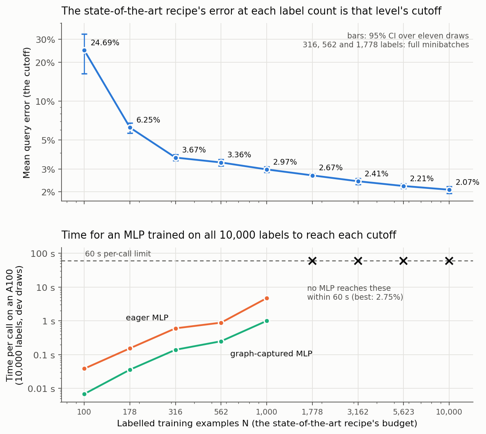

# Cutoffs from 100 to 10,000 labels on the release, and how fast an MLP reaches each

**Request (2026-09-25, verbatim):** "Generate the table of cutoffs for the state-of-the-art
method. I want cutoffs achievable with 100 examples, up to 10,000 examples the number of
examples increasing geometrically or exponentially and after that. Give me the times it takes
some MLP to achieve these cutoffs if they're achievable."

Read as: the error the state-of-the-art recipe reaches with N labels, for nine label counts
N = round(100 * 10^(i/4)) from 100 to 10,000 (four per decade), each error being that level's
cutoff; then, for every cutoff, the shortest time in which an MLP trained on all 10,000 labels
(what a competition entrant gets) reaches it on an A100, if any MLP does within the harness's
60 s per-call limit. "And after that" is read as introducing the second part; the grid stops at
10,000, the most labels the harness hands an entrant.

**Update, later the same day:** the recommended five cutoffs now come from the recipe trained for
24,000 steps, at 200 to 10,000 labels: 5.40 / 3.40 / 2.70 / 2.30 / 1.90%. See
[Five cutoffs from 200 to 10,000 labels at 24,000 steps](#five-cutoffs-from-200-to-10000-labels-at-24000-steps).
They are the five difficulties of `mnist-a100/` at the repository root.

## Answer

<!-- MAIN_TABLE START -->
| Level | Labels N | Cutoff: mean error | 95% CI | Band, rounded up | Eager MLP | Graph-captured MLP |
| ---: | ---: | ---: | --- | ---: | ---: | ---: |
| 1 | 100 | 24.686% | 16.37-33.01% | 24.70% | 42.2 ms | 8.8 ms |
| 2 | 178 | 6.250% | 5.69-6.81% | 6.25% | 148.7 ms | 43.6 ms |
| 3 | 316 * | 3.668% | 3.47-3.87% | 3.70% | 603.7 ms | 139.8 ms |
| 4 | 562 * | 3.363% | 3.17-3.56% | 3.40% | 890.5 ms | 249.5 ms |
| 5 | 1,000 | 2.971% | 2.83-3.11% | 3.00% | 4,925.3 ms | 1,001.2 ms |
| 6 | 1,778 * | 2.673% | 2.58-2.76% | 2.70% | not reached | not reached |
| 7 | 3,162 * | 2.433% | 2.32-2.55% | 2.45% | not reached | not reached |
| 8 | 5,623 | 2.213% | 2.12-2.31% | 2.25% | not reached | not reached |
| 9 | 10,000 | 2.072% | 1.95-2.20% | 2.10% | not reached | not reached |
<!-- MAIN_TABLE END -->

\* Rerun with every minibatch full, which fixes a batching defect in the recipe (below). MLP
times are the popcorn3 harness's ranked time per call (leaderboard mode, 11 MNIST + 4 hold-out
calls, band set to the cutoff rounded up to 0.01 point), each from one Modal A100-80GB
container. "Not reached": no configuration scores at least 0.15 points below the cutoff on dev
draws within the 60 s limit; the best any reaches is 2.75% error, above all four of these cutoffs.

* **The cutoffs fall from 24.7% error at 100 labels to 2.07% at 10,000.** From 316 labels
  on they are closely and evenly spaced: each quarter-decade more labels lowers the cutoff by
  6-12%.
* **An MLP trained on all 10,000 labels reaches the five loosest cutoffs, up to 1,000 labels.**
  Eager PyTorch needs 42 ms to 4.9 s per call; the same MLPs replayed from a CUDA graph need
  9 ms to 1.0 s. All ten passed the harness with the band set to their cutoff.
* **No MLP reaches the four tightest, from 1,778 labels up.** The best of 236 configurations
  under the 60 s limit scores 2.75% on dev draws, against a 2.67% cutoff at 1,778 labels. The
  recipe that sets those cutoffs is itself a Ladder network (an MLP encoder trained with a
  denoising decoder on the unlabelled test images too) and takes 6 to 9 minutes per fit on a T4.
* **Four cutoffs come from a corrected recipe.** The frozen recipe ended every epoch with one
  small minibatch, which made 316, 562 and 1,778 labels look 0.6-1.4 points easier than they
  are; rerun with full minibatches, the table is monotone (section below). 3,162 labels, rerun
  the same way, did not move.
* **The 100-label cutoff is unreliable.** Three of its eleven draws collapse to 40-45% error.



## The cutoffs

**Recipe.** `ladder-is06-long`, the state-of-the-art finalist of
`../release-ladder-20260924` (its `selection.json`): a transductive Ladder network
(60-1000-500-250-250-250-10, noise 0.3, input scale 0.6, reconstruction weight 2000,
lr 0.002, batch 250, 12,000 steps at every level) that also uses the 10,000 unlabelled query
images. It was fixed in advance; the one change made after seeing this study's results, the
batching correction below, is disclosed there.

**Protocol.** Unchanged from `../release-ladder-20260924` (`study.py` is a copy with nine
levels instead of five): eleven final seeds 2026092401-2026092411, 10,000 query rows per draw
from the other half of the pool, nested training prefixes, and the release fitted on each
level's own N training rows, as the harness would at `train=N`. Each level's cutoff is the
pooled query error over the eleven draws (110,000 queries); the interval is a Student-t 95% CI
over the eleven per-draw errors; the band rounds the cutoff up to the next 0.05 point.

**Reuse.** N = 10,000 was not refitted: the earlier study ran the same recipe with the same
learner seed on the same eleven seeds, and all eleven jobs' input hashes (inputs, training
rows, query rows) equal this study's, checked before any fit. Its levels 500, 1,057, 2,236 and
4,729 appear in `analysis/cutoffs.md` as points between this grid's levels; 1,057 carries the
batching defect described below (a 57-row last minibatch).

**Run.** 88 fits (8 levels x 11 seeds) on 8 T4s, 345-457 s each, none truncated, all
transductive; predictions frozen before any label was read (`predictions/final_freeze.json`),
then `score.py --stage final`. The rerun in `full-batches/`: 33 fits on 7 T4s, 387-525 s each,
none truncated, frozen and scored the same way.

## A batching defect, found and fixed

The frozen recipe walks each epoch's shuffle in minibatches of 250, so a level that is not a
multiple of 250 ends every epoch with one small minibatch. The Ladder normalises with batch
statistics, and a small batch makes that step much noisier. The scored table was not monotone
in N: 1,778 labels scored 3.276% against 2.971% at 1,000, worse on all eleven seeds, and every
level whose last minibatch was 66 rows or fewer (316, 562, 1,057 and 1,778, across both
studies) sat above the trend of its neighbours.

`full-batches/` reruns the three grid levels with the smallest last minibatch, with one change
(`full_batches=True` in its `neural.py`): each epoch's shuffle is padded with rows from a
second shuffle, so every minibatch has 250 labelled rows. At 100, 178, 1,000 and 10,000 labels
the change does nothing, not even to the random stream (checked bit for bit at 1,000), so those
cutoffs stand as scored.

<!-- FIX_TABLE START -->
| Labels N | Last minibatch, frozen recipe | Frozen recipe | Full batches | Change |
| ---: | ---: | ---: | ---: | ---: |
| 316 | 66 rows | 5.102% | 3.668% | -1.434 pp |
| 562 | 62 rows | 3.957% | 3.363% | -0.595 pp |
| 1,778 | 28 rows | 3.276% | 2.673% | -0.604 pp |
| 3,162 | 162 rows | 2.408% | 2.433% | +0.025 pp |
<!-- FIX_TABLE END -->

This fix was motivated by final-seed results, which the protocol would normally forbid; it is
disclosed here, it is a mechanical correction rather than a tuned setting, and the frozen
recipe's numbers stay in the tables. 3,162 labels (a 162-row last minibatch) was rerun later
in `full-batches-3162/`, because the five-threshold table below uses it: 2.433% against 2.408%,
no change beyond noise, so a last batch of more than half a batch does no measurable harm.
5,623 labels (123 rows) was not rerun; its frozen-recipe value stands.

## The 100-label level is unstable

Eight of the eleven draws land at 14.1-21.2% error; three collapse to 39.8%, 45.4% and 45.4%,
which is why the mean is 24.7% with a 12.4-point standard deviation (median 19.4%). Class
counts do not explain it: the collapsed draws have 4-7 labels in their rarest class, like the
others. What every 100-label draw shares is a release fitted on 100 rows: the query features
come out 1.3 to 4 times wider than the unit-variance training features. Treat this level's
cutoff as unreliable; as a board band it is loose enough that any learner clears it.

## How fast an MLP reaches each cutoff

**Family** (`mlp_timing/mlp_family.py`): K batched 60-W-W-10 ReLU MLPs trained together on all
10,000 labelled rows and averaged, generalising the popcorn3 reference entry
`submissions/mlp_ensemble.py`: dropout 0.1, input noise 0.3, label smoothing 0.1, AdamW with
learning rate 2e-3 x sqrt(batch/128), warm-up then cosine decay, EMA weights. Four knobs: K in
{1, 4, 16} (plus 32 and 64 for long runs), width W in {256, 1024} (plus 2048), steps S from 25
to 25,600, batch B in {128, 512} (plus 256). Two implementations of the same MLPs:

* **eager**, plain PyTorch, one kernel launch at a time; and
* **graph-captured**: the whole training step (forward, backward, fused AdamW, EMA) is captured
  once in a CUDA graph during the harness's untimed warm-up and replayed S times; batches are
  sampled with replacement, and every call re-initialises weights, optimiser state and random
  streams in place, so nothing learned is carried between calls.

**Sweep** (`mlp_timing/sweep.py`): every configuration on five dev draws (popcorn3
`reference.Pool`, fresh seeds, never the final seeds), timed harness-style after one untimed
warm-up, all eager configurations in one A100-80GB container and all graph-captured ones in
another. The eager container's GPU (SXM4) held its top clock, 1,410 MHz; the graph-captured
container's GPU (PCIe) ran at its 300 W power cap, median 1,335 MHz, so its GPU-bound
configurations are slightly pessimistic. On three eager configurations run in both containers,
the second was 7% faster (ratios 0.93-0.99), so the launch-bound times compare fairly.

**Rule** (frozen before any cutoff was known, `protocol.draft.json`): for each cutoff, the
fastest configuration whose dev error is at least 0.15 points below it, within 60 s per call;
then confirmed in the popcorn3 harness with the band set to the cutoff rounded up to 0.01
point. The graph-captured family was added after the eager sweep had started, still before any
cutoff was known; the same rule picks within each family. Every pick passed on the first try.

<!-- MLP_TABLE START -->
| Labels N | Band | Family | Configuration | Dev error | Dev time | Harness: verdict, MNIST accuracy, ranked time |
| ---: | ---: | --- | --- | ---: | ---: | --- |
| 100 | 24.69% | eager | `mlp-k1-w256-s25-b128` | 19.84% | 39 ms | pass, 79.63% (87,597/110,000), 42.2 ms |
| 100 | 24.69% | graphed | `mlpg-k1-w256-s25-b128` | 20.09% | 7 ms | pass, 78.60% (86,459/110,000), 8.8 ms |
| 178 | 6.25% | eager | `mlp-k1-w1024-s100-b512` | 5.22% | 154 ms | pass, 94.69% (104,160/110,000), 148.7 ms |
| 178 | 6.25% | graphed | `mlpg-k1-w1024-s100-b512` | 5.34% | 36 ms | pass, 94.96% (104,453/110,000), 43.6 ms |
| 316 | 3.67% | eager | `mlp-k1-w1024-s400-b512` | 3.36% | 601 ms | pass, 96.72% (106,397/110,000), 603.7 ms |
| 316 | 3.67% | graphed | `mlpg-k1-w1024-s400-b512` | 3.37% | 139 ms | pass, 96.84% (106,524/110,000), 139.8 ms |
| 562 | 3.37% | eager | `mlp-k16-w1024-s400-b512` | 3.21% | 886 ms | pass, 96.94% (106,629/110,000), 890.5 ms |
| 562 | 3.37% | graphed | `mlpg-k4-w256-s800-b512` | 3.20% | 250 ms | pass, 96.78% (106,463/110,000), 249.5 ms |
| 1,000 | 2.98% | eager | `mlp-k16-w256-s3200-b512` | 2.76% | 4,711 ms | pass, 97.14% (106,851/110,000), 4,925.3 ms |
| 1,000 | 2.98% | graphed | `mlpg-k4-w256-s3200-b512` | 2.82% | 1,001 ms | pass, 97.21% (106,929/110,000), 1,001.2 ms |
<!-- MLP_TABLE END -->

Launch overhead dominates the eager MLPs: about 1.5 ms per training step whatever the model
size, so their time is set by the step count. Graph capture removes most of it: the same
accuracy costs 3-6 times less time up to 16 networks of width 256, and nothing at 64 networks
of width 1024, where the GPU does real work. The best MLP found under 60 s is 16 networks of
width 256 at 3,200 steps of 512: 2.75% dev error, 1.64 s graph-captured or 4.71 s eager. More
networks, width or steps did not go lower. Timing caveat: the same entry's time differs by up
to a quarter between Modal A100-80GB hosts (popcorn3 `README.md`), so treat a single time as
plus or minus 13%.

## Five thresholds for the competition, with Ladder and MLP times

Requested 2026-09-25: five thresholds from 100 to 10,000 labels, with the time the state-of-the-art
Ladder and an MLP each need to reach them. They are every other grid level
(N = round(100 * 10^(i/2))). The Ladder column is the recipe trained on all 10,000 labels at
eight step budgets on five Modal A100-80GB hosts (`ladder_timing/`), on the same five dev draws
as the MLP sweep: the time at which its pooled error reaches the cutoff, interpolated between the
two measured budgets that bracket it (`ladder_timing/summarize.py`), on the median host. MLP
times are the harness-confirmed ones above.

<!-- FIVE_TABLE START -->
| Level | Labels N | Cutoff | Band | Ladder, 10,000 labels | MLP, eager | MLP, graph-captured |
| ---: | ---: | ---: | ---: | ---: | ---: | ---: |
| 1 | 100 | 24.686% | 24.70% | at most 2.5 s (100 steps) | 42 ms | 9 ms |
| 2 | 316 | 3.668% | 3.70% | about 40.8 s (about 2,000 steps) | 604 ms | 140 ms |
| 3 | 1,000 | 2.971% | 3.00% | about 71.3 s (about 3,600 steps) | 4.9 s | 1.0 s |
| 4 | 3,162 | 2.433% | 2.45% | about 133.0 s (about 6,700 steps) | not reached | not reached |
| 5 | 10,000 | 2.072% | 2.10% | 241.0 s at 12,000 steps (sets it) | not reached | not reached |
<!-- FIVE_TABLE END -->

* **MLPs own the three loosest thresholds.** Graph-captured, they are 70 to 290 times faster
  than the Ladder there, because the Ladder spends 10-27 ms on every training step.
* **Only the Ladder reaches the top two, and not within 60 s.** On the median host it needs
  about 133 s and 241 s; over the harness's per-call limit, those boards start empty.
* **Host speed spans more than two to one.** The same eager MLP call took 2.8 s on the fastest
  of the five A100-80GB hosts and 6.5 s on the slowest; three of the five held the GPU at its
  1,155 MHz application clock, the other two ran at 1,410 MHz on faster CPUs. The Ladder's
  12,000-step fit took 125-319 s across the same hosts. This is wider than the 26% popcorn3's
  README reports from eight earlier containers.

Report page (private): https://spacesheep.dev/@yaroslavvb/mnist-medium-five-cutoffs

## Can anything reach 2% error?

Asked 2026-09-25. Pre-registered in `below-2pct/protocol.draft.json` before any fit, and
scored on the same eleven final seeds that set the cutoffs: an equal-weight ensemble of the
recipe at learner seeds 11, 12 and 13 (softmax averaged, the earlier study's rule), and the
recipe trained for 24,000 steps instead of 12,000; secondary, the two-seed and four-member
ensembles and the new seeds alone. Seed 11's member is the earlier study's frozen predictions,
hash-checked against its freeze (`below-2pct/score_ensembles.py`).

<!-- BELOW_TABLE START -->
| Candidate, N = 10,000 labels | Pooled error | 95% CI | SD (pp) | At or below 2.00% |
| --- | ---: | --- | ---: | --- |
| single s11 (the recipe, 12,000 steps) | 2.072% | 1.945-2.198% | 0.188 | no |
| single s12 | 2.102% | 1.985-2.219% | 0.174 | no |
| single s13 | 2.078% | 1.968-2.188% | 0.164 | no |
| xlong: 24,000 steps, seed 11 (primary) | 1.870% | 1.737-2.003% | 0.198 | yes |
| ens2: seeds 11+12 | 1.995% | 1.868-2.121% | 0.188 | yes |
| ens3: seeds 11+12+13 (primary) | 1.944% | 1.837-2.050% | 0.159 | yes |
| ens4: ens3 + xlong | 1.890% | 1.775-2.005% | 0.171 | yes |
<!-- BELOW_TABLE END -->

* **Yes, and both pre-registered candidates reach it.** Training the recipe for 24,000 steps
  gives 1.870%, a paired change of −0.202 points against the 12,000-step recipe (95% CI −0.252
  to −0.152), better on all 11 draws. Averaging three learner seeds gives 1.944%, −0.128 points
  (−0.188 to −0.068), also better on all 11. The seed-11 row reproduces the published 2.0718%.
* **Neither fits the harness.** On T4s the long run took 705-841 s per fit and each ensemble
  member 336-417 s. From the A100 timing sweep (12,000 steps, median host 241 s), the long run
  would need about 8 minutes per call and the ensemble about 12, against a 60 s limit.
* **So the 12,000-step cutoffs were a little loose.** The next section refits them at 24,000 steps.
* **Spend.** Billed $4.54 in all (`below-2pct/budget-ledger.json` bounded it at $4.97), within
  the $10 assumed for this request.

Report pages (private): https://spacesheep.dev/@yaroslavvb/mnist-medium-five-cutoffs and, for the
anti-smuggling measures, https://spacesheep.dev/@yaroslavvb/mnist-medium-anti-smuggling

## Five cutoffs from 200 to 10,000 labels at 24,000 steps

Requested 2026-09-25: "Can you update [the five-cutoffs page] With cutoffs after rerunning for 24k
steps", amended before any fit: "make the bottom cutoff at 200 examples and top cutoff at 'achievable
by sota at 10k examples'". Levels N = round(200 * 50^(i/4)) = 200, 532, 1,414, 3,761, 10,000. The
recipe is `ladder-is06-long` with full minibatches, trained 24,000 steps, learner seed 11
(`ladder-xlong-s11`), on the same eleven final draws. Level 5 is the `below-2pct/` run itself
(1.870%). Levels 1-4 were fitted in `cutoffs-24k/`, whose selection, authorization (including both
amendments) and protocol were frozen before its first fit: 44 fits on 8 T4s, 705-912 s each, none
truncated. `cutoffs24k.py` computes the table with the same statistics and band rule as
`cutoffs.py`. Ladder times come from the 12,000-step timing sweep on all 10,000 labels
(`ladder_timing/summarize.py --cutoffs analysis/cutoffs-24k.json`). Level 5's time is an estimate:
twice the measured 12,000-step time on the median host, since the sweep's per-step cost is flat from
4,000 steps on. MLP picks use the same rule as before (`mlp_timing/analyze.py --suffix=-24k`), and each pick was confirmed
in the popcorn3 harness at the cutoff rounded up to 1 basis point
(`mlp_timing/confirm.py --picks results/picks-24k.json --tag 24k-`).

<!-- LONG_TABLE START -->
| Level | Labels N | Cutoff | 95% CI | Band | Ladder, 10,000 labels | MLP, eager | MLP, graph-captured |
| ---: | ---: | ---: | --- | ---: | ---: | ---: | ---: |
| 1 | 200 | 5.394% | 4.67-6.12% | 5.40% | about 17.0 s (about 900 steps) | 148 ms | 61 ms |
| 2 | 532 | 3.361% | 3.07-3.65% | 3.40% | about 52.2 s (about 2,600 steps) | 887 ms | 250 ms |
| 3 | 1,414 | 2.666% | 2.53-2.80% | 2.70% | about 98.5 s (about 4,900 steps) | not reached | not reached |
| 4 | 3,761 | 2.254% | 2.15-2.36% | 2.30% | about 171.3 s (about 8,600 steps) | not reached | not reached |
| 5 | 10,000 | 1.870% | 1.74-2.00% | 1.90% | about 482.1 s at 24,000 steps (sets it; estimate) | not reached | not reached |
<!-- LONG_TABLE END -->

* **MLPs reach two levels, the Ladder alone the other three.** Graph-captured MLPs clear 200 and
  532 labels in 61 and 250 ms per call. From 1,414 labels up, only the Ladder does, in about 99 s,
  171 s and 482 s, all over the harness's 60 s per-call limit.
* **Every cutoff is at or below the 12,000-step curve.** Interpolated log-log between its levels,
  the 12,000-step curve gives 5.61 / 3.39 / 2.79 / 2.36% at the first four levels; only 10,000 labels
  has a paired comparison (−0.20 points, 11 of 11 draws). At 532 labels the difference, 0.03 points,
  is well inside the noise.
* **Level 1 is stable.** Ten of its eleven draws fall between 4.3% and 6.0%, and one is at 8.2%. At
  100 labels, three of eleven collapsed to 40% or more.
* **Level 5 has little slack.** Its band sits 0.03 points above the Ladder's own error. As a normal
  approximation that counts the cutoff's own uncertainty, a rerun of the Ladder judged on eleven
  draws would qualify about 64% of the time; a 2.00% band raises that to about 94%.

<!-- LONG_MLP_TABLE START -->
| Labels N | Band | Family | Configuration | Dev error | Dev time | Harness: verdict, MNIST accuracy, ranked time |
| ---: | ---: | --- | --- | ---: | ---: | --- |
| 200 | 5.40% | eager | `mlp-k1-w1024-s100-b512` | 5.22% | 154 ms | pass, 94.77% (104,245/110,000), 147.6 ms |
| 200 | 5.40% | graphed | `mlpg-k1-w256-s200-b512` | 4.96% | 50 ms | pass, 95.07% (104,576/110,000), 61.1 ms |
| 532 | 3.37% | eager | `mlp-k16-w1024-s400-b512` | 3.21% | 886 ms | pass, 96.84% (106,528/110,000), 887.2 ms |
| 532 | 3.37% | graphed | `mlpg-k4-w256-s800-b512` | 3.20% | 250 ms | pass, 96.92% (106,616/110,000), 250.2 ms |
<!-- LONG_MLP_TABLE END -->

Spend: $7.59 billed through 23:59 UTC for the 44 fits; the ledger bounds the run at $9.42
(`cutoffs-24k/budget-ledger.json`). No budget was stated; the $10 of the previous requests was
assumed. The two harness confirmations bill after 00:00 UTC (about $0.15 from the earlier ten).

Report page (private): https://spacesheep.dev/@yaroslavvb/mnist-medium-five-cutoffs

## Spend

Modal's billing report (`modal billing report`, hourly, complete intervals through 16:00 UTC),
against an assumed $20 cap: this request stated no budget, so the $20 of the 2026-09-24 request
for the same kind of work applies (`authorization.json`).

| Run | Modal app | Billed |
| --- | --- | ---: |
| Ladder fits, 88 on 8 T4s | `release-cutoffs-20260925` | $8.86 |
| Full-batch rerun, 33 on 7 T4s | `release-cutoffs-20260925-full-batches` | $3.62 |
| MLP sweeps, eager and graph-captured, plus a check and one failed launch | `release-cutoffs-mlp-timing` | $4.01 |
| Harness confirmations, five runs of two files | `sutro-mnist-popcorn3` | $0.55 |
| Total, first request | | $17.04 |
| Full-batch rerun at 3,162, 11 on 6 T4s (second request, $10 cap) | `release-cutoffs-20260925-full-batches-3162` | $1.11 |
| Ladder timing, 5 A100-80GB hosts (second request) | `release-cutoffs-ladder-timing` | $1.86 |
| Total, second request, billed through 17:00 UTC | | $2.97 |

The second request's two runs ran a minute or two past 17:00 UTC; that tail bills in the next
hourly interval and is under $0.30.

The ledgers (`budget-ledger.json`, `full-batches/budget-ledger.json`) are upper-envelope
reservations, not invoices: $9.16 and $3.80 charged.

## Reproduce

```bash
cd mnist/experiments/release-cutoffs-20260925
/tmp/penv/bin/python study.py --prepare                     # pool arrays, manifest
/tmp/penv/bin/python plan.py final --selection selection.json
#   plans/final_gpu.json = plans/final.json minus the eleven N=10,000 jobs (reused)
/tmp/penv/bin/python runner.py --plan plans/final_gpu.json --gpu t4 --gpus 8 --minutes 95
/tmp/penv/bin/python score.py --freeze-final --plan plans/final_gpu.json
/tmp/penv/bin/python score.py --stage final
(cd full-batches && /tmp/penv/bin/python study.py --prepare && \
  /tmp/penv/bin/python plan.py final --selection selection.json && \
  /tmp/penv/bin/python runner.py --plan plans/final_gpu.json --gpu t4 --gpus 7 --minutes 42 && \
  /tmp/penv/bin/python score.py --freeze-final --plan plans/final_gpu.json && \
  /tmp/penv/bin/python score.py --stage final)             # plans/final_gpu.json keeps N = 316, 562, 1778
/tmp/penv/bin/python cutoffs.py                            # analysis/cutoffs.json, .md
cd mlp_timing
/tmp/penv/bin/python sweep.py --out results/sweep.json
/tmp/penv/bin/python sweep.py --family graphed --extra mlp-k1-w256-s400-b128,mlp-k1-w256-s800-b128,mlp-k16-w1024-s3200-b128 \
    --out results/sweep-graphed.json
/tmp/penv/bin/python analyze.py                            # results/picks.json, submissions/
/tmp/penv/bin/python confirm.py                            # popcorn3 harness, band = cutoff
cd .. && /tmp/penv/bin/python report_tables.py && /tmp/penv/bin/python analysis/figure.py

(cd full-batches-3162 && /tmp/penv/bin/python study.py --prepare && \
  /tmp/penv/bin/python plan.py final --selection selection.json && \
  /tmp/penv/bin/python runner.py --plan plans/final_gpu.json --gpu t4 --gpus 6 --minutes 24 && \
  /tmp/penv/bin/python score.py --freeze-final --plan plans/final_gpu.json && \
  /tmp/penv/bin/python score.py --stage final)             # plans/final_gpu.json keeps N = 3162
(cd ladder_timing && /tmp/penv/bin/python ladder_sweep.py --out results/ladder-sweep.json && \
  /tmp/penv/bin/python summarize.py)
(cd below-2pct && /tmp/penv/bin/python study.py --prepare && \
  /tmp/penv/bin/python plan.py final --selection selection.json && \
  /tmp/penv/bin/python runner.py --plan plans/final_gpu.json --gpu t4 --gpus 8 --minutes 48 && \
  /tmp/penv/bin/python score.py --freeze-final --plan plans/final_gpu.json && \
  /tmp/penv/bin/python score.py --stage final && /tmp/penv/bin/python score_ensembles.py)

(cd cutoffs-24k && /tmp/penv/bin/python study.py --prepare --force && \
  /tmp/penv/bin/python plan.py final --selection selection.json && \
  /tmp/penv/bin/python runner.py --plan plans/final_gpu.json --gpu t4 --gpus 8 --minutes 92 && \
  /tmp/penv/bin/python score.py --freeze-final --plan plans/final_gpu.json && \
  /tmp/penv/bin/python score.py --stage final)             # plans/final_gpu.json keeps N = 200, 532, 1414, 3761
/tmp/penv/bin/python cutoffs24k.py                         # analysis/cutoffs-24k.json, .md (10,000 from below-2pct/)
(cd ladder_timing && /tmp/penv/bin/python summarize.py --cutoffs ../analysis/cutoffs-24k.json --out results/summary-24k.json)
(cd mlp_timing && /tmp/penv/bin/python analyze.py --cutoffs ../analysis/cutoffs-24k.json --suffix=-24k && \
  /tmp/penv/bin/python confirm.py --picks results/picks-24k.json --tag 24k-)
/tmp/penv/bin/python report_tables.py

# tests: 172, CPU only, under a minute
/tmp/penv/bin/python -m pytest -q test_study.py test_neural.py test_kernels.py
(cd full-batches && /tmp/penv/bin/python -m pytest -q test_full_batches.py)
```

## Files

* `analysis/cutoffs.md`, `.json`: the cutoff table, per-draw errors, the between-grid points.
* `analysis/figures/cutoffs.png`: cutoffs and MLP times against labels.
* `mlp_timing/results/`: both sweeps, picks, the frontier, and every harness confirmation.
* `mlp_timing/submissions/`: the chosen MLPs as harness-ready files.
* `full-batches/`, `full-batches-3162/`: the reruns with full minibatches, each with its own
  protocol, ledger and scores.
* `ladder_timing/`: the Ladder at eight step budgets with all 10,000 labels on five A100-80GB
  hosts, and its summary.
* `below-2pct/`: the pre-registered attempts at 2% (two more learner seeds, a 24,000-step run),
  their ledger, freeze and scores, and `score_ensembles.py`.
* `cutoffs-24k/`: the 24,000-step recipe at 200, 532, 1,414 and 3,761 labels, with its own
  selection, authorization, protocol, ledger, freeze and scores; `analysis/cutoffs-24k.md`, `.json`.
* `authorization.json`, `protocol.draft.json`, `selection.json`, `budget-ledger.json`: frozen
  records; `results/`, `predictions/`, `logs/`: the scored run (do not edit).
