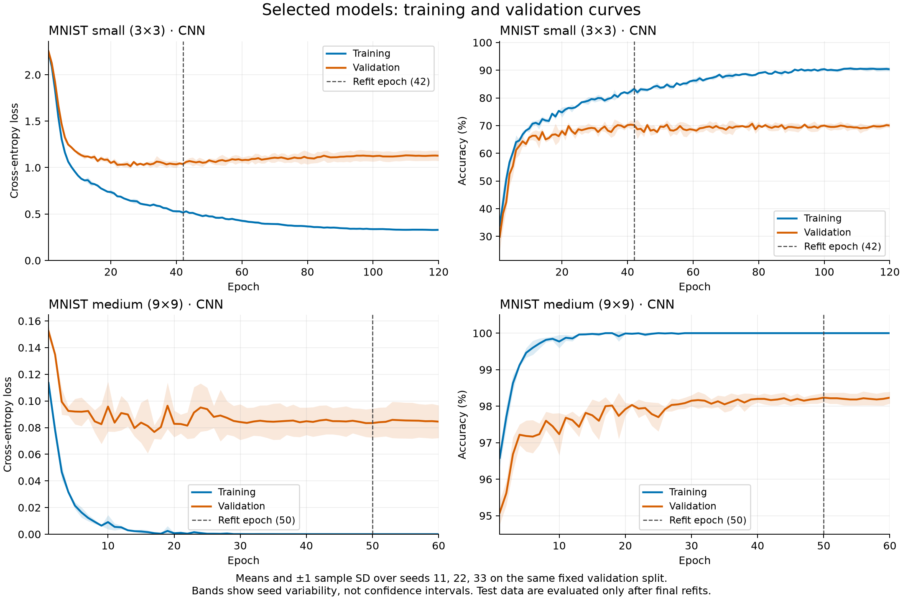
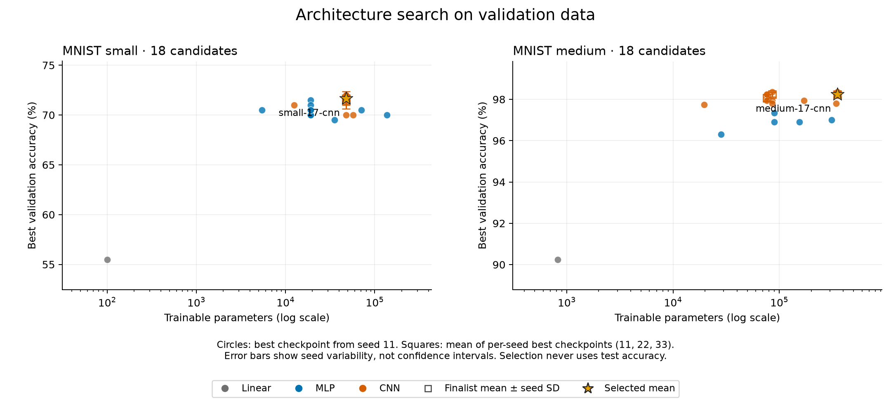
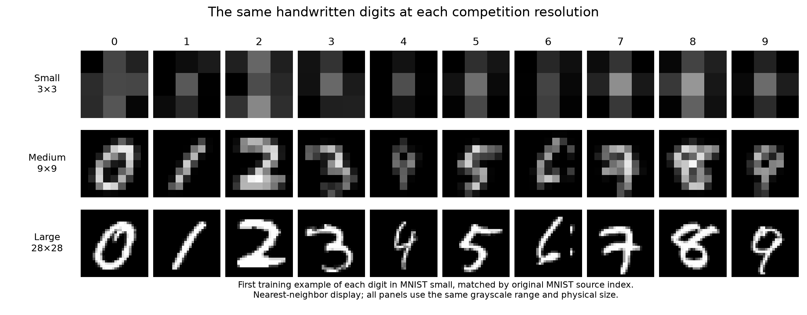

# MNIST competition tiers and tuned baselines

**Historical reference experiment:** small uses 1,000/1,000 and medium uses
10,000/10,000 examples from separate official train/test splits. These results
do not measure the current 600/600 and 6,000/6,000 problems, whose train and test
examples both come from the original training pool. See the
[current problem specification](../../../README.md) and the
[historical dataset manifest](../dataset_manifest.json).

Experiment group: `mnist-20260910`. 54 completed training runs across small and medium.

## Datasets

| Tier | Image size | Training examples | Test examples | Tuning fit / validation |
|---|---:|---:|---:|---:|
| MNIST small | 3×3 | 1,000 | 1,000 | 800 / 200 |
| MNIST medium | 9×9 | 10,000 | 10,000 | 8,000 / 2,000 |
| MNIST large | 28×28 | 60,000 | 10,000 | Not tuned |

Small and medium are sampled without replacement using dataset seed 20260910. Training and test are independent permutations of their official MNIST splits; tiers use nested prefixes. Medium includes all 10,000 official test examples in randomized order. Large uses all 60,000 training and 10,000 test examples at the original resolution; this report tunes models only for small and medium.

Pixels are float32 in [0, 1]. Downsampling uses exact separable box-area averaging, including fractional input-pixel overlap. Each run standardizes using only the examples it fits. The final refit computes normalization from the entire training tier.

The download mirror and source checksums follow the [torchvision MNIST implementation](https://github.com/pytorch/vision/blob/main/torchvision/datasets/mnist.py).

## Results

| Tier | Selected architecture | Parameters | Validation accuracy (%) | Final test accuracy (%) | Refit epochs |
|---|---|---:|---:|---:|---:|
| MNIST small | CNN | 47,914 | 71.67 ± 0.29 | 73.47 ± 0.70 | 42 |
| MNIST medium | CNN | 352,106 | 98.25 ± 0.13 | 98.14 ± 0.08 | 50 |

Values are mean ± sample standard deviation across three training seeds. Validation uses seeds 11, 22, 33 on one fixed split; final test uses independently refitted seeds 101, 102, 103 on the same test examples. These are measures of seed variability, not confidence intervals or uncertainty over newly sampled datasets. Final models are scored separately; no ensemble is used. Validation accuracy is a tuning result, not an unbiased performance estimate.

## Selection protocol

1. Hold out a fixed, stratified 20% of each training tier (split seed 4701).
2. Run all predefined architecture and hyperparameter candidates with seed 11. Rank by best validation accuracy, then validation loss, then parameter count.
3. Repeat the best three candidates with seeds 22 and 33. Select by mean per-seed best validation accuracy, then mean validation loss, then parameter count.
4. Freeze the selected configuration and the median best-checkpoint epoch before opening test arrays. Refit on the entire training tier with seeds 101, 102, 103; evaluate each model on test once after its fixed stopping epoch.

All runs use AdamW, a cosine learning-rate schedule ending at 2% of initial learning rate, float32, deterministic PyTorch algorithms, and no data augmentation. Final refits keep the original schedule duration and stop at the selected epoch. Search varies architecture, width, depth, dropout, learning rate, weight decay, batch size, and (for medium CNNs) pooling.

Training and validation loss/accuracy are logged every epoch; test metrics are logged only at the end of final refits. W&B records the run configuration, scalar histories, and final model artifacts through its [logging API](https://docs.wandb.ai/models/track/log).

## MNIST small

Selected trial: `small-17-cnn`.

2 same-padded 3×3 convolutions of width 32, each without convolution bias and followed by BatchNorm and GELU. No pooling. Flatten → linear 128 → GELU → dropout 0.1 → linear 10 logits.

Learning rate `0.001`; weight decay `0.001`; batch size `128`; search duration `120` epochs; final refit `42` epochs.

Completed runs: 18 initial candidates, 6 finalist replications, and 3 final refits.

### Finalist comparison

| Trial | Parameters | Validation accuracy (%) | Mean validation loss | Median best epoch |
|---|---:|---:|---:|---:|
| `small-17-cnn` **selected** | 47,914 | 71.67 ± 0.29 | 1.0509 | 42 |
| `small-12-cnn` | 47,914 | 71.50 ± 0.50 | 1.0354 | 32 |
| `small-14-cnn` | 47,914 | 71.50 ± 0.87 | 1.2181 | 20 |

### Selected validation runs

| Seed | Best validation accuracy | Validation loss at best checkpoint | Best epoch | W&B |
|---:|---:|---:|---:|---|
| 11 | 72.00% | 1.0490 | 43 | [Run](https://wandb.ai/yaroslavvb/sutro-mnist-tiers/runs/j944x114) |
| 22 | 71.50% | 1.0464 | 42 | [Run](https://wandb.ai/yaroslavvb/sutro-mnist-tiers/runs/oeu61qu3) |
| 33 | 71.50% | 1.0574 | 41 | [Run](https://wandb.ai/yaroslavvb/sutro-mnist-tiers/runs/kxvz3zih) |

### Final test evaluations

| Seed | Test accuracy | Test cross-entropy loss | Refit epochs | W&B |
|---:|---:|---:|---:|---|
| 101 | 73.40% | 0.8707 | 42 | [Run and model artifact](https://wandb.ai/yaroslavvb/sutro-mnist-tiers/runs/i74bfmk3) |
| 102 | 74.20% | 0.8948 | 42 | [Run and model artifact](https://wandb.ai/yaroslavvb/sutro-mnist-tiers/runs/m9xpcern) |
| 103 | 72.80% | 0.8822 | 42 | [Run and model artifact](https://wandb.ai/yaroslavvb/sutro-mnist-tiers/runs/tvie0dtp) |

### All tuning runs

| Trial | Phase | Seed | Parameters | Best validation accuracy | Best epoch | W&B |
|---|---|---:|---:|---:|---:|---|
| `small-00-linear` | search | 11 | 100 | 55.50% | 35 | [Run](https://wandb.ai/yaroslavvb/sutro-mnist-tiers/runs/3lwobvw3) |
| `small-01-mlp` | search | 11 | 5,450 | 70.50% | 57 | [Run](https://wandb.ai/yaroslavvb/sutro-mnist-tiers/runs/pm5l56hk) |
| `small-02-mlp` | search | 11 | 19,082 | 70.00% | 43 | [Run](https://wandb.ai/yaroslavvb/sutro-mnist-tiers/runs/kddgnz6c) |
| `small-03-mlp` | search | 11 | 70,922 | 70.50% | 18 | [Run](https://wandb.ai/yaroslavvb/sutro-mnist-tiers/runs/vozixm6l) |
| `small-04-mlp` | search | 11 | 35,594 | 69.50% | 72 | [Run](https://wandb.ai/yaroslavvb/sutro-mnist-tiers/runs/ff51106d) |
| `small-05-mlp` | search | 11 | 136,714 | 70.00% | 61 | [Run](https://wandb.ai/yaroslavvb/sutro-mnist-tiers/runs/lulx1dnz) |
| `small-06-mlp` | search | 11 | 19,082 | 71.50% | 52 | [Run](https://wandb.ai/yaroslavvb/sutro-mnist-tiers/runs/ms9qfblx) |
| `small-07-mlp` | search | 11 | 19,082 | 71.00% | 49 | [Run](https://wandb.ai/yaroslavvb/sutro-mnist-tiers/runs/rcvwcl1z) |
| `small-08-mlp` | search | 11 | 19,082 | 70.50% | 117 | [Run](https://wandb.ai/yaroslavvb/sutro-mnist-tiers/runs/3t8fckf4) |
| `small-09-mlp` | search | 11 | 19,082 | 70.00% | 32 | [Run](https://wandb.ai/yaroslavvb/sutro-mnist-tiers/runs/zzf1z5d6) |
| `small-10-mlp` | search | 11 | 19,082 | 70.50% | 78 | [Run](https://wandb.ai/yaroslavvb/sutro-mnist-tiers/runs/86pd6di6) |
| `small-11-cnn` | search | 11 | 12,442 | 71.00% | 43 | [Run](https://wandb.ai/yaroslavvb/sutro-mnist-tiers/runs/z5y54t6e) |
| `small-12-cnn` | search | 11 | 47,914 | 72.00% | 32 | [Run](https://wandb.ai/yaroslavvb/sutro-mnist-tiers/runs/bs7vl0jq) |
| `small-13-cnn` | search | 11 | 47,914 | 71.50% | 24 | [Run](https://wandb.ai/yaroslavvb/sutro-mnist-tiers/runs/f8z1zkxo) |
| `small-14-cnn` | search | 11 | 47,914 | 72.00% | 20 | [Run](https://wandb.ai/yaroslavvb/sutro-mnist-tiers/runs/652ykzdd) |
| `small-15-cnn` | search | 11 | 57,194 | 70.00% | 19 | [Run](https://wandb.ai/yaroslavvb/sutro-mnist-tiers/runs/fbmdhif4) |
| `small-16-cnn` | search | 11 | 47,914 | 70.00% | 58 | [Run](https://wandb.ai/yaroslavvb/sutro-mnist-tiers/runs/gljkmkui) |
| `small-17-cnn` | search | 11 | 47,914 | 72.00% | 43 | [Run](https://wandb.ai/yaroslavvb/sutro-mnist-tiers/runs/j944x114) |
| `small-12-cnn` | replicate | 22 | 47,914 | 71.50% | 35 | [Run](https://wandb.ai/yaroslavvb/sutro-mnist-tiers/runs/omfwedgb) |
| `small-12-cnn` | replicate | 33 | 47,914 | 71.00% | 19 | [Run](https://wandb.ai/yaroslavvb/sutro-mnist-tiers/runs/3f5xqn0d) |
| `small-17-cnn` | replicate | 22 | 47,914 | 71.50% | 42 | [Run](https://wandb.ai/yaroslavvb/sutro-mnist-tiers/runs/oeu61qu3) |
| `small-17-cnn` | replicate | 33 | 47,914 | 71.50% | 41 | [Run](https://wandb.ai/yaroslavvb/sutro-mnist-tiers/runs/kxvz3zih) |
| `small-14-cnn` | replicate | 22 | 47,914 | 70.50% | 56 | [Run](https://wandb.ai/yaroslavvb/sutro-mnist-tiers/runs/gl4uvvch) |
| `small-14-cnn` | replicate | 33 | 47,914 | 72.00% | 16 | [Run](https://wandb.ai/yaroslavvb/sutro-mnist-tiers/runs/j0xvezpm) |

### Provenance

Dataset archive SHA-256: `b5cab1e475c3a6d8d35bf5c27e27bddee55f33baab20c178a50b053b764a78ca`.

Hardware: NVIDIA A100-SXM4-40GB. Python 3.11.15; PyTorch 2.5.1+cu124; NumPy 2.2.6; W&B 0.30.0.

## MNIST medium

Selected trial: `medium-17-cnn`.

3 same-padded 3×3 convolutions of width 32, each without convolution bias and followed by BatchNorm and GELU. No pooling. Flatten → linear 128 → GELU → dropout 0.2 → linear 10 logits.

Learning rate `0.001`; weight decay `0.001`; batch size `128`; search duration `60` epochs; final refit `50` epochs.

Completed runs: 18 initial candidates, 6 finalist replications, and 3 final refits.

### Finalist comparison

| Trial | Parameters | Validation accuracy (%) | Mean validation loss | Median best epoch |
|---|---:|---:|---:|---:|
| `medium-17-cnn` **selected** | 352,106 | 98.25 ± 0.13 | 0.0828 | 50 |
| `medium-12-cnn` | 85,866 | 98.23 ± 0.10 | 0.0962 | 52 |
| `medium-07-cnn` | 76,586 | 98.07 ± 0.18 | 0.0759 | 28 |

### Selected validation runs

| Seed | Best validation accuracy | Validation loss at best checkpoint | Best epoch | W&B |
|---:|---:|---:|---:|---|
| 11 | 98.35% | 0.0735 | 50 | [Run](https://wandb.ai/yaroslavvb/sutro-mnist-tiers/runs/irfm99uw) |
| 22 | 98.30% | 0.0798 | 19 | [Run](https://wandb.ai/yaroslavvb/sutro-mnist-tiers/runs/j5gu9kor) |
| 33 | 98.10% | 0.0951 | 50 | [Run](https://wandb.ai/yaroslavvb/sutro-mnist-tiers/runs/jwrqh8fp) |

### Final test evaluations

| Seed | Test accuracy | Test cross-entropy loss | Refit epochs | W&B |
|---:|---:|---:|---:|---|
| 101 | 98.18% | 0.0845 | 50 | [Run and model artifact](https://wandb.ai/yaroslavvb/sutro-mnist-tiers/runs/b02t0xdi) |
| 102 | 98.19% | 0.0858 | 50 | [Run and model artifact](https://wandb.ai/yaroslavvb/sutro-mnist-tiers/runs/79tnclhp) |
| 103 | 98.05% | 0.0902 | 50 | [Run and model artifact](https://wandb.ai/yaroslavvb/sutro-mnist-tiers/runs/xjmlhkwj) |

### All tuning runs

| Trial | Phase | Seed | Parameters | Best validation accuracy | Best epoch | W&B |
|---|---|---:|---:|---:|---:|---|
| `medium-00-linear` | search | 11 | 820 | 90.25% | 24 | [Run](https://wandb.ai/yaroslavvb/sutro-mnist-tiers/runs/bek3g8ho) |
| `medium-01-mlp` | search | 11 | 28,298 | 96.30% | 46 | [Run](https://wandb.ai/yaroslavvb/sutro-mnist-tiers/runs/bs6vbijg) |
| `medium-02-mlp` | search | 11 | 89,354 | 96.90% | 54 | [Run](https://wandb.ai/yaroslavvb/sutro-mnist-tiers/runs/x0tx8msx) |
| `medium-03-mlp` | search | 11 | 89,354 | 97.35% | 59 | [Run](https://wandb.ai/yaroslavvb/sutro-mnist-tiers/runs/ndlyzey1) |
| `medium-04-mlp` | search | 11 | 155,146 | 96.90% | 25 | [Run](https://wandb.ai/yaroslavvb/sutro-mnist-tiers/runs/np8tle0c) |
| `medium-05-mlp` | search | 11 | 309,770 | 97.00% | 33 | [Run](https://wandb.ai/yaroslavvb/sutro-mnist-tiers/runs/lym1hqxt) |
| `medium-06-cnn` | search | 11 | 19,610 | 97.75% | 44 | [Run](https://wandb.ai/yaroslavvb/sutro-mnist-tiers/runs/6sitxils) |
| `medium-07-cnn` | search | 11 | 76,586 | 98.25% | 28 | [Run](https://wandb.ai/yaroslavvb/sutro-mnist-tiers/runs/cijncjl2) |
| `medium-08-cnn` | search | 11 | 76,586 | 98.05% | 49 | [Run](https://wandb.ai/yaroslavvb/sutro-mnist-tiers/runs/flldr87l) |
| `medium-09-cnn` | search | 11 | 76,586 | 98.10% | 31 | [Run](https://wandb.ai/yaroslavvb/sutro-mnist-tiers/runs/5wi9dh0y) |
| `medium-10-cnn` | search | 11 | 170,938 | 97.95% | 24 | [Run](https://wandb.ai/yaroslavvb/sutro-mnist-tiers/runs/1gq0esed) |
| `medium-11-cnn` | search | 11 | 85,866 | 97.95% | 23 | [Run](https://wandb.ai/yaroslavvb/sutro-mnist-tiers/runs/xgqxi1hy) |
| `medium-12-cnn` | search | 11 | 85,866 | 98.35% | 56 | [Run](https://wandb.ai/yaroslavvb/sutro-mnist-tiers/runs/wgy9572v) |
| `medium-13-cnn` | search | 11 | 76,586 | 98.25% | 44 | [Run](https://wandb.ai/yaroslavvb/sutro-mnist-tiers/runs/xc29rzvd) |
| `medium-14-cnn` | search | 11 | 76,586 | 97.95% | 45 | [Run](https://wandb.ai/yaroslavvb/sutro-mnist-tiers/runs/jvntxsba) |
| `medium-15-cnn` | search | 11 | 86,170 | 97.80% | 32 | [Run](https://wandb.ai/yaroslavvb/sutro-mnist-tiers/runs/ive7rahm) |
| `medium-16-cnn` | search | 11 | 342,826 | 97.80% | 31 | [Run](https://wandb.ai/yaroslavvb/sutro-mnist-tiers/runs/bd3boprn) |
| `medium-17-cnn` | search | 11 | 352,106 | 98.35% | 50 | [Run](https://wandb.ai/yaroslavvb/sutro-mnist-tiers/runs/irfm99uw) |
| `medium-17-cnn` | replicate | 22 | 352,106 | 98.30% | 19 | [Run](https://wandb.ai/yaroslavvb/sutro-mnist-tiers/runs/j5gu9kor) |
| `medium-17-cnn` | replicate | 33 | 352,106 | 98.10% | 50 | [Run](https://wandb.ai/yaroslavvb/sutro-mnist-tiers/runs/jwrqh8fp) |
| `medium-12-cnn` | replicate | 22 | 85,866 | 98.20% | 52 | [Run](https://wandb.ai/yaroslavvb/sutro-mnist-tiers/runs/a4235ke9) |
| `medium-12-cnn` | replicate | 33 | 85,866 | 98.15% | 33 | [Run](https://wandb.ai/yaroslavvb/sutro-mnist-tiers/runs/ykqaf1da) |
| `medium-07-cnn` | replicate | 22 | 76,586 | 97.90% | 13 | [Run](https://wandb.ai/yaroslavvb/sutro-mnist-tiers/runs/gukr0igw) |
| `medium-07-cnn` | replicate | 33 | 76,586 | 98.05% | 42 | [Run](https://wandb.ai/yaroslavvb/sutro-mnist-tiers/runs/1p212513) |

### Provenance

Dataset archive SHA-256: `1c5332004d6ab673aa26594ef73e1937b7ab5fa57da9e88b9169b3e037df2fb2`.

Hardware: NVIDIA A100-SXM4-40GB. Python 3.11.15; PyTorch 2.5.1+cu124; NumPy 2.2.6; W&B 0.30.0.

## Plots and experiment workspace

The curve panels show epoch-aligned means and ±1 sample standard deviation for the selected configuration's three validation runs. They exclude final refit curves, which use more training data and have no validation set. Dashed vertical lines mark the epoch chosen for final refitting. The search plot compares seed-11 best checkpoints and three-seed finalist summaries; test accuracy plays no role in either plot.

[W&B project](https://wandb.ai/yaroslavvb/sutro-mnist-tiers)

