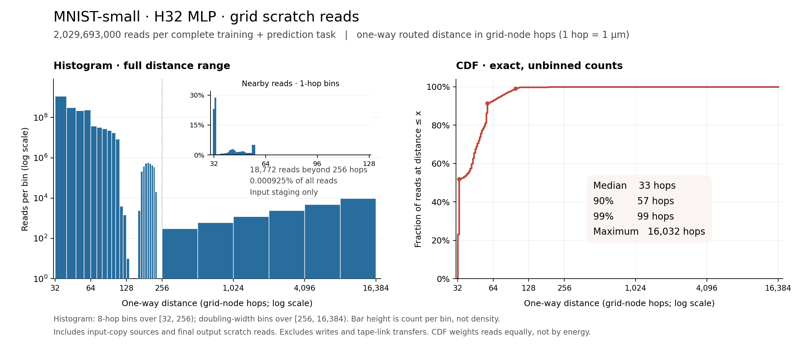

# H32 MLP: MNIST-small, 60% target

Submission date: September 11, 2026 (America/Los_Angeles; evidence timestamps use UTC).
Contributor: Codex, requested by Yaroslav Bulatov.

This fresh submission achieves **67.08% ± 1.54 pp** accuracy over 11 independently
sampled datasets: **7,379 / 11,000** correct, exceeding the 60% target. Each draw
contains 1,000 training and 1,000 disjoint test images, reduced to 3 × 3 pixels
from the official 60,000-image training split. Historical 600/600 measurements
are not used for this result.

The fixed learner is a 9–32–10 ReLU MLP with 650 FP32 parameters (2,600 bytes),
300 epochs of squared-error minibatch SGD, batch size 25, learning rate 0.2, and
initialization seed 101. Training uses the supplied sample order in every epoch.
Each draw starts from fresh seed-only parameters. The architecture and optimizer
come from the prior H32 learner; batch size 25 was selected before test evaluation
to divide the new training size exactly. No hyperparameters were selected using
these test labels.

Pixels are converted to FP32 and divided by 255 before exact separable area
resizing, using the repository generator. The learner then applies `4*x - 0.5`.
Products and additions use ascending-index FP32 reductions without fused
multiply-add. Gradients depend on pre-update weights. Prediction chooses the
first maximal output class. The implementation accepts only training images,
training labels, and test images.

## Accuracy evidence

All 11 predictions were frozen before the separate evaluator read their test
labels. Dataset seeds are 20261201 through 20261211. Each seed independently
permutes the 60,000 source rows using NumPy PCG64; rows 0–999 become training
examples and rows 1000–1999 become test examples. Draws may overlap with other
draws, but training and test rows are disjoint within every draw.

| Draw | Dataset seed | Correct / total | Accuracy |
| ---: | ---: | ---: | ---: |
| 0 | 20261201 | 679 / 1000 | 67.9% |
| 1 | 20261202 | 685 / 1000 | 68.5% |
| 2 | 20261203 | 676 / 1000 | 67.6% |
| 3 | 20261204 | 659 / 1000 | 65.9% |
| 4 | 20261205 | 655 / 1000 | 65.5% |
| 5 | 20261206 | 678 / 1000 | 67.8% |
| 6 | 20261207 | 654 / 1000 | 65.4% |
| 7 | 20261208 | 686 / 1000 | 68.6% |
| 8 | 20261209 | 670 / 1000 | 67.0% |
| 9 | 20261210 | 692 / 1000 | 69.2% |
| 10 | 20261211 | 645 / 1000 | 64.5% |

The exact mean is `7379 / 11000 = 0.6708181818181818`. Sample standard deviation
is 1.5380625356715387 percentage points (`ddof=1`). Qualification uses the exact
count, with 6,600 correct required. The files preserve protocol/source hashes,
source gzip hashes, all sampled indices, allowed input array hashes, prediction
hashes, parameter hashes, and individual counts.

## Measured A100 cost

| Accuracy | Energy on A100 | Time on A100 |
| --- | ---: | ---: |
| 67.08% ± 1.54 pp | 3,300 mJ | 130 ms |

Cost values use two significant figures. The exact means are 3,314.076141 mJ
idle-adjusted energy and 134.199254 ms CUDA time per complete task. This is a
measurement of draw 0; accuracy above aggregates all 11 draws. The fixed-shape
learner performs the same instruction schedule on every draw.

One NVIDIA A100-SXM4-40GB ran three trials of 64 CUDA graph replays. **Each replay
resets all 650 parameters and performs input normalization, target construction,
all 12,000 SGD minibatches, and all 1,000 predictions.** Parameters, scores and
predictions agree bit-for-bit with independent ordered FP32 CPU execution before
and after timing. Additional runs changed the queries and training labels and
verified changed outputs against the CPU reference.

NVML cumulative board energy is sampled around every active interval. Idle power
is the mean of paired three-second idle intervals, each following a three-second
settling gap. Per-task energy is `(active_j - mean_idle_w * active_s) / 64`.
Trial energies are 3,300.471855, 3,262.222175 and 3,379.534394 mJ; their sample
standard deviation is 59.827641 mJ. Mean unadjusted board energy is 11,357.90625 mJ.
The paired idle powers range from 59.31 to 60.31 W. All raw counters, durations,
baselines and GPU telemetry are retained.

The measurement excludes host/device transfers, tensor allocation, compilation,
CUDA graph construction, source-image resizing, and cold start. The inputs
already contain the prescribed 3 × 3 images. It measures repeated steady-state
GPU training and prediction; CPU energy and cold-start latency are outside scope.
Caching and temperature/clock drift can affect repeated-run results. Peak GPU
allocator usage was not measured; the implementation explicitly allocates
372,600 bytes of task tensor storage, excluding library, graph and driver memory.

Software: Python 3.11.15, NumPy 2.2.6, PyTorch 2.5.1+cu124, Triton 3.1.0,
CUDA 12.4, NVIDIA driver 580.95.05, nvidia-ml-py 12.560.30 and Modal 1.5.5.
The container digest, GPU UUID and PTX checksums are in
[gpu_results.json](gpu_results.json). The bounded
[Modal run](https://modal.com/apps/yaroslavvb/main/ap-H7snAZGIIheWcsV6xOKdtg)
has completed. No W&B run was created.

## Grid-model cost

| Energy in grid model | Time in grid model | Peak allocated scratch | Time to score |
| ---: | ---: | ---: | ---: |
| 0.24 mJ | 3,100 ms | 91,116 bytes | 0.14 s |

These are theoretical costs for a specified serialized implementation on
[spatial-computer revision `01a0bd5e0d2564825b0f53dd766f763c82dbc7c0`](https://github.com/cybertronai/simplified-dally-model/blob/01a0bd5e0d2564825b0f53dd766f763c82dbc7c0/models/spatial-computer/README.md),
not measured A100 costs. Exact totals are **242,990,182,992 word-node hops**,
0.242990182992 mJ and 3,073,508,456 ns. The fixed program has the same costs on
all 11 datasets. The scorer's host runtime was 0.144242008 seconds, excluding
program generation, JSON/file I/O and numerical accuracy execution.

The implementation places arithmetic on processor `P(125,0)` and serializes all
accesses and instructions globally. Scratch addresses fill legal cells in the
nearest tiles, with cells ordered by distance from their owning processor; one
staging word is reserved at each of the 250 bottom-row tape ports. The 22,529
program words plus 250 staging words occupy 91,116 bytes (about 89 KiB), with
no tile exceeding its 12,288-word capacity. All 250 bottom-row processors issue
tape instructions, while at most one instruction/access is active at a time.

The tape contains 9,000 FP32 training pixel words, 1,000 raw uint32 training
labels, and 9,000 FP32 test pixel words. Global input word `k` enters port
`k mod 250`; output label `q` exits port `q mod 250`. Each transfer explicitly
uses its staging word and a charged copy to/from the program address. Training
images and targets remain resident; prediction streams one 9-word query at a
time and reuses the activation buffer. Memory initialization, training,
normalization, predictions, all local/remote accesses and tape traffic are
charged. Source-image resizing is outside the benchmark input contract.

This is a conservative serialized schedule, so the theoretical runtime does not
claim to exploit the grid's parallelism. Static scoring does not numerically
execute the full billion-instruction program. The shared verification executes
a tiny complete MLP, checks its parameter/prediction bits, compares static cost
counts with expanded wire/scratch events, validates placement and tape-port
wraparound, and rejects uninitialized reads. The production numerical algorithm
is independently validated by the full CPU/A100 bitwise checks above.

The [shared scorer and specification notes](../grid-mlp-scoring-20260912/README.md),
[exact small score](../grid-mlp-scoring-20260912/small60/grid-score.json),
[generated program](../grid-mlp-scoring-20260912/small60/program.spatial.json), and
[scorer tests](../grid-mlp-scoring-20260912/test-results.json) contain the complete
placement, instruction set, schedule, formulas and reproduction commands.
Regenerate this exact grid program and score with:

```bash
uv run --with numpy==2.2.6 python mnist/submissions/grid-mlp-scoring-20260912/score.py --features 9 --width 32 --epochs 300 --batch 25 --n-train 1000 --n-test 1000 --learning-rate 0.2 --seed 101 --output /tmp/small60-grid-score
```

## Read-distance histogram and CDF

The complete training-and-prediction schedule performs **2,029,693,000 scratch
reads**. The median distance is **33 grid hops**, the 90th percentile is **57**,
and the 99th percentile is **99**. Only **18,772 reads (0.000925%)** travel beyond
256 hops; these are input-staging reads, reaching a maximum of **16,032 hops**.
Every draw has this same fixed access distribution.

Distance means the **one-way routed length**, in grid-node hops:
`r = 128 × L + d`, where `L` is the Manhattan number of processor links from
the issuing core to the owning core, and `d` is the owning-core-to-cell
Manhattan distance. One grid hop represents 1 µm. This follows the actual route
through the owning core, rather than measuring direct geometric displacement
between the issuing core and the cell.

The histogram uses **8-hop bins over [32, 256)**, then doubling-width bins
with edges **256, 512, 1024, 2048, 4096, 8192, 16384**. All bins include their
lower edge and exclude their upper edge. Logarithmic distance and count axes
keep the sparse staging tail visible; bar height is reads per bin, not density.
The inset uses single-hop bins for nearby reads. The CDF uses the exact
per-distance counts without binning and reports the fraction of reads at
distance ≤ x, with every read weighted equally.



Counts include every normal source operand read (including repeated operands
and both `select` candidates), 19,000 input staging-copy source reads, 1,000
output-copy source reads, and 1,000 final `send` scratch reads. Writes and
tape-link transport are excluded. A final `send` reads its local staging cell
at distance 32; its outgoing 64-hop tape link is a separate transfer.

The distribution is computed from exact affine loop multiplicities and the
frozen physical placement, without sampling or expanding billions of events.
All scratch distances exceed the model's energy floor, so `2 × sum(r)` gives
**174,613,318,112 fJ (0.174613318112 mJ)** of scratch-read energy. This matches the
corresponding components of the saved grid score; writes and tape transfers
account for the remaining total energy. The CDF is a read-count distribution,
not an energy-share distribution.

Three tests check the compressed counts against independently expanded tiny
traces, including remote memory and tape-port wraparound, and reconcile the
full submission's counts and energy with its frozen score. Reproduce the
figure, data, and checks from the repository root:

```bash
uvx --with numpy==2.2.6 --with matplotlib==3.10.6 python mnist/submissions/small60-grid-20260912/access_distance/plot_access_distance.py
uvx --with numpy==2.2.6 python mnist/submissions/small60-grid-20260912/access_distance/test_plot_access_distance.py
```

[Exact distance counts and CDF (CSV)](access_distance/read_distance.csv) ·
[Histogram bins (CSV)](access_distance/read_distance_bins.csv) ·
[Statistics and provenance](access_distance/summary.json) ·
[Vector figure (SVG)](access_distance/read_distance.svg) ·
[Plot source](access_distance/plot_access_distance.py) ·
[Tests](access_distance/test_plot_access_distance.py)

## Reproduce and audit

Run from the repository root. The committed protocol and results refuse to be
overwritten. To recompute all existing accuracy evidence (downloads only the
verified source label gzip when absent):

```bash
uv run --with numpy==2.2.6 python mnist/submissions/small60-grid-20260912/run.py verify
```

For a completely fresh run, copy the source into a new directory under
`mnist/submissions`, keeping the archived evidence intact:

```bash
mkdir -p mnist/submissions/small60-reproduction
cp mnist/submissions/small60-grid-20260912/{run.py,reference.py,gpu_benchmark.py,verify.py,.gitignore} mnist/submissions/small60-reproduction/
uv run --with numpy==2.2.6 python mnist/submissions/small60-reproduction/run.py prepare
uv run --with numpy==2.2.6 python mnist/submissions/small60-reproduction/run.py fit
uv run --with numpy==2.2.6 python mnist/submissions/small60-reproduction/run.py evaluate
uvx --with numpy==2.2.6 modal==1.5.5 run mnist/submissions/small60-reproduction/gpu_benchmark.py
uv run --with numpy==2.2.6 python mnist/submissions/small60-reproduction/verify.py
```

The preparation phase verifies canonical MNIST gzip checksums and emits only
allowed learner input arrays under the ignored `private/` directory. No data
archives or learned checkpoints are committed. Modal credentials and access to
an A100 are required only for the GPU command. `verify.py` checks a complete
training epoch against explicitly ordered scalar reductions and, when GPU
results exist, verifies all A100 prediction, learned parameter, and score bits
against the independently computed CPU evidence. NVML energy is recomputed from
raw interval counters and paired idle baselines.

Evidence: [protocol](protocol.json), [draw manifest](draw_manifest.json),
[frozen predictions](prediction_manifest.json), [accuracy](accuracy.json),
[prediction arrays](predictions/), [verification](verification.json),
[FP32 learner](reference.py), [data/run/evaluator](run.py), and
[A100 implementation](gpu_benchmark.py).
