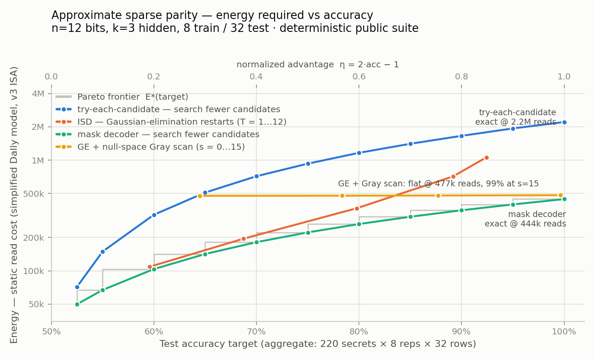
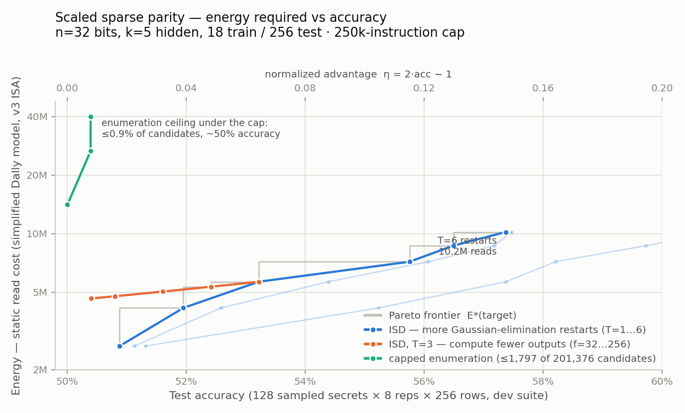

# Sparse parity

$$
\begin{array}{cl|c}
 & \text{bits} & \text{sparse parity} \\
\text{train} &
\left\lbrace \begin{array}{ccccc}
1 & 0 & 1 & 0 & 0 \\
1 & 0 & 0 & 0 & 1
\end{array} \right. &
\begin{array}{c}
1 \\
0
\end{array} \\
\\
\begin{array}{c}
\text{test} \\
\text{8x larger}
\end{array} &
\left\lbrace \begin{array}{ccccc}
1 & 0 & 0 & 0 & 1 \\
1 & 1 & 1 & 0 & 0 \\
0 & 1 & 0 & 1 & 1 \\
0 & 0 & 1 & 1 & 0 \\
1 & 0 & 1 & 1 & 0 \\
0 & 1 & 1 & 0 & 1
\end{array} \right. &
\begin{array}{c}
? \\
? \\
? \\
? \\
? \\
?
\end{array}
\end{array}
$$

- Given some labeled examples of k-sparse parity, and some unlabeled ones.
- What is the most energy-efficient way to fill in missing labels?
- To measure energy, use simplified version of Bill Dally's [model](https://github.com/cybertronai/simplified-dally-model), v3 [instruction set](https://github.com/cybertronai/simplified-dally-model/tree/main/instruction-sets), 8-bits

## API

```python
import sparse_parity

# Verify your IR predicts y_test correctly and return its read-cost.
ir   = sparse_parity.generate_baseline_small()   # small
cost = sparse_parity.score_small(ir)             # → 6,918

ir   = sparse_parity.generate_baseline_medium()  # medium
cost = sparse_parity.score_medium(ir)            # → 816,251
```

## Small, 100% target

2 hidden bits, 3 total bits, 4 train examples, 32 test.

| Date       | Cost   | Time   | Submission                                                                   | Contributors                                 | Description                                      |
| -          | -:     | -:     | -                                                                            | -                                            | -                                                |
| 2026-05-08 | 22,238 | 6.1 ms | [ir](submissions/ge_small.ir), [report](submissions/ge_small.md), [py](submissions/ge_small.py) | [@yaroslavvb](https://github.com/yaroslavvb) | `generate_ge_small` (GF(2) Gaussian elimination) |
| 2026-05-07 |  6,918 | 3.9 ms | [ir](submissions/baseline_small.ir), [report](submissions/baseline_small.md) | [@yaroslavvb](https://github.com/yaroslavvb) | `generate_baseline_small` (try-each-candidate)   |
| 2026-05-08 |  1,932 | 3.7 ms | [ir](submissions/small_pack_best.ir), [report](submissions/small_pack_report.md), [py](submissions/small_pack_generator.py) | [@sjbaebae](https://github.com/sjbaebae) | low-address row decoder + scheduled output/test aliasing ★ best |

## Medium, 100% target

3 hidden bits, 8 total bits, 8 train examples, 64 test.

| Date       | Cost    | Time  | Submission                                                                     | Contributors                                 | Description                                       |
| -          | -:      | -:    | -                                                                              | -                                            | -                                                 |
| 2026-05-07 | 816,251 | 26 ms  | [ir](submissions/baseline_medium.ir), [report](submissions/baseline_medium.md) | [@yaroslavvb](https://github.com/yaroslavvb) | `generate_baseline_medium` (try-each-candidate)   |
| 2026-05-08 | 473,046 | 12 ms  | [ir](submissions/ge_medium.ir), [report](submissions/ge_medium.md), [py](submissions/ge_medium.py) | [@yaroslavvb](https://github.com/yaroslavvb) | `generate_ge_medium` (GF(2) Gaussian elimination) |
| 2026-05-08 |  16,084 | 3.6 ms | [ir](submissions/ge_medium_packed.ir), [report](submissions/ge_medium_packed.md), [py](submissions/ge_medium_packed.py) | [@sjbaebae](https://github.com/sjbaebae) | packed-column candidate check |
| 2026-05-08 |  15,960 | 2.7 ms | [ir](submissions/predpack_medium.ir), [report](submissions/predpack_medium.md), [py](submissions/predpack_medium.py) | [@sjbaebae](https://github.com/sjbaebae) | packed-column decoder + pair-XOR reuse |
| 2026-05-08 |  15,691 | 2.7 ms | [ir](submissions/predpack_tuned_medium.ir), [report](submissions/predpack_tuned.md), [py](submissions/predpack_tuned.py) | [@sjbaebae](https://github.com/sjbaebae) | pair-XOR reuse + address/liveness tuning ★ best |

## Medium, 50% target

Same instance shape as Medium 100%, but scored with `score_medium_approx50` — the IR only has to label ≥ 50 % of test rows correctly per hidden seed.

| Date       | Cost   | Time   | Submission                                                                                  | Contributors                                 | Description                                                                |
| -          | -:     | -:     | -                                                                                           | -                                            | -                                                                          |
| 2026-05-09 | 8,723  | 5.2 ms | [ir](submissions/half_packed_approx50.ir), [report](submissions/half_packed_approx50.md), [py](submissions/half_packed_approx50.py) | [@yaroslavvb](https://github.com/yaroslavvb) | packed-column candidate which only labels first 32 test examples   |

## Approximate, accuracy vs energy

3 hidden bits, 12 total bits, 8 train examples, 32 test — [approx_sparse_parity.py](approx_sparse_parity.py), tested by [test_approx_sparse_parity.py](test_approx_sparse_parity.py).

Instead of demanding 100% recovery, a submission picks a point on an accuracy-vs-energy curve: the scorer measures aggregate test accuracy over a deterministic suite and reports the IR's static read cost. Submissions are ranked on the Pareto frontier E\*(target) — the least energy achieving each accuracy target.



Regenerate with `python3 generate_graph.py` (~2 s on an M-series laptop; needs numpy + matplotlib). Four families are plotted, all swept on decode-side knobs only — the output-truncation curve was dropped as uniformly dominated (and inconsistent with the mask-recovery direction of the newer tiers): `generate_approx_baseline(q, 32)` (try-each-candidate over the first `q` of 220 candidates), `generate_mask_baseline(q, 32)` (same decode, predictions via a 12-bit secret mask — exact at 444k reads instead of 2.2M), plus the scalable families from the larger tiers run at this size: `generate_isd(T, spec=APPROX)` (ISD Gaussian-elimination restarts) and `generate_scan(s, spec=APPROX, joint=True)` (GE + null-space Gray scan — a nearly flat line at ~480k reads sweeping 65→99%, since 2⁴ = 16 solutions cover the whole null space at n=12). At this size enumeration still owns the frontier; the n=32 graphs show the regime flip.

### Why n=12, k=3, 8 train, 32 test

- C(12,3) = 220 and log₂220 ≈ 7.8, so 8 training labels sit almost exactly at the information-theoretic threshold — and 220 < 256 means a candidate's identity fits an 8-bit packed signature (n=12 is the largest 3-sparse size where it does).
- With 8 train rows < 12 bits, GF(2) linear algebra alone can't solve the task: a random interpolant scores ~53% and minimum-support Gaussian elimination ~64% (η ≈ 0.28), so everything past the lowest target requires sparse search. At n=8 plain GE reaches 100% and sparsity does no work.
- The naive candidate-enumeration baseline is 36.7k IR instructions — comfortably inside the 100k instruction cap; n=16 brushes the cap (93.5k) and k=4+ exceeds it.
- 32 test rows keep decoding and prediction energy comparable for optimized solvers, so partial decoding and partial prediction both matter to the frontier.

### Scoring

- **Deterministic, stratified suite.** Every one of the 220 secrets × R repetitions (8 dev, 32 final, 128 = full-cube audit where every 12-bit test row appears exactly once per secret). Instances derive from SHA-256 of (suite version, key, secret, repetition) — same suite every run, so repeated scoring is bit-identical.
- **Unique identifiability.** Training sets are rejection-sampled until exactly one candidate matches, so 100% accuracy is always attainable and the benchmark measures approximation quality, not dataset ambiguity.
- **Exactly balanced tests.** Test rows come in bitwise-complement pairs split across repetition pairs; since k is odd their labels differ, so any constant guess scores exactly 50%.
- **Aggregate accuracy, no per-instance thresholds**, reported raw and as normalized advantage η = 2·acc − 1 (0 = chance, 1 = perfect).
- **Public key for development, private key for adjudication.** The public suite is fully precomputable (labels included), so a submission tuned against it can mine roughly +0.03–0.05 of spurious measured advantage near a threshold. Rankings close to a target should be confirmed by re-scoring with a held-out `suite_key` (`score_approx(ir, t, suite_key=...)`) and/or the exhaustive full-cube audit (`evaluate(ir, full_cube=True)`).

```python
import approx_sparse_parity as ap

ir = ap.generate_mask_baseline()         # exact two-phase baseline
cost = ap.score_approx_t90(ir)           # → 444,389 (η = 1.0 ≥ 0.9)

ir = ap.generate_mask_baseline(110, 32)  # search half the candidates
ap.evaluate(ir)  # EvalResult(cost=222255, raw_accuracy=0.75, advantage=0.5, ...)
```

| Date       | Target η | Cost      | Time   | Submission | Contributors | Description |
| -          | -:       | -:        | -:     | -          | -            | -           |
| 2026-08-26 | 1.00     | 2,209,461 | 150 ms | [ir](submissions/approx_baseline_full.ir), [py](approx_sparse_parity.py) | [@yaroslavvb](https://github.com/yaroslavvb) | `generate_approx_baseline()` (try-each-candidate) |
| 2026-08-26 | 1.00     |   444,389 | 43 ms  | [ir](submissions/mask_baseline_full.ir), [py](approx_sparse_parity.py) | [@yaroslavvb](https://github.com/yaroslavvb) | `generate_mask_baseline()` ★ best |
| 2026-08-26 | ≥ 0.90   |   397,838 | 42 ms  | [py](approx_sparse_parity.py) | [@yaroslavvb](https://github.com/yaroslavvb) | `generate_mask_baseline(198, 32)` |
| 2026-08-26 | ≥ 0.50   |   222,255 | 27 ms  | [py](approx_sparse_parity.py) | [@yaroslavvb](https://github.com/yaroslavvb) | `generate_mask_baseline(110, 32)` |
| 2026-08-26 | ≥ 0.25   |   122,523 | 16 ms  | [py](approx_sparse_parity.py) | [@yaroslavvb](https://github.com/yaroslavvb) | `generate_mask_baseline(55, 32)` |

Times are per-IR scoring on the final 32-repetition suite (7,040 instances, 225,280 labels) after its one-time ~0.4 s build.

## Mask recovery, n=32 — current main tier

5 hidden bits, 32 total bits, 18 train, **no test set**, **2,000,000-instruction cap** — [mask_sparse_parity.py](mask_sparse_parity.py), tested by [test_mask_sparse_parity.py](test_mask_sparse_parity.py). Full write-up: **[benchmark report](https://cybertronai.github.io/sutro-problems/docs/)** (GitHub Pages).

The submission outputs the secret itself: 32 mask cells, scored by exact match against the hidden k-subset (well-defined because training sets are uniquely identifiable). For sparse parity the dropped test set is provably redundant — a circuit that hasn't identified the secret predicts at exactly 50%, so joint test accuracy was always (1 + recovery)/2 — and a fixed standard evaluator can label rows from a recovered mask for a rank-irrelevant constant (~4.4k reads/row). The accuracy axis is now the **secret recovery rate**, with a chance floor of 1/C(n,k) ≈ 0.

The cap is 2M (up from the joint tier's 250k) so that a known family reaches 100%: `generate_scan(s)` runs full-width branchless GF(2) Gaussian elimination, extracts the null-space basis (dimension 14), and Gray-walks `s` of the 2¹⁴ solutions capturing any weight-k visitor — which identifiability guarantees is the secret. Sweeping s traces the whole curve; `generate_isd_mask(T)` (restarts) is cheapest at low recovery; capped enumeration (≤15,000 of 201,376 candidates, ~4.2M ops needed even packed) recovers ≤ 8% at dominated energy.


Regenerate with `python3 generate_mask_graph.py` (~40 s). Dev scoring uses the deterministic `mask-dev` suite (128 sampled secrets × 8 reps, cached); adjudication uses `evaluate_mask(ir, suite_key=None)` — 256 × 8 fresh hidden instances, ~20 s per run.

| Date       | Energy (reads) | Recovery | Ops       | Description |
| -          | -:             | -:       | -:        | -           |
| 2026-08-26 | 1,505,862      | 5.8%     | 36,542    | `generate_isd_mask(1)` |
| 2026-08-26 | 12,042,480     | 22.5%    | 291,958   | `generate_isd_mask(8)` |
| 2026-08-26 | 23,676,539     | 74.2%    | 593,160   | `generate_scan(4095)` |
| 2026-08-26 | 43,325,468     | 100.0%   | 1,772,808 | `generate_scan()` ([ir](submissions/scan_full_mask32.ir)) ★ frontier |

Instruction counts are large because the ISA is straight-line: loops are fully unrolled (the 2¹⁴-step scan is literally emitted 16,383 times), branches become cmp/select chains, and data-dependent reads become select chains over all possibilities — a ten-line looped GE compiles to ~10⁵ instructions.

## Scaled joint, n=32 — superseded by the mask tier

5 hidden bits, 32 total bits, 18 train / 256 test, **250,000-instruction cap** — [scaled_sparse_parity.py](scaled_sparse_parity.py), tested by [test_scaled_sparse_parity.py](test_scaled_sparse_parity.py). Kept for reference; the mask tier above replaces it as the main benchmark.

At this size brute force is priced out by the instruction cap rather than by energy: try-each-candidate over C(32,5) = 201,376 secrets needs ~26M instructions (a capped circuit checks ≤ 1,797 candidates, η ≤ 0.009), and full null-space enumeration needs 2¹⁴ Gray-code steps that also exceed the cap. The intended solution family is polynomial: GF(2) Gaussian elimination and its randomized restarts (information-set decoding). The reference circuit `generate_isd(T, f)` runs T branchless GE restarts on rotating 18-column information sets, accepts a solution only if it has weight k and reproduces every training label (unique identifiability then guarantees it *is* the secret), and mask-predicts the first f test rows.



Regenerate with `python3 generate_scaled_graph.py` (~15 s). Scoring is joint train+test (one IR, one energy number) and aggregate. The suite samples 128 secrets × 8 repetitions (dev, deterministic key `scaled-dev`, cached) or 256 × 8 with a fresh hidden `SystemRandom` key per run (final: `evaluate_scaled(ir, suite_key=None)`, unminable, ±1–3pp run noise). m_test = 256 was set from the measured decode/predict energy split (P ≈ 4,400/output vs D ≈ 1.5M per restart) so the test side carries 11–43% of the energy across the frontier.

| Date       | T restarts | Ops     | Cost       | Advantage η | Description |
| -          | -:         | -:      | -:         | -:          | -           |
| 2026-08-26 | 1          | 52,926  | 2,641,072  | 0.018       | `generate_isd(1)` |
| 2026-08-26 | 3          | 125,902 | 5,657,464  | 0.064       | `generate_isd(3)` |
| 2026-08-26 | 6          | 235,366 | 10,181,932 | 0.147       | `generate_isd(6)` ([ir](submissions/isd6_scaled32.ir)) ★ frontier |

[access_distance](doc/access_distance/) — per-submission read-distance histogram + CDF for every exact-recovery (Small/Medium) IR above.
