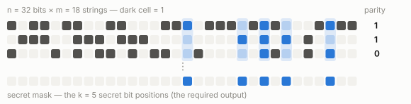
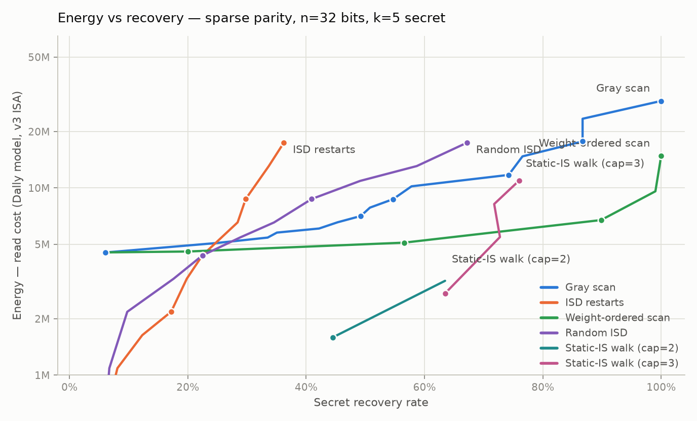

# Sparse parity

The **k-parity** of a bit string is the sum mod 2 of its k secret bits.



**Task:** given the m strings and their parities, figure out the locations of
the secret bits. Every instance: n = 32 bits, k = 5 secret positions, m = 18
strings.

We are looking for the lowest-energy solutions at 20%, 40%, 60%, 80% and 100%
accuracy — the secret recovery rate, i.e. the fraction of instances where all
32 output cells exactly match the hidden mask — measured on the
[simplified Bill Dally model](https://github.com/cybertronai/simplified-dally-model)
([v3 instruction set](https://github.com/cybertronai/simplified-dally-model/tree/main/instruction-sets),
8-bit):

## 20% target

| Date       | Cost       | Submission | Contributors | Description |
| -          | -:         | -          | -            | -           |
| 2026-09-02 | 86,753 | [ir](submissions/packedstatic20_mask32.ir), [py](packed_sparse_parity.py), [audit](submissions/packed_static20_audit.json) | [@b0nce](https://github.com/b0nce) | `generate_packed_static20()` (packed static information set) |
| 2026-09-01 | 135,348 | [ir](submissions/packedscan1_mask32.ir), [report](submissions/packedscan1_mask32.md), [py](packed_sparse_parity.py) | [@jurajselep](https://github.com/jurajselep) | `generate_packed_scan(1)` (packed-column scan + SSA layout) |
| 2026-08-31 | 151,117 | [ir](submissions/packedsis_pcap2_mask32.ir), [report](submissions/packedsis_pcap2_mask32.md), [py](submissions/packedsis.py) | [@npow](https://github.com/npow) | `generate_packed_sis(cap=2, seed=13, g2=8)` (packed SIS, partial cap-2 walk, exhaustive information-set tuning) |
| 2026-08-30 | 1,317,480 | [ir](submissions/siswalk1_cap2_mask32.ir), [report](submissions/siswalk1_cap2_mask32.md), [py](mask_sparse_parity.py) | [@zh4ngx](https://github.com/zh4ngx) | `optimize_layout(generate_sis_mask(1, 2))` (static-IS walk, staged layout) |
| 2026-08-27 | 17,331,683 | [report](submissions/scan127_mask32.md), [py](mask_sparse_parity.py) | [@yaroslavvb](https://github.com/yaroslavvb) | `generate_scan(127)` (Gray scan) |
| 2026-08-26 | 12,042,480 | [ir](submissions/isd8_mask32.ir), [report](submissions/isd8_mask32.md), [py](mask_sparse_parity.py) | [@yaroslavvb](https://github.com/yaroslavvb) | `generate_isd_mask(8)` (ISD restarts) |

## 40% target

| Date       | Cost       | Submission | Contributors | Description |
| -          | -:         | -          | -            | -           |
| 2026-09-02 | 147,000 | [ir](submissions/packedroute40_mask32.ir), [py](packed_sparse_parity.py) | [@b0nce](https://github.com/b0nce) | `generate_packed_route40()` (cap-2 Gray prefix) |
| 2026-09-01 | 151,943 | [ir](submissions/packedscan2_mask32.ir), [report](submissions/packedscan2_mask32.md), [py](packed_sparse_parity.py) | [@jurajselep](https://github.com/jurajselep) | `generate_packed_scan(2)` (packed-column scan + SSA layout) |
| 2026-08-31 | 163,378 | [ir](submissions/packedwalk1_cap2_s5_mask32.ir), [report](submissions/packedwalk1_mask32.md), [py](submissions/packedwalk.py) | [@npow](https://github.com/npow) | `generate(1, 2, seed=5)` (bit-packed SIS walk, 3-phase layout, higher dev recovery) |
| 2026-08-30 | 1,317,480 | [ir](submissions/siswalk1_cap2_mask32.ir), [report](submissions/siswalk1_cap2_mask32.md), [py](mask_sparse_parity.py) | [@zh4ngx](https://github.com/zh4ngx) | `optimize_layout(generate_sis_mask(1, 2))` (static-IS walk, staged layout) |
| 2026-08-28 | 17,418,235 | [ir](submissions/weightscan2_mask32.ir), [report](submissions/weightscan2_mask32.md), [py](mask_sparse_parity.py) | [@zh4ngx](https://github.com/zh4ngx) | `generate_scan(0, walk="weight", weight_cap=2)` (weight-ordered scan) |
| 2026-08-27 | 18,764,343 | [report](submissions/scan1023_mask32.md), [py](mask_sparse_parity.py) | [@yaroslavvb](https://github.com/yaroslavvb) | `generate_scan(1023)` (Gray scan) |
| 2026-08-27 | 17,945,660 | [ir](submissions/scan511_mask32.ir), [report](submissions/scan511_mask32.md), [py](mask_sparse_parity.py) | [@yaroslavvb](https://github.com/yaroslavvb) | `generate_scan(511)` (Gray scan) |

## 60% target

| Date       | Cost       | Submission | Contributors | Description |
| -          | -:         | -          | -            | -           |
| 2026-09-02 | 176,331 | [ir](submissions/packedroute60_mask32.ir), [py](packed_sparse_parity.py) | [@b0nce](https://github.com/b0nce) | `generate_packed_route60()` (cap-3 Gray prefix) |
| 2026-09-01 | 200,937 | [ir](submissions/packedscan3_mask32.ir), [report](submissions/packedscan3_mask32.md), [py](packed_sparse_parity.py) | [@jurajselep](https://github.com/jurajselep) | `generate_packed_scan(3)` (packed-column scan + SSA layout) |
| 2026-08-31 | 284,049 | [ir](submissions/packedsis_cap3_s13_mask32.ir), [report](submissions/packedsis_pcap2_mask32.md), [py](submissions/packedsis.py) | [@npow](https://github.com/npow) | `generate_packed_sis(cap=3, seed=13)` (bit-packed SIS walk, full cap-3, tuned seed) |
| 2026-08-30 | 2,137,725 | [ir](submissions/siswalk1_cap3_mask32.ir), [report](submissions/siswalk1_cap3_mask32.md), [py](mask_sparse_parity.py) | [@zh4ngx](https://github.com/zh4ngx) | `optimize_layout(generate_sis_mask(1, 3))` (static-IS walk, staged layout) |
| 2026-08-28 | 18,509,753 | [ir](submissions/weightscan3_mask32.ir), [report](submissions/weightscan3_mask32.md), [py](mask_sparse_parity.py) | [@zh4ngx](https://github.com/zh4ngx) | `generate_scan(0, walk="weight", weight_cap=3)` (weight-ordered scan) |
| 2026-08-27 | 26,951,367 | [report](submissions/scan6143_mask32.md), [py](mask_sparse_parity.py) | [@yaroslavvb](https://github.com/yaroslavvb) | `generate_scan(6143)` (Gray scan) |
| 2026-08-26 | 23,676,539 | [ir](submissions/scan4095_mask32.ir), [report](submissions/scan4095_mask32.md), [py](mask_sparse_parity.py) | [@yaroslavvb](https://github.com/yaroslavvb) | `generate_scan(4095)` (Gray scan) |

## 80% target

| Date       | Cost       | Submission | Contributors | Description |
| -          | -:         | -          | -            | -           |
| 2026-09-02 | 196,139 | [ir](submissions/packedroute80_mask32.ir), [py](packed_sparse_parity.py) | [@b0nce](https://github.com/b0nce) | `generate_packed_route80()` (cap-3 Gray prefix) |
| 2026-09-01 | 200,937 | [ir](submissions/packedscan3_mask32.ir), [report](submissions/packedscan3_mask32.md), [py](packed_sparse_parity.py) | [@jurajselep](https://github.com/jurajselep) | `generate_packed_scan(3)` (packed-column scan + SSA layout) |
| 2026-08-31 | 493,193 | [ir](submissions/septwalk_wcap3_mask32.ir), [report](submissions/septwalk_wcap3_mask32.md), [py](submissions/septwalk.py) | [@npow](https://github.com/npow) | `generate_staged(weight_cap=3)` (septet-packed dynamic RREF + row-coordinate walk) |
| 2026-08-30 | 5,593,997 | [ir](submissions/weightscan3_mask32.ir), [report](submissions/weightscan3_mask32.md), [py](mask_sparse_parity.py) | [@zh4ngx](https://github.com/zh4ngx) | `optimize_layout(generate_scan(0, walk="weight", weight_cap=3))` (weight-ordered scan, staged layout) |
| 2026-08-27 | 33,501,030 | [report](submissions/scan10239_mask32.md), [py](mask_sparse_parity.py) | [@yaroslavvb](https://github.com/yaroslavvb) | `generate_scan(10239)` (Gray scan) |
| 2026-08-27 | 30,226,172 | [ir](submissions/scan8191_mask32.ir), [report](submissions/scan8191_mask32.md), [py](mask_sparse_parity.py) | [@yaroslavvb](https://github.com/yaroslavvb) | `generate_scan(8191)` (Gray scan) |

## 100% target

| Date       | Cost       | Submission | Contributors | Description |
| -          | -:         | -          | -            | -           |
| 2026-09-02 | 392,666 | [ir](submissions/packedscan5_mask32.ir), [report](submissions/packedscan5_mask32.md), [py](packed_sparse_parity.py) | [@jurajselep](https://github.com/jurajselep), [@b0nce](https://github.com/b0nce) | `generate_packed_scan(5)` (packed RREF + specialized capture) |
| 2026-08-31 | 938,331 | [ir](submissions/septwalk_mask32.ir), [report](submissions/septwalk_mask32.md), [py](submissions/septwalk.py) | [@npow](https://github.com/npow) | `generate_staged()` (septet-packed RREF + row-coordinate walk) |
| 2026-08-30 | 12,461,610 | [ir](submissions/weightscan5_mask32.ir), [report](submissions/weightscan5_mask32.md), [py](mask_sparse_parity.py) | [@zh4ngx](https://github.com/zh4ngx) | `optimize_layout(generate_scan(0, walk="weight", weight_cap=5))` (weight-ordered scan, staged layout) |
| 2026-08-26 | 43,325,468 | [ir](submissions/scan_full_mask32.ir), [report](submissions/scan_full_mask32.md), [py](mask_sparse_parity.py) | [@yaroslavvb](https://github.com/yaroslavvb) | `generate_scan(16383)` (Gray scan, full walk) |



## Evaluation speed

The record programs above are scored by
[dally-eval](https://github.com/cybertronai/dally-eval), a Rust
re-implementation of this evaluator (bit-exact: same static costs, same
outputs on the dev suite). Measured on the current record programs,
1,024-instance batches (Python = this repository's evaluator, warm;
Rust = dally-eval 16-thread CPU/Rayon; host: Ryzen 9 9950X + RX 6900
XT):

| program | ops | Python | Rust CPU | speedup |
| - | -: | -: | -: | -: |
| packedsis (20% band, 172k cost) | 15,390 | 15.2k inst/s | 935k inst/s | 61x |
| packedwalk (40% band, 163k cost) | 17,815 | 13.7k inst/s | 876k inst/s | 64x |
| packedsis (60% band, 284k cost) | 30,555 | 7.0k inst/s | 502k inst/s | 72x |
| weightscan (80% band, 5.6M cost) | 266,185 | 937 inst/s | 60k inst/s | 64x |
| weightscan (100% band, 12.5M cost) | 709,513 | 313 inst/s | 21.8k inst/s | 70x |

A dally-eval GPU backend (wgpu) is included for scale experiments; at
current batch sizes the CPU engine is the practical scorer.


- Github Pages: [sparse parity](https://cybertronai.github.io/sutro-problems/sparse-parity)
- [Literature background](https://cybertronai.github.io/sutro-problems/docs/spatial-model-analysis.html)


<details>
<summary>Submission instructions for agents</summary>

- A submission is one straight-line program (an **IR**) in the v3 instruction
  set: 8-bit cells, no loops, no branches, no data-dependent addressing, at
  most **2,000,000 lines** (every line counts, declarations included).
- An IR is plain text. Line 1 declares the input cell addresses
  (comma-separated — you choose the addresses; the grader writes the inputs
  there), the last line declares the 32 output addresses, and each line
  between is one op (`set`, `copy`, `not`, `abs`, `and`, `or`, `xor`, `add`,
  `sub`, `mul`, `div`, `cmp`, `select`), e.g. `xor 3,1,2`. Complete example:
  [submissions/scan_full_mask32.ir](submissions/scan_full_mask32.ir).
- **Inputs**, in declaration order: the 18×32 training bits (row-major), then
  the 18 parities. **Outputs:** the 32 declared cells, each holding exactly
  0 or 1; cell c = 1 iff bit position c is secret. An instance scores 1 only
  on an exact 32-cell match (training sets are uniquely identifiable, so 100%
  is attainable).
- **Energy** is the program's static read cost: every operand read of address
  a costs ⌈√a⌉, and each declared output cell is charged one final read.
- Score locally against the deterministic dev suite — run from this directory
  (needs only numpy). The evaluator and reference generators live in
  [mask_sparse_parity.py](mask_sparse_parity.py); submission-specific
  generators are linked from their leaderboard rows. The evaluator is checked
  by [test_mask_sparse_parity.py](test_mask_sparse_parity.py).

  ```python
  import mask_sparse_parity as mp

  ir = mp.generate_scan(4095)      # or your own IR string
  res = mp.evaluate_mask(ir)       # 1,024-instance dev suite, a few seconds
  res.cost, res.recovery           # → (23676539, 0.742)
  ```

- Adjudication: `mp.evaluate_mask(ir, suite_key=None)` draws a fresh random
  2,048-instance suite each call (recovery noise ≈ ±2 pp; ~2⁻¹⁴ of instances
  are rank-deficient and can dip a full scan just below 100%).
- When adjudication affects record selection, commit fixed suite keys, hashes,
  integer successes, and denominators. The packed-record example is
  [audit script](submissions/audit_packed_records.py) +
  [results](submissions/packed_records_audit.json).
- The table and figure above are measured on the dev suite; the full sweep is
  in [doc/mask32_bands.json](doc/mask32_bands.json). Regenerate both with
  `python3 doc/generate_mask_graph.py` (~4 min).
- Submit a PR adding your `.ir` and generator under
  [submissions/](submissions/) and updating the accuracy band (table row) it
  improves.

</details>

---

[**Legacy page**](legacy.md) — the archived full write-up: the retired Small,
Medium, Approximate and Scaled-joint tiers with their leaderboards, scoring
rules and submissions. Their modules are in [legacy/](legacy/).
