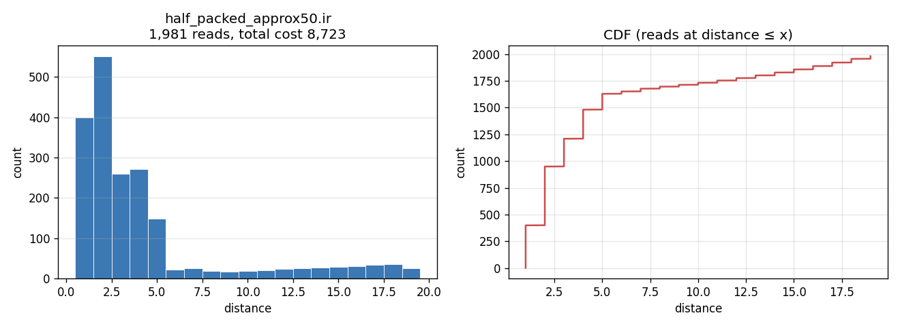

# Access distance — sparse-parity

One PNG per IR submission. Left panel: histogram of read distance ⌈√addr⌉
across every operand read in the v3 trace. Right panel: CDF of cumulative
read count at each distance — showing how much of the total cost comes
from reads at distance ≤ x.

Generated by [`plot_access_distance.py`](plot_access_distance.py).

## Combined CDFs

All small-category submissions on one axis (legend sorted by total cost,
cheapest first):

All medium-category submissions on one axis:

## Small

**`ge_small.ir`** — cost 22,238

**`baseline_small.ir`** — cost 6,918

**`small_pack_column_gf2.ir`** — cost 2,077

**`small_pack_best.ir`** — cost 1,932 ★ best

## Medium

**`baseline_medium.ir`** — cost 816,251

**`ge_medium.ir`** — cost 473,046

**`ge_medium_packed.ir`** — cost 16,084

**`predpack_medium.ir`** — cost 15,960

**`predpack_tuned_medium.ir`** — cost 15,691 ★ best

**`half_packed_approx50.ir`** — cost 8,723 *(50% target)*

