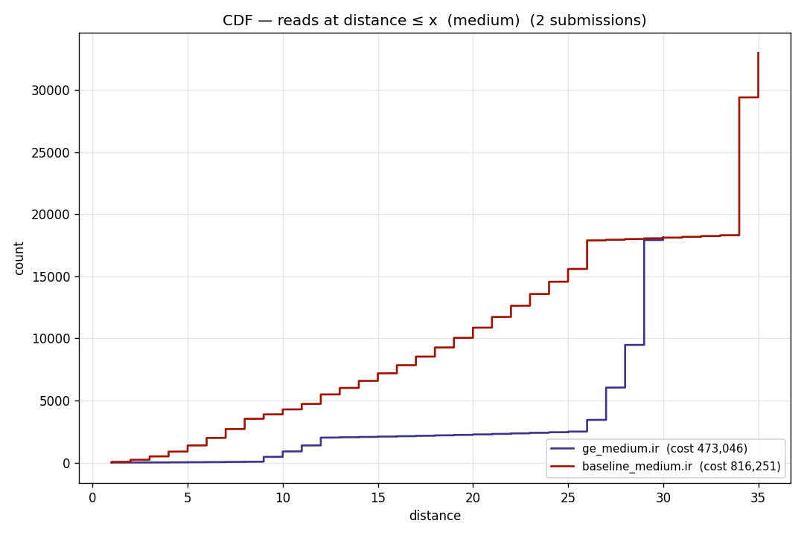
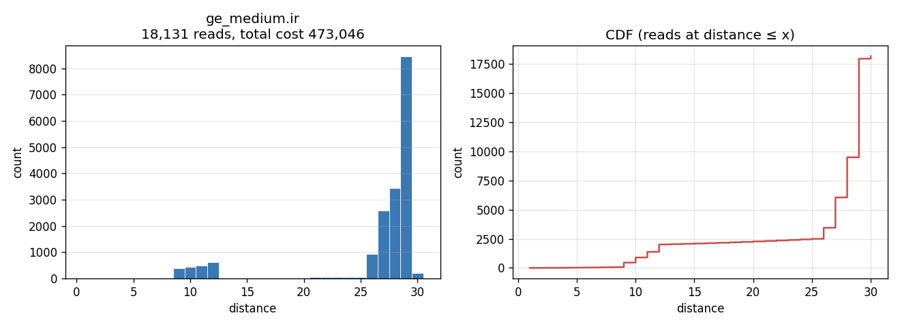

# Access-distance plots — sparse-parity

One PNG per IR submission. Left panel: histogram of read distance ⌈√addr⌉
across every operand read in the v3 trace. Right panel: CDF of cumulative
read count at each distance — showing how much of the total cost comes
from reads at distance ≤ x.

Generated by [`plot_access_distances.py`](plot_access_distances.py).

## Combined CDF — medium

All medium-category submissions on one axis (legend sorted by total cost,
cheapest first).

## Small

**`baseline_small.ir`**

**`ge_small.ir`**

## Medium

**`baseline_medium.ir`**

**`ge_medium.ir`**

