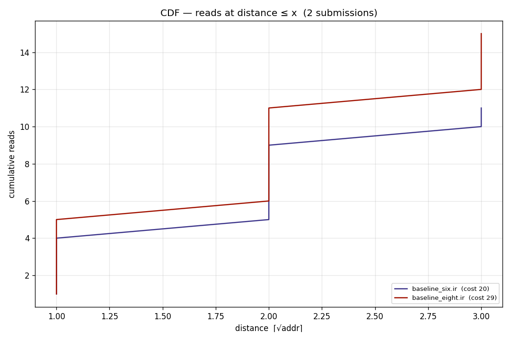
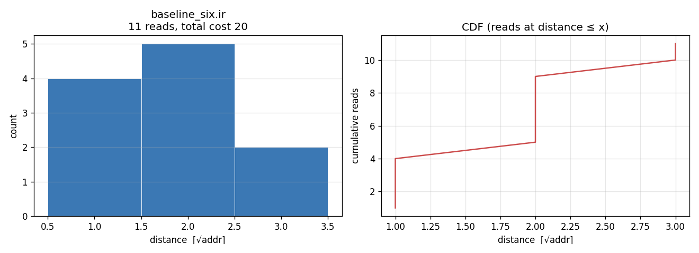
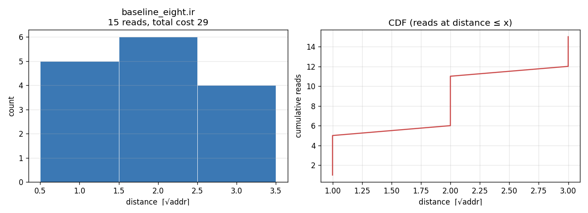

# Access distance

One PNG per IR submission. Left panel: histogram of read distance ⌈√addr⌉
across every operand read in the v3 trace. Right panel: CDF of cumulative
read count at each distance — showing how much of the total cost comes
from reads at distance ≤ x.

Generated by [`plot_access_distance.py`](plot_access_distance.py).

## Combined CDF

All submissions on one axis (legend sorted by total cost, cheapest first).

## Six-bit

**`baseline_six.ir`**

## Eight-bit

**`baseline_eight.ir`**

